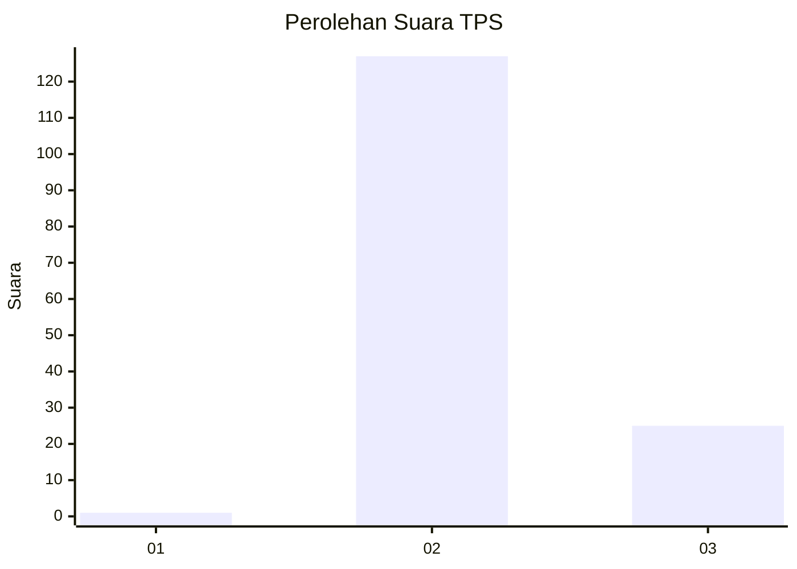
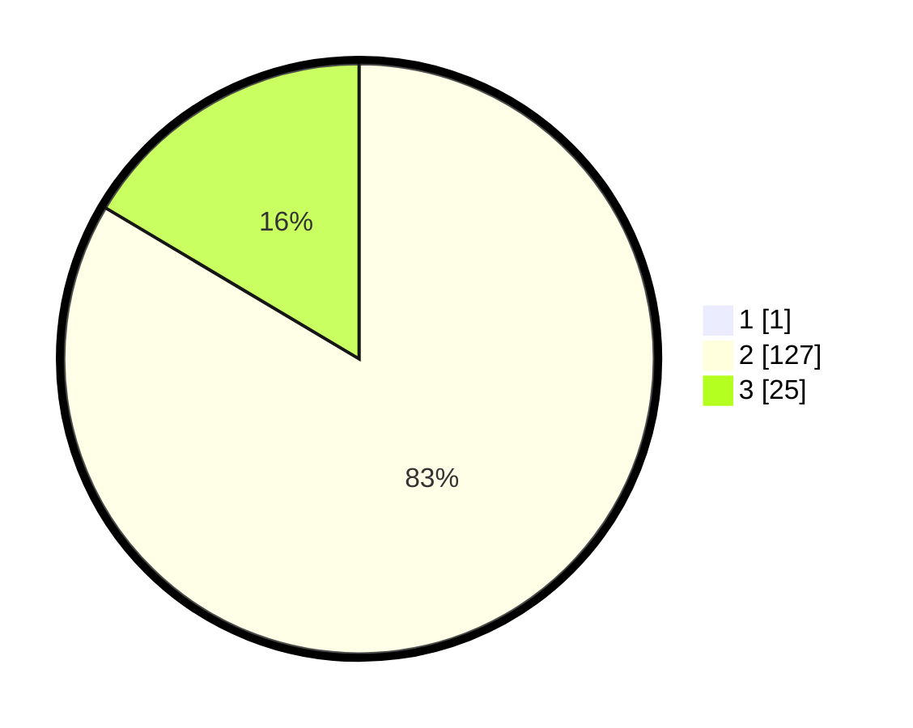

# Hasil

## Grafik

## Tabel

| No. | Nama Paslon    | Suara | Suara (raw) | Persentase |
|:--- |:-------------- | -----:| -----------:| ----------:|
| 1   | ANIES MUHAIMIN | 1     | [1][p-1]    | 0,65       |
| 2   | PRABOWO GIBRAN | 127   | [127][p-2]  | 83,01      |
| 3   | GANJAR MAHFUD  | 25    | [25][p-3]   | 16,34      |

[p-1]: https://github.com/gigit-pemilu/pemilu-2024-11-aceh/blob/main/pilpres/hitung-suara/sub/11-aceh/sub/02-aceh-tenggara/sub/06-babul-makmur/sub/2016-muara-setia/sub/002-tps/sub/paslon-1.txt
[p-2]: https://github.com/gigit-pemilu/pemilu-2024-11-aceh/blob/main/pilpres/hitung-suara/sub/11-aceh/sub/02-aceh-tenggara/sub/06-babul-makmur/sub/2016-muara-setia/sub/002-tps/sub/paslon-2.txt
[p-3]: https://github.com/gigit-pemilu/pemilu-2024-11-aceh/blob/main/pilpres/hitung-suara/sub/11-aceh/sub/02-aceh-tenggara/sub/06-babul-makmur/sub/2016-muara-setia/sub/002-tps/sub/paslon-3.txt

## Foto C Plano

https://sirekap-obj-formc.kpu.go.id/2308/pemilu/ppwp/11/02/06/20/16/1102062016002-20240222-170713--de0ba399-56e1-40b5-b31f-94b48325b2a3.jpg

https://sirekap-obj-formc.kpu.go.id/2308/pemilu/ppwp/11/02/06/20/16/1102062016002-20240222-171232--54010881-db27-408f-b952-188dc0c43577.jpg

https://sirekap-obj-formc.kpu.go.id/2308/pemilu/ppwp/11/02/06/20/16/1102062016002-20240222-171315--e4975a6e-ff27-425c-8f44-0a4d617caf6d.jpg

## Metadata

| Key        | Value               |
| ---------- | ------------------- |
| Time Stamp | 2024-02-24 22:31:28 |

## DATA PEMILIH TETAP

Jumlah pemilih dalam DPT: **170**.
 * L: **84**.
 * P: **86**.

## DATA PENGGUNA HAK PILIH

Jumlah pengguna hak pilih dalam DPT: **138**.
 * L: **63**.
 * P: **75**.

Jumlah pengguna hak pilih dalam DPTb: **1**.
 * L: **1**.
 * P: **0**.

Jumlah pengguna hak pilih dalam DPK: **15**.
 * L: **9**.
 * P: **6**.

Jumlah pengguna hak pilih: **154**.
 * L: **73**.
 * P: **81**.

## JUMLAH SUARA SAH DAN TIDAK SAH

JUMLAH SELURUH SUARA SAH: **153**.

JUMLAH SUARA TIDAK SAH: **1**.

JUMLAH SELURUH SUARA SAH DAN SUARA TIDAK SAH: **154**.

