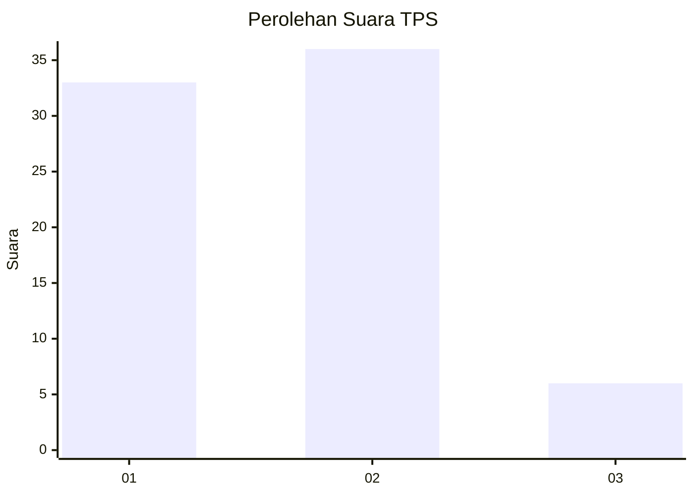
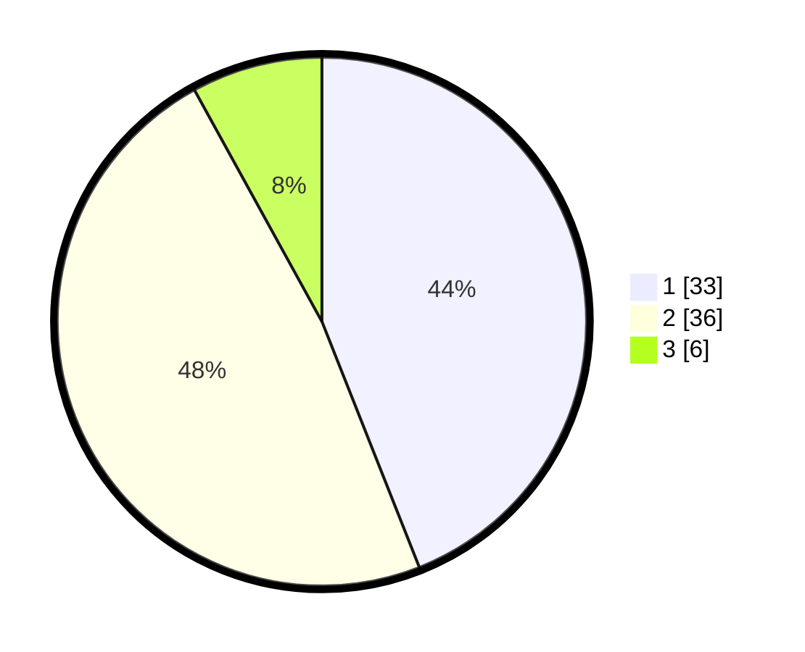

# Hasil

## Grafik

## Tabel

| No. | Nama Paslon    | Suara | Suara (raw) | Persentase |
|:--- |:-------------- | -----:| -----------:| ----------:|
| 1   | ANIES MUHAIMIN | 33    | [33][p-1]   | 44,00      |
| 2   | PRABOWO GIBRAN | 36    | [36][p-2]   | 48,00      |
| 3   | GANJAR MAHFUD  | 6     | [6][p-3]    | 8,00       |

[p-1]: https://github.com/gigit-pemilu/pemilu-2024-11-aceh/blob/main/pilpres/hitung-suara/sub/11-aceh/sub/02-aceh-tenggara/sub/06-babul-makmur/sub/2024-lawe-tawakh/sub/002-tps/sub/paslon-1.txt
[p-2]: https://github.com/gigit-pemilu/pemilu-2024-11-aceh/blob/main/pilpres/hitung-suara/sub/11-aceh/sub/02-aceh-tenggara/sub/06-babul-makmur/sub/2024-lawe-tawakh/sub/002-tps/sub/paslon-2.txt
[p-3]: https://github.com/gigit-pemilu/pemilu-2024-11-aceh/blob/main/pilpres/hitung-suara/sub/11-aceh/sub/02-aceh-tenggara/sub/06-babul-makmur/sub/2024-lawe-tawakh/sub/002-tps/sub/paslon-3.txt

## Foto C Plano

https://sirekap-obj-formc.kpu.go.id/a97f/pemilu/ppwp/11/02/06/20/24/1102062024002-20240215-033451--b1b6435c-4b30-4f48-a141-fa4c9de58c50.jpg

https://sirekap-obj-formc.kpu.go.id/a97f/pemilu/ppwp/11/02/06/20/24/1102062024002-20240222-203125--942b25fe-1fe2-41a4-b38e-3e482a3d7cae.jpg

https://sirekap-obj-formc.kpu.go.id/a97f/pemilu/ppwp/11/02/06/20/24/1102062024002-20240215-033834--158de147-0251-4f26-9fbb-2189a8aa343a.jpg

## Metadata

| Key        | Value               |
| ---------- | ------------------- |
| Time Stamp | 2024-02-22 21:00:00 |

## DATA PEMILIH TETAP

Jumlah pemilih dalam DPT: **97**.
 * L: **50**.
 * P: **47**.

## DATA PENGGUNA HAK PILIH

Jumlah pengguna hak pilih dalam DPT: **76**.
 * L: **36**.
 * P: **39**.

Jumlah pengguna hak pilih dalam DPTb: **0**.
 * L: **0**.
 * P: **0**.

Jumlah pengguna hak pilih dalam DPK: **1**.
 * L: **1**.
 * P: **0**.

Jumlah pengguna hak pilih: **76**.
 * L: **37**.
 * P: **39**.

## JUMLAH SUARA SAH DAN TIDAK SAH

JUMLAH SELURUH SUARA SAH: **75**.

JUMLAH SUARA TIDAK SAH: **1**.

JUMLAH SELURUH SUARA SAH DAN SUARA TIDAK SAH: **76**.

