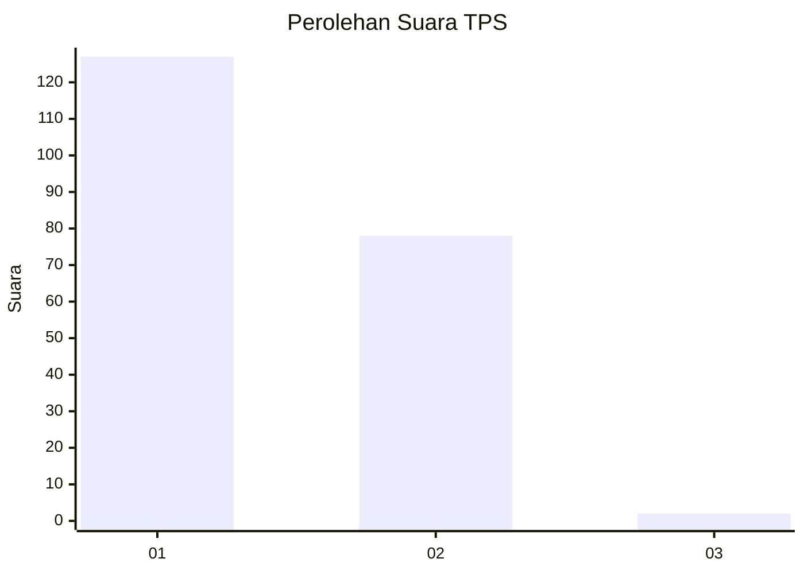
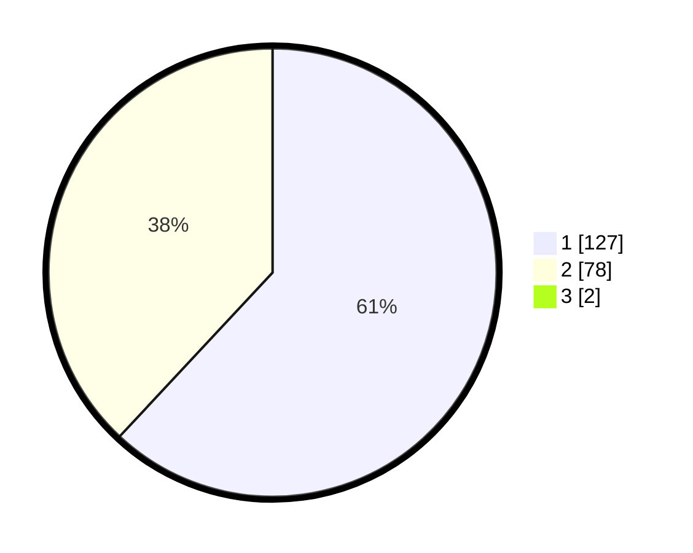

# Hasil

## Grafik

## Tabel

| No. | Nama Paslon    | Suara | Suara (raw) | Persentase |
|:--- |:-------------- | -----:| -----------:| ----------:|
| 1   | ANIES MUHAIMIN | 127   | [127][p-1]  | 61,35      |
| 2   | PRABOWO GIBRAN | 78    | [78][p-2]   | 37,68      |
| 3   | GANJAR MAHFUD  | 2     | [2][p-3]    | 0,97       |

[p-1]: https://github.com/gigit-pemilu/pemilu-2024-11-aceh/blob/main/pilpres/hitung-suara/sub/11-aceh/sub/02-aceh-tenggara/sub/07-darul-hasanah/sub/2002-pulo-piku/sub/001-tps/sub/paslon-1.txt
[p-2]: https://github.com/gigit-pemilu/pemilu-2024-11-aceh/blob/main/pilpres/hitung-suara/sub/11-aceh/sub/02-aceh-tenggara/sub/07-darul-hasanah/sub/2002-pulo-piku/sub/001-tps/sub/paslon-2.txt
[p-3]: https://github.com/gigit-pemilu/pemilu-2024-11-aceh/blob/main/pilpres/hitung-suara/sub/11-aceh/sub/02-aceh-tenggara/sub/07-darul-hasanah/sub/2002-pulo-piku/sub/001-tps/sub/paslon-3.txt

## Foto C Plano

https://sirekap-obj-formc.kpu.go.id/36a8/pemilu/ppwp/11/02/07/20/02/1102072002001-20240215-141048--aaf11c59-d3f2-4903-bded-aa50a0e7958c.jpg

https://sirekap-obj-formc.kpu.go.id/36a8/pemilu/ppwp/11/02/07/20/02/1102072002001-20240215-141256--e250b199-3218-481a-97ed-36d54ee20fba.jpg

https://sirekap-obj-formc.kpu.go.id/36a8/pemilu/ppwp/11/02/07/20/02/1102072002001-20240215-141433--ac8475e0-0ec8-4022-99ff-ca7bb3745fc7.jpg

## Metadata

| Key        | Value               |
| ---------- | ------------------- |
| Time Stamp | 2024-02-15 16:00:26 |

