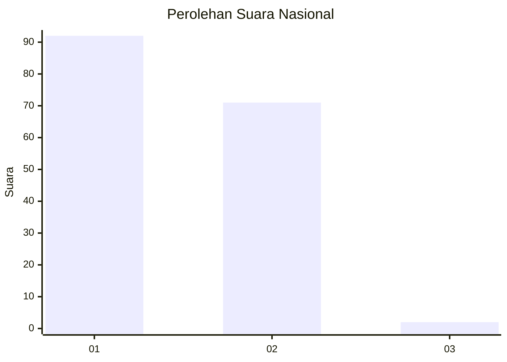
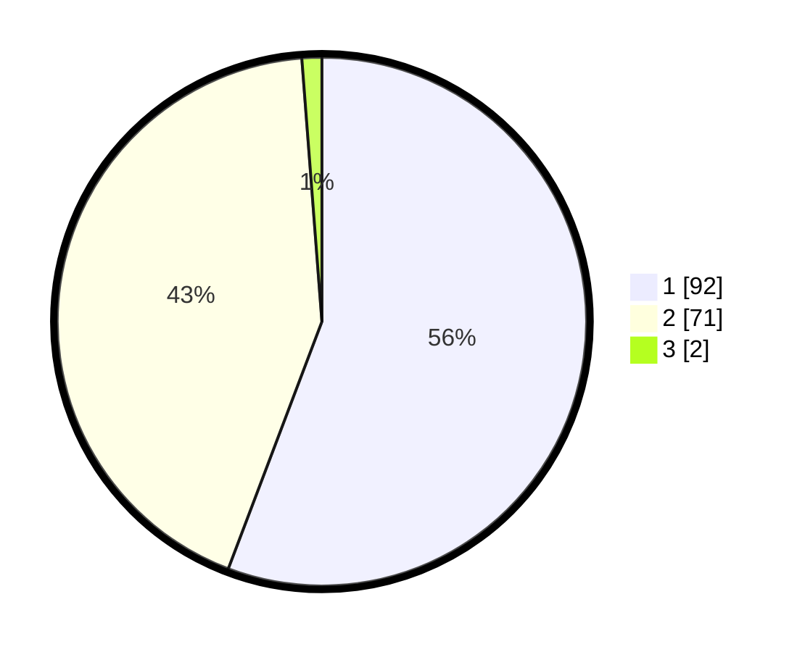

# Hasil

## Grafik

## Tabel

| No. | Nama Paslon    | Suara | Suara (raw) | Persentase |
|:--- |:-------------- | -----:| -----------:| ----------:|
| 1   | ANIES MUHAIMIN | 92    | [92][p-1]   | 55,76      |
| 2   | PRABOWO GIBRAN | 71    | [71][p-2]   | 43,03      |
| 3   | GANJAR MAHFUD  | 2     | [2][p-3]    | 1,21       |

[p-1]: https://github.com/gigit-pemilu/pemilu-2024/blob/main/pilpres/hitung-suara/sub/11-aceh/sub/02-aceh-tenggara/sub/07-darul-hasanah/sub/2003-terutung-kute/sub/002-tps/sub/paslon-1.txt
[p-2]: https://github.com/gigit-pemilu/pemilu-2024/blob/main/pilpres/hitung-suara/sub/11-aceh/sub/02-aceh-tenggara/sub/07-darul-hasanah/sub/2003-terutung-kute/sub/002-tps/sub/paslon-2.txt
[p-3]: https://github.com/gigit-pemilu/pemilu-2024/blob/main/pilpres/hitung-suara/sub/11-aceh/sub/02-aceh-tenggara/sub/07-darul-hasanah/sub/2003-terutung-kute/sub/002-tps/sub/paslon-3.txt

## Foto C Plano

https://sirekap-obj-formc.kpu.go.id/abad/pemilu/ppwp/11/02/07/20/03/1102072003002-20240216-144912--9f92904e-656f-48bd-b976-de2267b658c8.jpg

https://sirekap-obj-formc.kpu.go.id/abad/pemilu/ppwp/11/02/07/20/03/1102072003002-20240216-144913--fb74e494-fde7-4109-a806-fb5800e1392e.jpg

https://sirekap-obj-formc.kpu.go.id/abad/pemilu/ppwp/11/02/07/20/03/1102072003002-20240216-144912--eb44acc1-a56a-431e-8eca-0e343fb7d864.jpg

## Metadata

| Key        | Value               |
| ---------- | ------------------- |
| Time Stamp | 2024-02-21 15:00:00 |

## DATA PEMILIH TETAP

Jumlah pemilih dalam DPT: **186**.
 * L: **103**.
 * P: **83**.

## DATA PENGGUNA HAK PILIH

Jumlah pengguna hak pilih dalam DPT: **165**.
 * L: **84**.
 * P: **81**.

Jumlah pengguna hak pilih dalam DPTb: **0**.
 * L: **0**.
 * P: **0**.

Jumlah pengguna hak pilih dalam DPK: **5**.
 * L: **1**.
 * P: **4**.

Jumlah pengguna hak pilih: **170**.
 * L: **85**.
 * P: **85**.

## JUMLAH SUARA SAH DAN TIDAK SAH

JUMLAH SELURUH SUARA SAH: **165**.

JUMLAH SUARA TIDAK SAH: **5**.

JUMLAH SELURUH SUARA SAH DAN SUARA TIDAK SAH: **170**.

