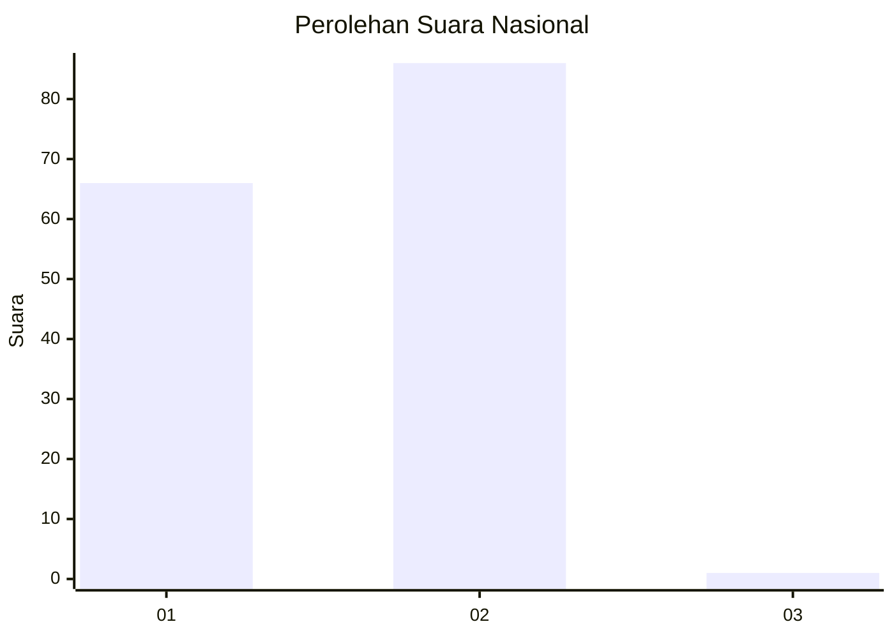
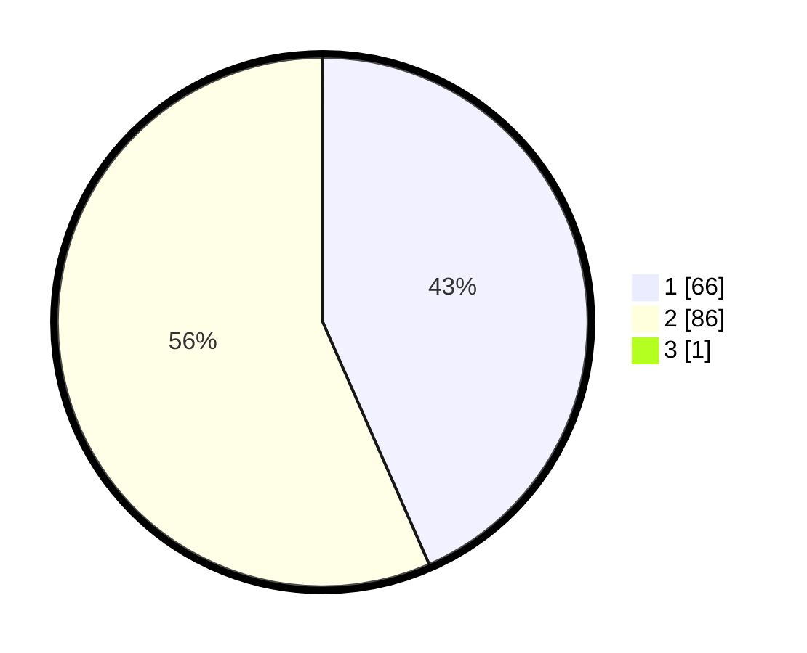

# Hasil

## Grafik

## Tabel

| No. | Nama Paslon    | Suara | Suara (raw) | Persentase |
|:--- |:-------------- | -----:| -----------:| ----------:|
| 1   | ANIES MUHAIMIN | 66    | [66][p-1]   | 43,14      |
| 2   | PRABOWO GIBRAN | 86    | [86][p-2]   | 56,21      |
| 3   | GANJAR MAHFUD  | 1     | [1][p-3]    | 0,65       |

[p-1]: https://github.com/gigit-pemilu/pemilu-2024/blob/main/pilpres/hitung-suara/sub/11-aceh/sub/02-aceh-tenggara/sub/07-darul-hasanah/sub/2005-lawe-stul/sub/002-tps/sub/paslon-1.txt
[p-2]: https://github.com/gigit-pemilu/pemilu-2024/blob/main/pilpres/hitung-suara/sub/11-aceh/sub/02-aceh-tenggara/sub/07-darul-hasanah/sub/2005-lawe-stul/sub/002-tps/sub/paslon-2.txt
[p-3]: https://github.com/gigit-pemilu/pemilu-2024/blob/main/pilpres/hitung-suara/sub/11-aceh/sub/02-aceh-tenggara/sub/07-darul-hasanah/sub/2005-lawe-stul/sub/002-tps/sub/paslon-3.txt

## Foto C Plano

https://sirekap-obj-formc.kpu.go.id/6ff9/pemilu/ppwp/11/02/07/20/05/1102072005002-20240222-122948--85e71815-87e7-4d3a-b254-8e7b4c9ee3a8.jpg

https://sirekap-obj-formc.kpu.go.id/6ff9/pemilu/ppwp/11/02/07/20/05/1102072005002-20240222-122950--889a588f-5785-4860-8e68-bcdeee825a18.jpg

https://sirekap-obj-formc.kpu.go.id/6ff9/pemilu/ppwp/11/02/07/20/05/1102072005002-20240222-122949--cb8e8cea-9c04-4444-bb99-5701b4a9cf10.jpg

## Metadata

| Key        | Value               |
| ---------- | ------------------- |
| Time Stamp | 2024-02-24 22:31:28 |

## DATA PEMILIH TETAP

Jumlah pemilih dalam DPT: **0**.
 * L: **0**.
 * P: **0**.

## DATA PENGGUNA HAK PILIH

Jumlah pengguna hak pilih dalam DPT: **0**.
 * L: **0**.
 * P: **0**.

Jumlah pengguna hak pilih dalam DPTb: **0**.
 * L: **0**.
 * P: **0**.

Jumlah pengguna hak pilih dalam DPK: **0**.
 * L: **0**.
 * P: **0**.

Jumlah pengguna hak pilih: **0**.
 * L: **0**.
 * P: **0**.

## JUMLAH SUARA SAH DAN TIDAK SAH

JUMLAH SELURUH SUARA SAH: **153**.

JUMLAH SUARA TIDAK SAH: **3**.

JUMLAH SELURUH SUARA SAH DAN SUARA TIDAK SAH: **156**.

