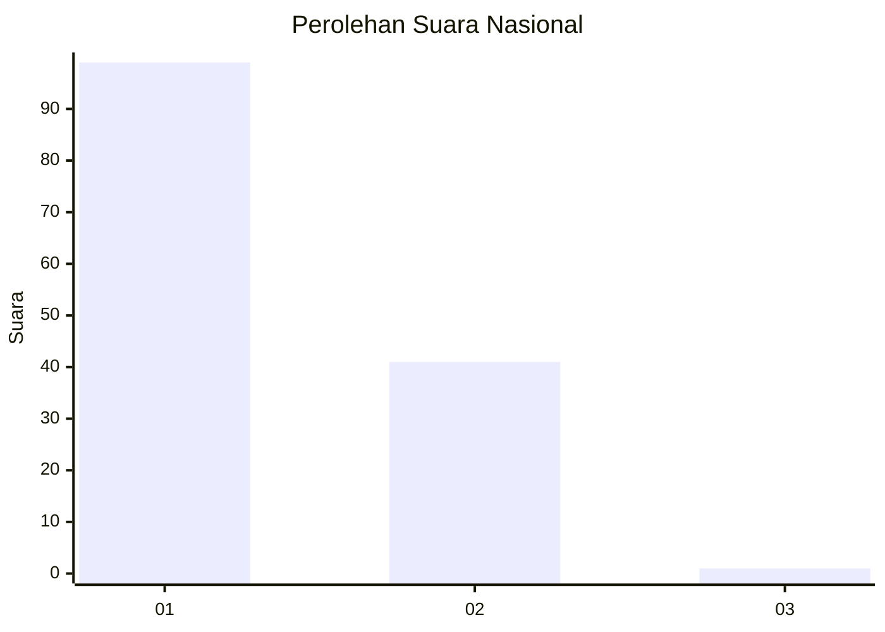
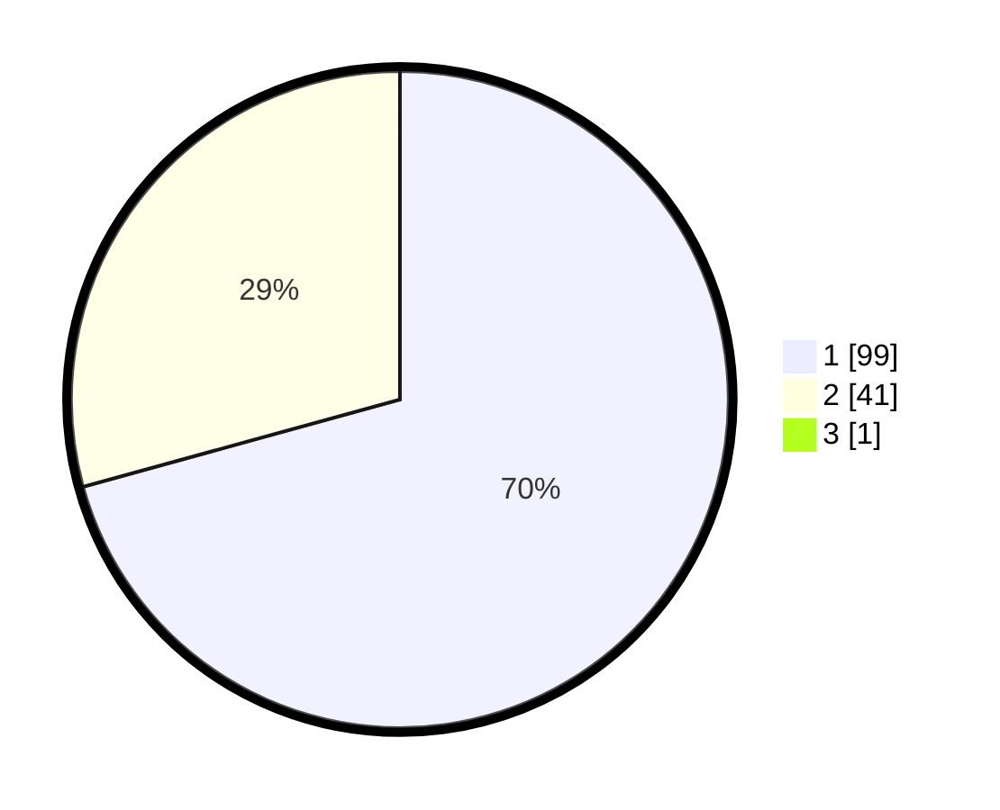

# Hasil

## Grafik

## Tabel

| No. | Nama Paslon    | Suara | Suara (raw) | Persentase |
|:--- |:-------------- | -----:| -----------:| ----------:|
| 1   | ANIES MUHAIMIN | 99    | [99][p-1]   | 70,21      |
| 2   | PRABOWO GIBRAN | 41    | [41][p-2]   | 29,08      |
| 3   | GANJAR MAHFUD  | 1     | [1][p-3]    | 0,71       |

[p-1]: https://github.com/gigit-pemilu/pemilu-2024/blob/main/pilpres/hitung-suara/sub/11-aceh/sub/02-aceh-tenggara/sub/07-darul-hasanah/sub/2006-kite-merangun/sub/001-tps/sub/paslon-1.txt
[p-2]: https://github.com/gigit-pemilu/pemilu-2024/blob/main/pilpres/hitung-suara/sub/11-aceh/sub/02-aceh-tenggara/sub/07-darul-hasanah/sub/2006-kite-merangun/sub/001-tps/sub/paslon-2.txt
[p-3]: https://github.com/gigit-pemilu/pemilu-2024/blob/main/pilpres/hitung-suara/sub/11-aceh/sub/02-aceh-tenggara/sub/07-darul-hasanah/sub/2006-kite-merangun/sub/001-tps/sub/paslon-3.txt

## Foto C Plano

https://sirekap-obj-formc.kpu.go.id/09db/pemilu/ppwp/11/02/07/20/06/1102072006001-20240218-194746--1311ee1e-756f-4e02-847c-b92190831e11.jpg

https://sirekap-obj-formc.kpu.go.id/09db/pemilu/ppwp/11/02/07/20/06/1102072006001-20240218-194748--cc3037a2-191e-4a49-9c92-d147a663e4f8.jpg

https://sirekap-obj-formc.kpu.go.id/09db/pemilu/ppwp/11/02/07/20/06/1102072006001-20240218-194747--1d20f02f-d1c2-4cd4-9d63-eeec0928e9b8.jpg

## Metadata

| Key        | Value               |
| ---------- | ------------------- |
| Time Stamp | 2024-02-21 15:00:00 |

## DATA PEMILIH TETAP

Jumlah pemilih dalam DPT: **167**.
 * L: **76**.
 * P: **91**.

## DATA PENGGUNA HAK PILIH

Jumlah pengguna hak pilih dalam DPT: **142**.
 * L: **65**.
 * P: **77**.

Jumlah pengguna hak pilih dalam DPTb: **0**.
 * L: **0**.
 * P: **0**.

Jumlah pengguna hak pilih dalam DPK: **0**.
 * L: **0**.
 * P: **0**.

Jumlah pengguna hak pilih: **142**.
 * L: **65**.
 * P: **77**.

## JUMLAH SUARA SAH DAN TIDAK SAH

JUMLAH SELURUH SUARA SAH: **141**.

JUMLAH SUARA TIDAK SAH: **1**.

JUMLAH SELURUH SUARA SAH DAN SUARA TIDAK SAH: **142**.

