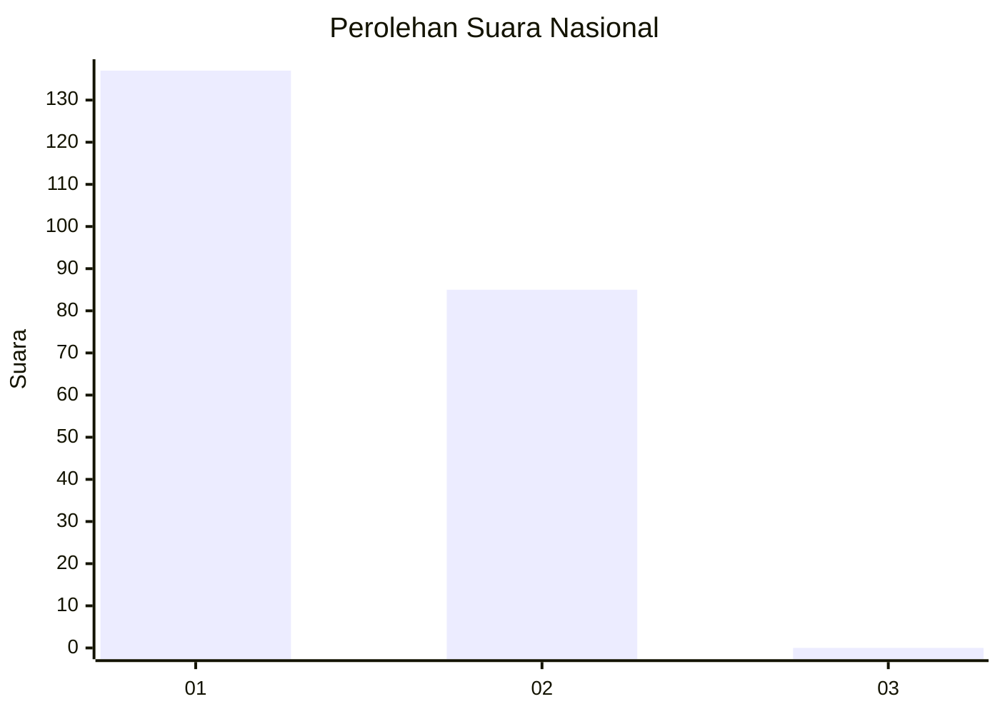
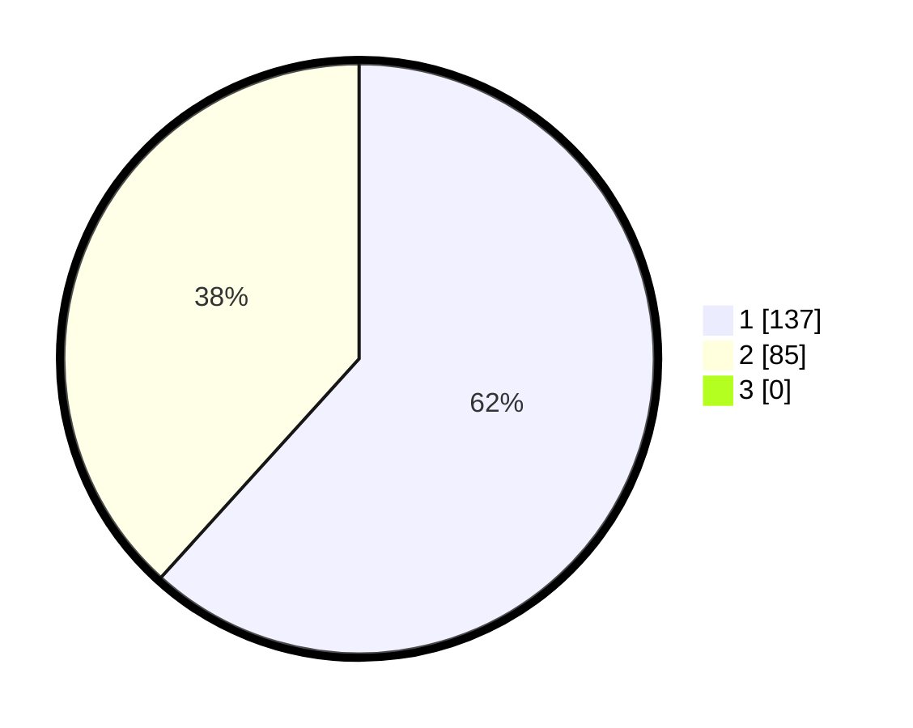

# Hasil

## Grafik

## Tabel

| No. | Nama Paslon    | Suara | Suara (raw) | Persentase |
|:--- |:-------------- | -----:| -----------:| ----------:|
| 1   | ANIES MUHAIMIN | 137   | [137][p-1]  | 61,71      |
| 2   | PRABOWO GIBRAN | 85    | [85][p-2]   | 38,29      |
| 3   | GANJAR MAHFUD  | 0     | [0][p-3]    | 0,00       |

[p-1]: https://github.com/gigit-pemilu/pemilu-2024/blob/main/pilpres/hitung-suara/sub/11-aceh/sub/02-aceh-tenggara/sub/07-darul-hasanah/sub/2007-mamas/sub/001-tps/sub/paslon-1.txt
[p-2]: https://github.com/gigit-pemilu/pemilu-2024/blob/main/pilpres/hitung-suara/sub/11-aceh/sub/02-aceh-tenggara/sub/07-darul-hasanah/sub/2007-mamas/sub/001-tps/sub/paslon-2.txt
[p-3]: https://github.com/gigit-pemilu/pemilu-2024/blob/main/pilpres/hitung-suara/sub/11-aceh/sub/02-aceh-tenggara/sub/07-darul-hasanah/sub/2007-mamas/sub/001-tps/sub/paslon-3.txt

## Foto C Plano

https://sirekap-obj-formc.kpu.go.id/bedf/pemilu/ppwp/11/02/07/20/07/1102072007001-20240215-082420--2cf57a3a-31c4-4810-b11e-188322e0783f.jpg

https://sirekap-obj-formc.kpu.go.id/bedf/pemilu/ppwp/11/02/07/20/07/1102072007001-20240215-082709--a116450a-9c0e-4e43-b24b-6ba5d7416314.jpg

https://sirekap-obj-formc.kpu.go.id/bedf/pemilu/ppwp/11/02/07/20/07/1102072007001-20240215-083017--33accd9e-036c-4cde-9176-81de9a906693.jpg

## Metadata

| Key        | Value               |
| ---------- | ------------------- |
| Time Stamp | 2024-02-24 22:31:28 |

