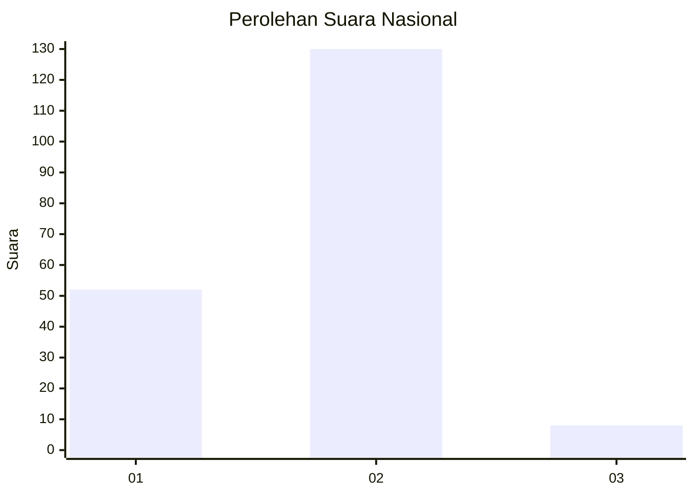
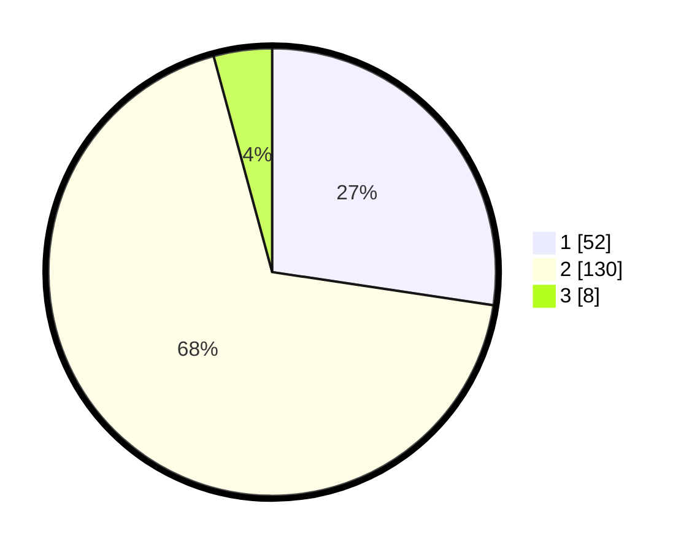

# Hasil

## Grafik

## Tabel

| No. | Nama Paslon    | Suara | Suara (raw) | Persentase |
|:--- |:-------------- | -----:| -----------:| ----------:|
| 1   | ANIES MUHAIMIN | 52    | [52][p-1]   | 27,37      |
| 2   | PRABOWO GIBRAN | 130   | [130][p-2]  | 68,42      |
| 3   | GANJAR MAHFUD  | 8     | [8][p-3]    | 4,21       |

[p-1]: https://github.com/gigit-pemilu/pemilu-2024/blob/main/pilpres/hitung-suara/sub/11-aceh/sub/02-aceh-tenggara/sub/07-darul-hasanah/sub/2010-rambung-teldak/sub/002-tps/sub/paslon-1.txt
[p-2]: https://github.com/gigit-pemilu/pemilu-2024/blob/main/pilpres/hitung-suara/sub/11-aceh/sub/02-aceh-tenggara/sub/07-darul-hasanah/sub/2010-rambung-teldak/sub/002-tps/sub/paslon-2.txt
[p-3]: https://github.com/gigit-pemilu/pemilu-2024/blob/main/pilpres/hitung-suara/sub/11-aceh/sub/02-aceh-tenggara/sub/07-darul-hasanah/sub/2010-rambung-teldak/sub/002-tps/sub/paslon-3.txt

## Foto C Plano

https://sirekap-obj-formc.kpu.go.id/5daa/pemilu/ppwp/11/02/07/20/10/1102072010002-20240215-144526--c42edf71-8ff8-417d-ac3a-8f95b4491763.jpg

https://sirekap-obj-formc.kpu.go.id/5daa/pemilu/ppwp/11/02/07/20/10/1102072010002-20240215-144719--ff0feb9e-d9dc-45b3-95b4-edc70082e5d5.jpg

https://sirekap-obj-formc.kpu.go.id/5daa/pemilu/ppwp/11/02/07/20/10/1102072010002-20240215-101105--813939d2-1c47-4c94-b8bb-516ed402c91e.jpg

## Metadata

| Key        | Value               |
| ---------- | ------------------- |
| Time Stamp | 2024-02-24 22:31:28 |

