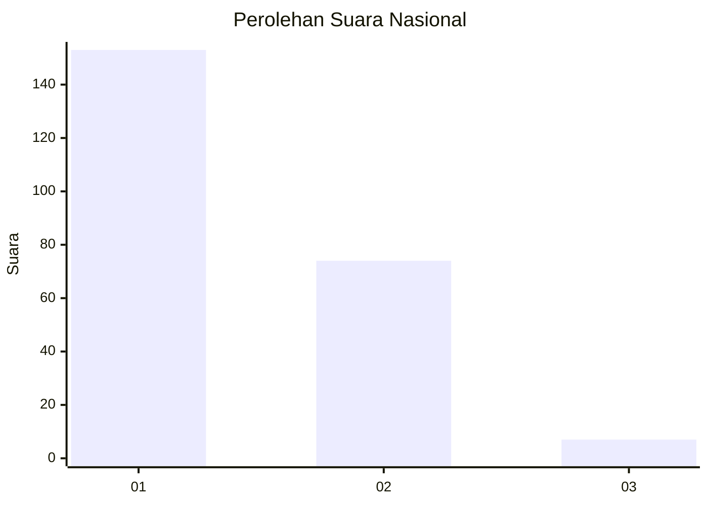
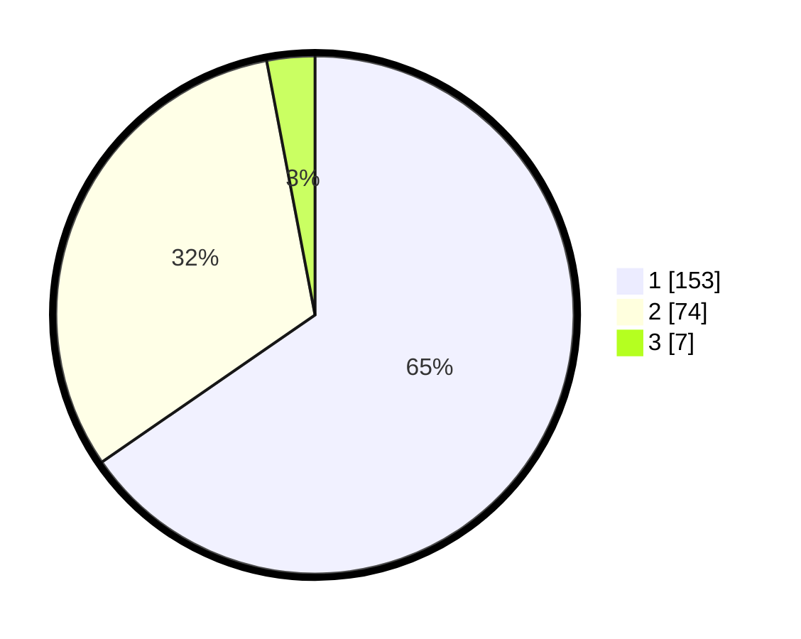

# Hasil

## Grafik

## Tabel

| No. | Nama Paslon    | Suara | Suara (raw) | Persentase |
|:--- |:-------------- | -----:| -----------:| ----------:|
| 1   | ANIES MUHAIMIN | 153   | [153][p-1]  | 65,38      |
| 2   | PRABOWO GIBRAN | 74    | [74][p-2]   | 31,62      |
| 3   | GANJAR MAHFUD  | 7     | [7][p-3]    | 2,99       |

[p-1]: https://github.com/gigit-pemilu/pemilu-2024/blob/main/pilpres/hitung-suara/sub/11-aceh/sub/02-aceh-tenggara/sub/07-darul-hasanah/sub/2013-ujung-baru/sub/001-tps/sub/paslon-1.txt
[p-2]: https://github.com/gigit-pemilu/pemilu-2024/blob/main/pilpres/hitung-suara/sub/11-aceh/sub/02-aceh-tenggara/sub/07-darul-hasanah/sub/2013-ujung-baru/sub/001-tps/sub/paslon-2.txt
[p-3]: https://github.com/gigit-pemilu/pemilu-2024/blob/main/pilpres/hitung-suara/sub/11-aceh/sub/02-aceh-tenggara/sub/07-darul-hasanah/sub/2013-ujung-baru/sub/001-tps/sub/paslon-3.txt

## Foto C Plano

https://sirekap-obj-formc.kpu.go.id/f97c/pemilu/ppwp/11/02/07/20/13/1102072013001-20240214-222141--67a54189-4c77-4512-9eaa-06938890570b.jpg

https://sirekap-obj-formc.kpu.go.id/f97c/pemilu/ppwp/11/02/07/20/13/1102072013001-20240214-222245--c33514dd-fa12-4084-9ade-0282093ac68d.jpg

https://sirekap-obj-formc.kpu.go.id/f97c/pemilu/ppwp/11/02/07/20/13/1102072013001-20240214-222000--488975f1-282b-4fd8-9fff-3128d51acce3.jpg

## Metadata

| Key        | Value               |
| ---------- | ------------------- |
| Time Stamp | 2024-02-25 11:00:00 |

