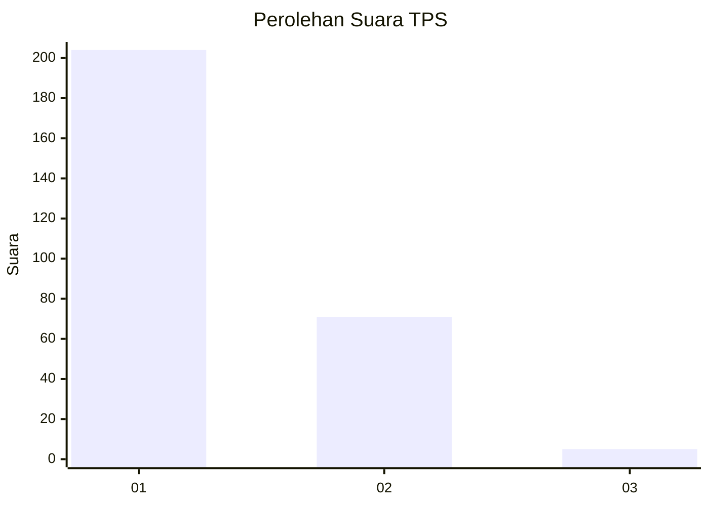
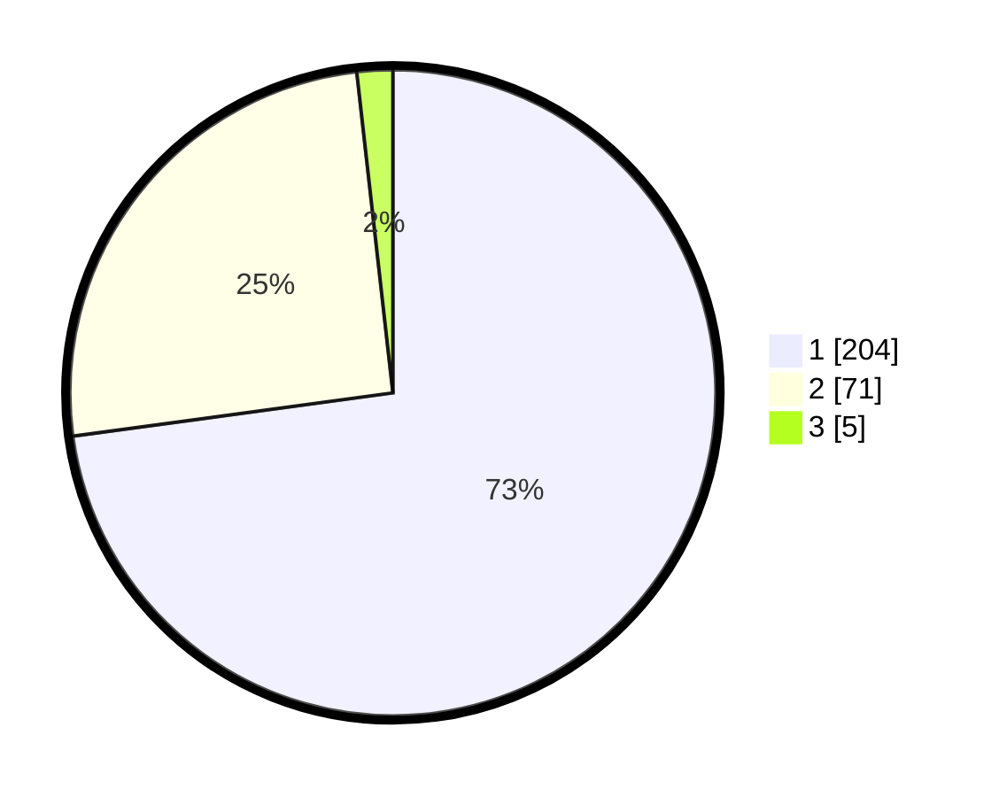

# Hasil

## Grafik

## Tabel

| No. | Nama Paslon    | Suara | Suara (raw) | Persentase |
|:--- |:-------------- | -----:| -----------:| ----------:|
| 1   | ANIES MUHAIMIN | 204   | [204][p-1]  | 72,86      |
| 2   | PRABOWO GIBRAN | 71    | [71][p-2]   | 25,36      |
| 3   | GANJAR MAHFUD  | 5     | [5][p-3]    | 1,79       |

[p-1]: https://github.com/gigit-pemilu/pemilu-2024-11-aceh/blob/main/pilpres/hitung-suara/sub/11-aceh/sub/02-aceh-tenggara/sub/07-darul-hasanah/sub/2014-kute-rambe/sub/002-tps/sub/paslon-1.txt
[p-2]: https://github.com/gigit-pemilu/pemilu-2024-11-aceh/blob/main/pilpres/hitung-suara/sub/11-aceh/sub/02-aceh-tenggara/sub/07-darul-hasanah/sub/2014-kute-rambe/sub/002-tps/sub/paslon-2.txt
[p-3]: https://github.com/gigit-pemilu/pemilu-2024-11-aceh/blob/main/pilpres/hitung-suara/sub/11-aceh/sub/02-aceh-tenggara/sub/07-darul-hasanah/sub/2014-kute-rambe/sub/002-tps/sub/paslon-3.txt

## Foto C Plano

https://sirekap-obj-formc.kpu.go.id/fb3b/pemilu/ppwp/11/02/07/20/14/1102072014002-20240215-083940--8e749b24-82b3-4c63-80a4-5904a155fbf5.jpg

https://sirekap-obj-formc.kpu.go.id/fb3b/pemilu/ppwp/11/02/07/20/14/1102072014002-20240215-084308--e8dcf6e0-4cc5-4241-aa14-d0ce950bca64.jpg

https://sirekap-obj-formc.kpu.go.id/fb3b/pemilu/ppwp/11/02/07/20/14/1102072014002-20240215-084513--eacf0547-83d6-4503-a28c-727302e46151.jpg

## Metadata

| Key        | Value               |
| ---------- | ------------------- |
| Time Stamp | 2024-02-15 21:30:27 |

