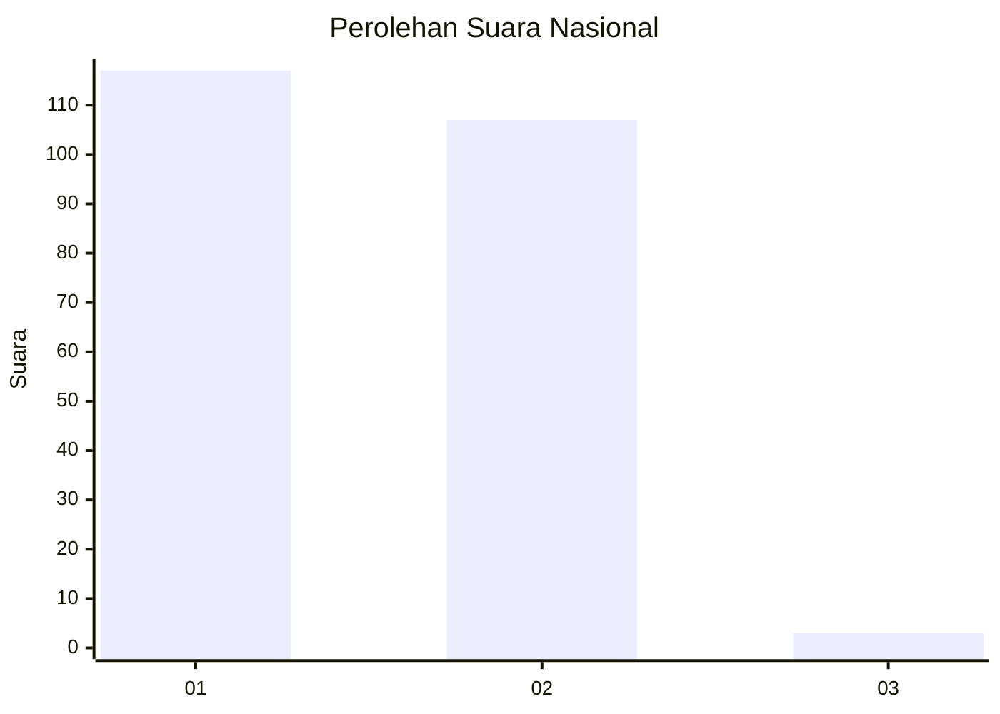
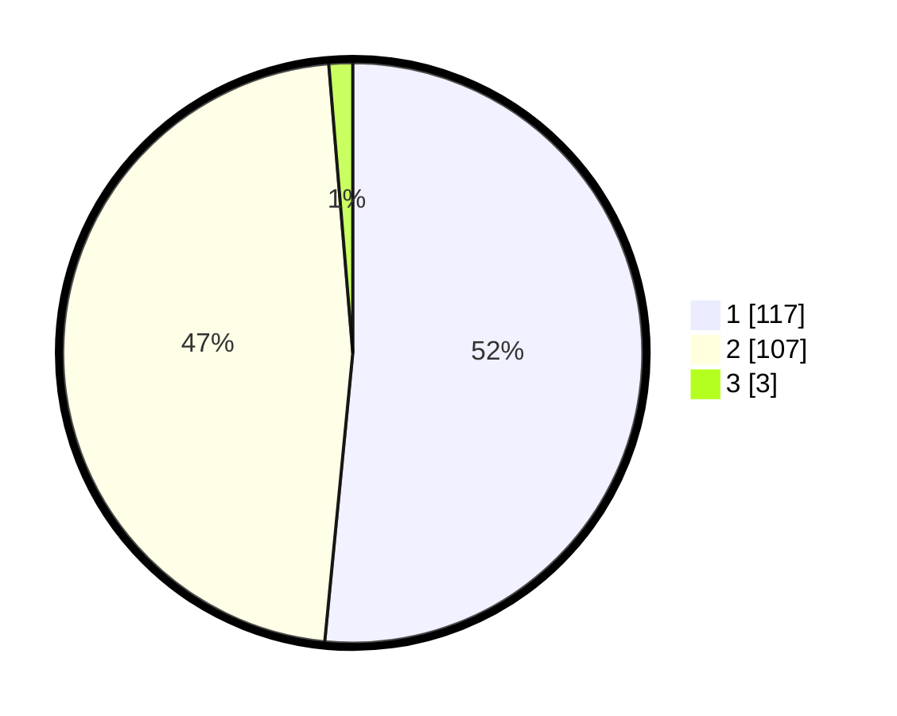

# Hasil

## Grafik

## Tabel

| No. | Nama Paslon    | Suara | Suara (raw) | Persentase |
|:--- |:-------------- | -----:| -----------:| ----------:|
| 1   | ANIES MUHAIMIN | 117   | [117][p-1]  | 51,54      |
| 2   | PRABOWO GIBRAN | 107   | [107][p-2]  | 47,14      |
| 3   | GANJAR MAHFUD  | 3     | [3][p-3]    | 1,32       |

[p-1]: https://github.com/gigit-pemilu/pemilu-2024/blob/main/pilpres/hitung-suara/sub/11-aceh/sub/02-aceh-tenggara/sub/07-darul-hasanah/sub/2015-mamas-baru/sub/002-tps/sub/paslon-1.txt
[p-2]: https://github.com/gigit-pemilu/pemilu-2024/blob/main/pilpres/hitung-suara/sub/11-aceh/sub/02-aceh-tenggara/sub/07-darul-hasanah/sub/2015-mamas-baru/sub/002-tps/sub/paslon-2.txt
[p-3]: https://github.com/gigit-pemilu/pemilu-2024/blob/main/pilpres/hitung-suara/sub/11-aceh/sub/02-aceh-tenggara/sub/07-darul-hasanah/sub/2015-mamas-baru/sub/002-tps/sub/paslon-3.txt

## Foto C Plano

https://sirekap-obj-formc.kpu.go.id/bfc8/pemilu/ppwp/11/02/07/20/15/1102072015002-20240215-142120--f563e9d2-dce0-4305-a089-9dec66a512e6.jpg

https://sirekap-obj-formc.kpu.go.id/bfc8/pemilu/ppwp/11/02/07/20/15/1102072015002-20240215-165746--95ab25b3-1c17-47e8-b75a-295fed1238c7.jpg

https://sirekap-obj-formc.kpu.go.id/bfc8/pemilu/ppwp/11/02/07/20/15/1102072015002-20240215-151023--c9c3b491-a7e0-4c11-8560-4b6c1db9ecb3.jpg

## Metadata

| Key        | Value               |
| ---------- | ------------------- |
| Time Stamp | 2024-02-15 21:30:27 |

