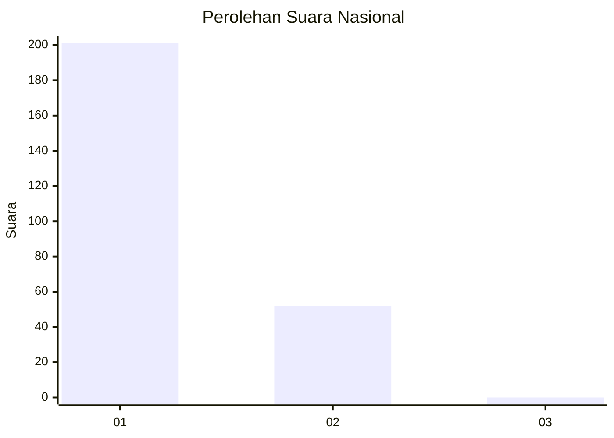
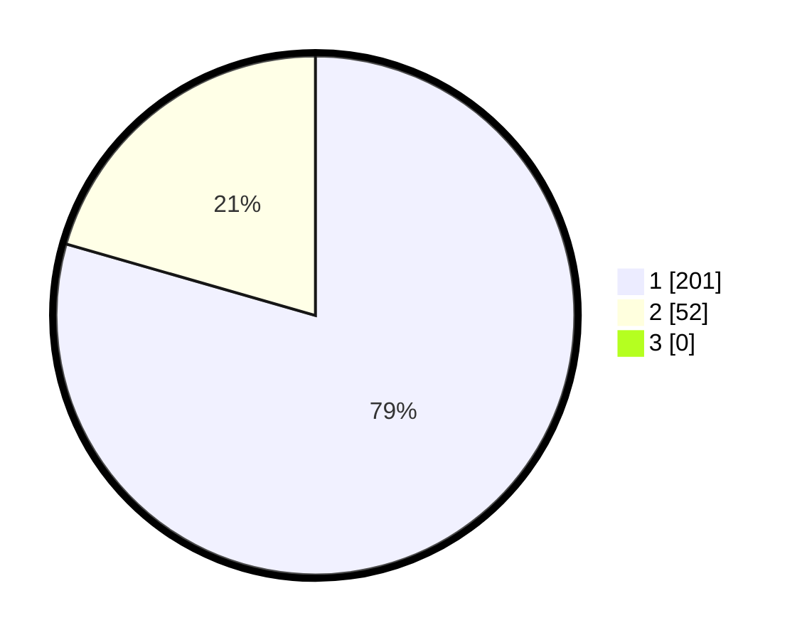

# Hasil

## Grafik

## Tabel

| No. | Nama Paslon    | Suara | Suara (raw) | Persentase |
|:--- |:-------------- | -----:| -----------:| ----------:|
| 1   | ANIES MUHAIMIN | 201   | [201][p-1]  | 79,45      |
| 2   | PRABOWO GIBRAN | 52    | [52][p-2]   | 20,55      |
| 3   | GANJAR MAHFUD  | 0     | [0][p-3]    | 0,00       |

[p-1]: https://github.com/gigit-pemilu/pemilu-2024/blob/main/pilpres/hitung-suara/sub/11-aceh/sub/02-aceh-tenggara/sub/07-darul-hasanah/sub/2018-darul-makmur/sub/001-tps/sub/paslon-1.txt
[p-2]: https://github.com/gigit-pemilu/pemilu-2024/blob/main/pilpres/hitung-suara/sub/11-aceh/sub/02-aceh-tenggara/sub/07-darul-hasanah/sub/2018-darul-makmur/sub/001-tps/sub/paslon-2.txt
[p-3]: https://github.com/gigit-pemilu/pemilu-2024/blob/main/pilpres/hitung-suara/sub/11-aceh/sub/02-aceh-tenggara/sub/07-darul-hasanah/sub/2018-darul-makmur/sub/001-tps/sub/paslon-3.txt

## Foto C Plano

https://sirekap-obj-formc.kpu.go.id/b4f4/pemilu/ppwp/11/02/07/20/18/1102072018001-20240215-035225--69d3db32-c3b5-41c2-99c4-f77c02991536.jpg

https://sirekap-obj-formc.kpu.go.id/b4f4/pemilu/ppwp/11/02/07/20/18/1102072018001-20240215-035357--3873af21-1dab-4951-9f51-bb5beb9cb535.jpg

https://sirekap-obj-formc.kpu.go.id/b4f4/pemilu/ppwp/11/02/07/20/18/1102072018001-20240215-035529--7ca6f93e-9cdc-41a9-8cb1-1c696bbd96ef.jpg

## Metadata

| Key        | Value               |
| ---------- | ------------------- |
| Time Stamp | 2024-02-15 15:00:29 |

