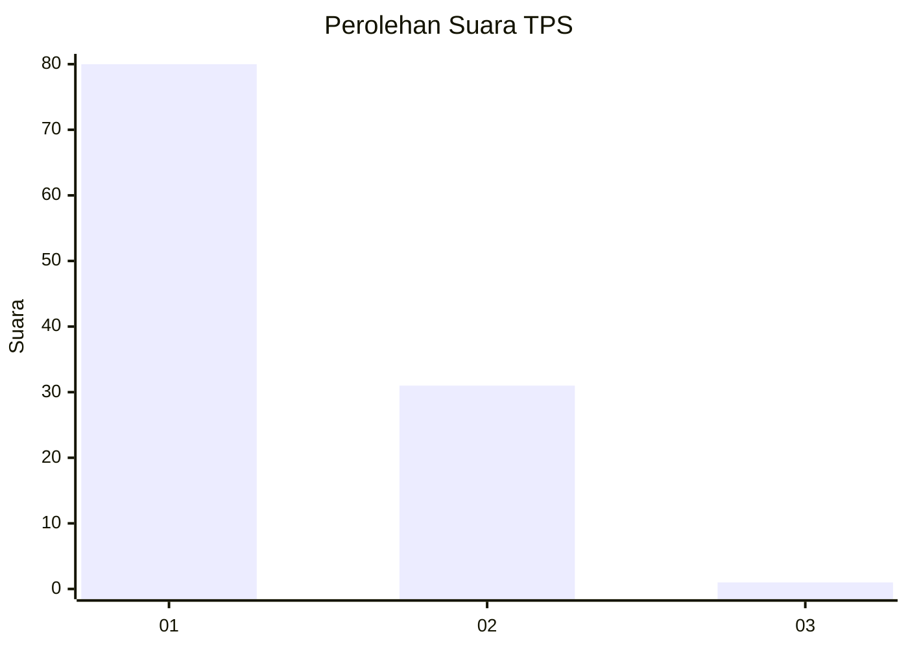
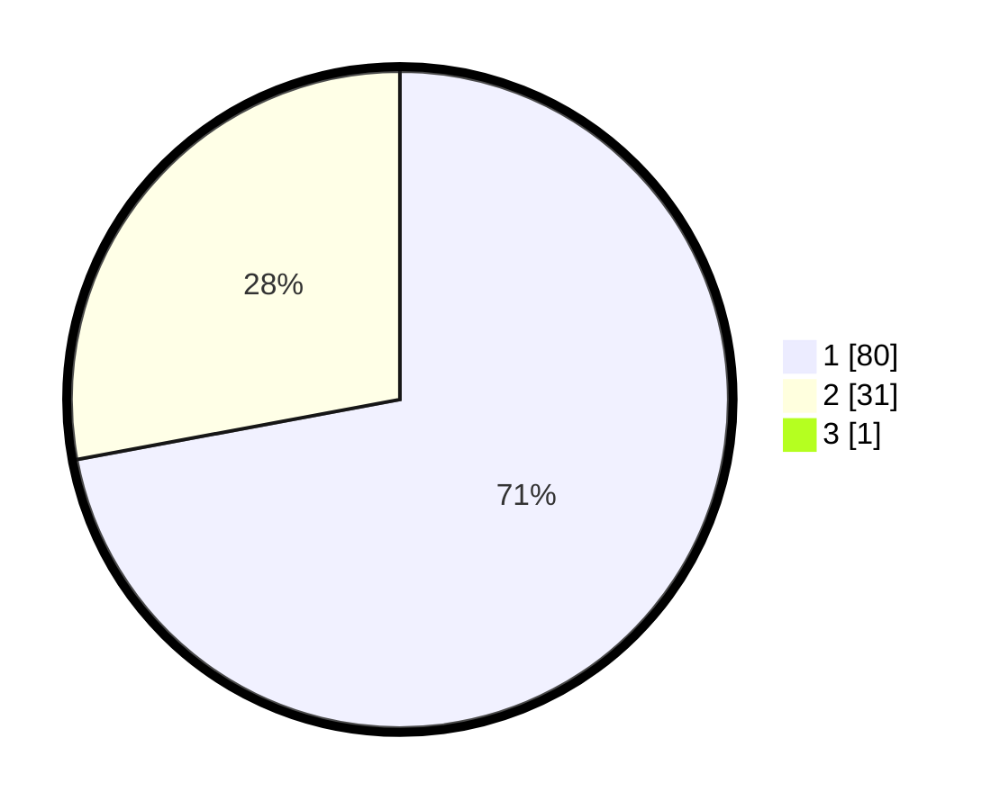

# Hasil

## Grafik

## Tabel

| No. | Nama Paslon    | Suara | Suara (raw) | Persentase |
|:--- |:-------------- | -----:| -----------:| ----------:|
| 1   | ANIES MUHAIMIN | 80    | [80][p-1]   | 71,43      |
| 2   | PRABOWO GIBRAN | 31    | [31][p-2]   | 27,68      |
| 3   | GANJAR MAHFUD  | 1     | [1][p-3]    | 0,89       |

[p-1]: https://github.com/gigit-pemilu/pemilu-2024-11-aceh/blob/main/pilpres/hitung-suara/sub/11-aceh/sub/02-aceh-tenggara/sub/07-darul-hasanah/sub/2021-kokhtan-jaya/sub/002-tps/sub/paslon-1.txt
[p-2]: https://github.com/gigit-pemilu/pemilu-2024-11-aceh/blob/main/pilpres/hitung-suara/sub/11-aceh/sub/02-aceh-tenggara/sub/07-darul-hasanah/sub/2021-kokhtan-jaya/sub/002-tps/sub/paslon-2.txt
[p-3]: https://github.com/gigit-pemilu/pemilu-2024-11-aceh/blob/main/pilpres/hitung-suara/sub/11-aceh/sub/02-aceh-tenggara/sub/07-darul-hasanah/sub/2021-kokhtan-jaya/sub/002-tps/sub/paslon-3.txt

## Foto C Plano

https://sirekap-obj-formc.kpu.go.id/2237/pemilu/ppwp/11/02/07/20/21/1102072021002-20240216-155451--00c67ac1-fd84-431c-b27f-39e0dc8f33f0.jpg

https://sirekap-obj-formc.kpu.go.id/2237/pemilu/ppwp/11/02/07/20/21/1102072021002-20240216-155518--718c0204-517c-4727-b7bf-ec3058209506.jpg

https://sirekap-obj-formc.kpu.go.id/2237/pemilu/ppwp/11/02/07/20/21/1102072021002-20240216-155539--eab9660f-ad1e-4b30-a35b-26114d8336c8.jpg

## Metadata

| Key        | Value               |
| ---------- | ------------------- |
| Time Stamp | 2024-02-19 06:16:00 |

## DATA PEMILIH TETAP

Jumlah pemilih dalam DPT: **129**.
 * L: **68**.
 * P: **61**.

## DATA PENGGUNA HAK PILIH

Jumlah pengguna hak pilih dalam DPT: **114**.
 * L: **58**.
 * P: **56**.

Jumlah pengguna hak pilih dalam DPTb: **1**.
 * L: **0**.
 * P: **1**.

Jumlah pengguna hak pilih dalam DPK: **20**.
 * L: **0**.
 * P: **5**.

Jumlah pengguna hak pilih: **114**.
 * L: **68**.
 * P: **61**.

## JUMLAH SUARA SAH DAN TIDAK SAH

JUMLAH SELURUH SUARA SAH: **112**.

JUMLAH SUARA TIDAK SAH: **2**.

JUMLAH SELURUH SUARA SAH DAN SUARA TIDAK SAH: **114**.

