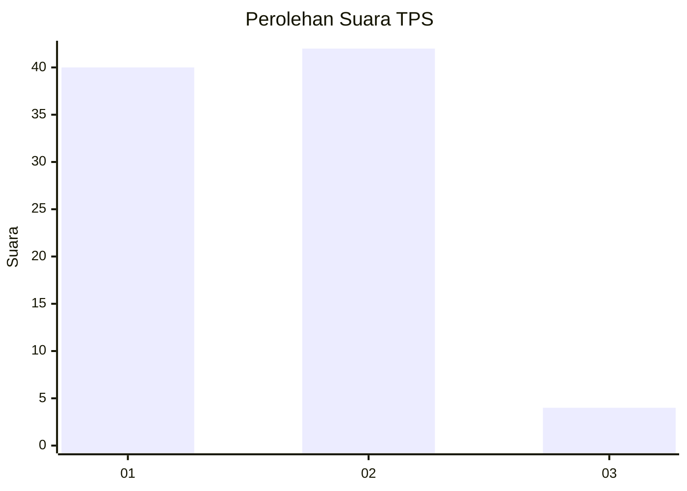
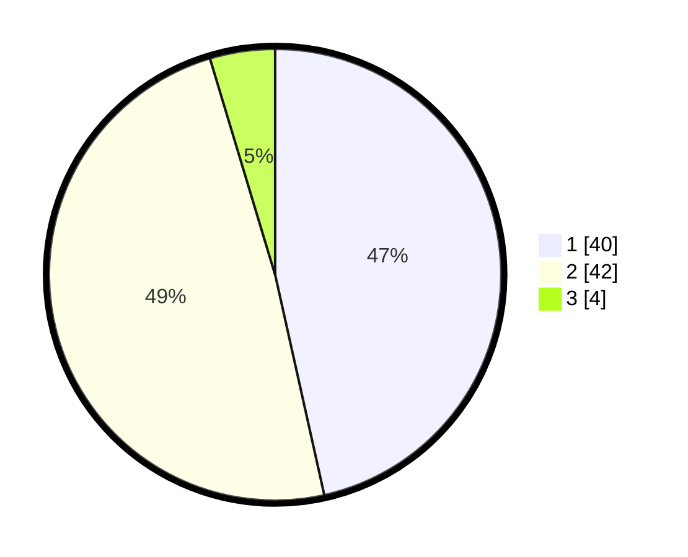

# Hasil

## Grafik

## Tabel

| No. | Nama Paslon    | Suara | Suara (raw) | Persentase |
|:--- |:-------------- | -----:| -----------:| ----------:|
| 1   | ANIES MUHAIMIN | 40    | [40][p-1]   | 46,51      |
| 2   | PRABOWO GIBRAN | 42    | [42][p-2]   | 48,84      |
| 3   | GANJAR MAHFUD  | 4     | [4][p-3]    | 4,65       |

[p-1]: https://github.com/gigit-pemilu/pemilu-2024-11-aceh/blob/main/pilpres/hitung-suara/sub/11-aceh/sub/02-aceh-tenggara/sub/07-darul-hasanah/sub/2022-istiqamah/sub/002-tps/sub/paslon-1.txt
[p-2]: https://github.com/gigit-pemilu/pemilu-2024-11-aceh/blob/main/pilpres/hitung-suara/sub/11-aceh/sub/02-aceh-tenggara/sub/07-darul-hasanah/sub/2022-istiqamah/sub/002-tps/sub/paslon-2.txt
[p-3]: https://github.com/gigit-pemilu/pemilu-2024-11-aceh/blob/main/pilpres/hitung-suara/sub/11-aceh/sub/02-aceh-tenggara/sub/07-darul-hasanah/sub/2022-istiqamah/sub/002-tps/sub/paslon-3.txt

## Foto C Plano

https://sirekap-obj-formc.kpu.go.id/6f97/pemilu/ppwp/11/02/07/20/22/1102072022002-20240220-212728--17b22a9b-e050-4234-b382-6bf9893f8829.jpg

https://sirekap-obj-formc.kpu.go.id/6f97/pemilu/ppwp/11/02/07/20/22/1102072022002-20240220-213221--1c50ee11-7338-4fd6-b724-6cb7f2da36bf.jpg

https://sirekap-obj-formc.kpu.go.id/6f97/pemilu/ppwp/11/02/07/20/22/1102072022002-20240220-212850--4e6f70b7-db13-4220-864c-d9e25eb67c97.jpg

## Metadata

| Key        | Value               |
| ---------- | ------------------- |
| Time Stamp | 2024-02-24 22:31:28 |

