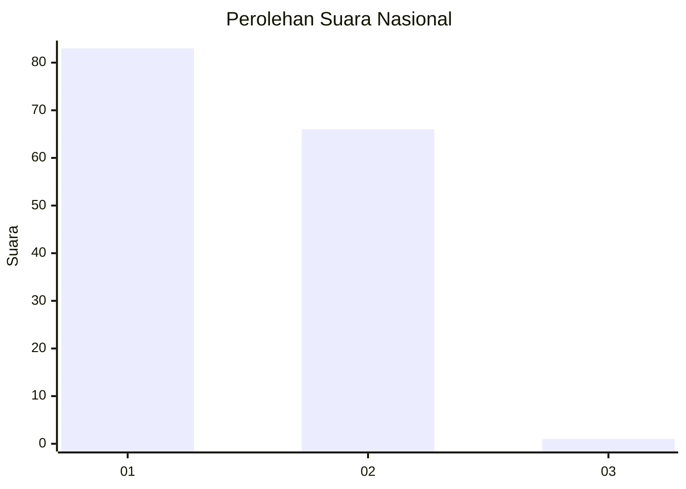
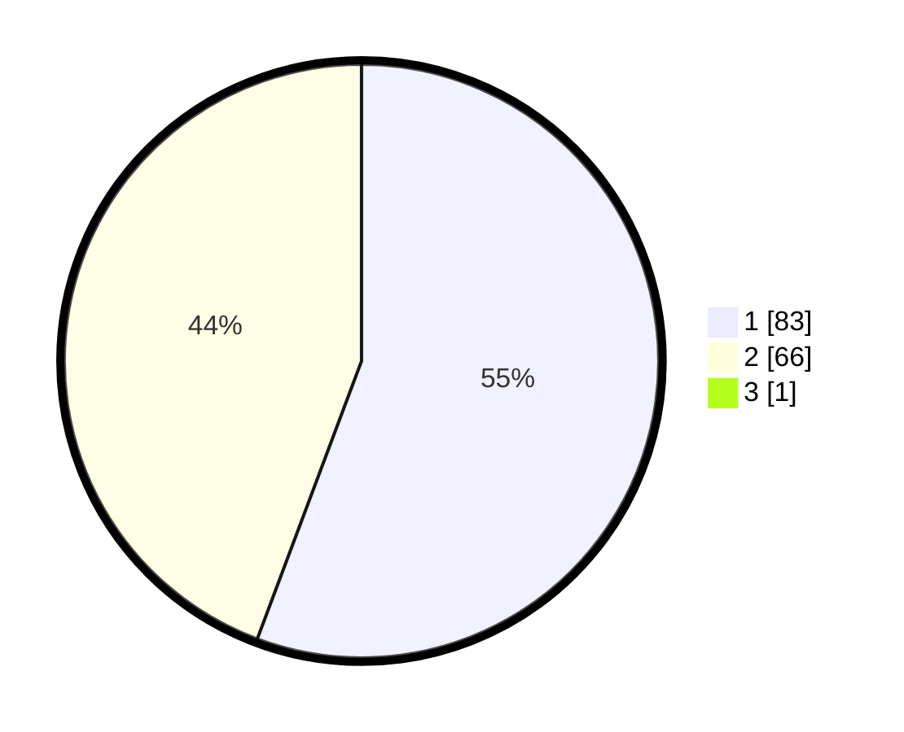

# Hasil

## Grafik

## Tabel

| No. | Nama Paslon    | Suara | Suara (raw) | Persentase |
|:--- |:-------------- | -----:| -----------:| ----------:|
| 1   | ANIES MUHAIMIN | 83    | [83][p-1]   | 55,33      |
| 2   | PRABOWO GIBRAN | 66    | [66][p-2]   | 44,00      |
| 3   | GANJAR MAHFUD  | 1     | [1][p-3]    | 0,67       |

[p-1]: https://github.com/gigit-pemilu/pemilu-2024/blob/main/pilpres/hitung-suara/sub/11-aceh/sub/02-aceh-tenggara/sub/07-darul-hasanah/sub/2023-lawe-mamas-indah/sub/001-tps/sub/paslon-1.txt
[p-2]: https://github.com/gigit-pemilu/pemilu-2024/blob/main/pilpres/hitung-suara/sub/11-aceh/sub/02-aceh-tenggara/sub/07-darul-hasanah/sub/2023-lawe-mamas-indah/sub/001-tps/sub/paslon-2.txt
[p-3]: https://github.com/gigit-pemilu/pemilu-2024/blob/main/pilpres/hitung-suara/sub/11-aceh/sub/02-aceh-tenggara/sub/07-darul-hasanah/sub/2023-lawe-mamas-indah/sub/001-tps/sub/paslon-3.txt

## Foto C Plano

https://sirekap-obj-formc.kpu.go.id/4acd/pemilu/ppwp/11/02/07/20/23/1102072023001-20240216-210047--1abb88d7-8264-472e-bbf3-c62e80935679.jpg

https://sirekap-obj-formc.kpu.go.id/4acd/pemilu/ppwp/11/02/07/20/23/1102072023001-20240215-040917--551542f0-1877-497d-89f7-df5b4c4d28a5.jpg

https://sirekap-obj-formc.kpu.go.id/4acd/pemilu/ppwp/11/02/07/20/23/1102072023001-20240215-043428--41270465-130b-4b45-8893-dbf28a08f200.jpg

## Metadata

| Key        | Value               |
| ---------- | ------------------- |
| Time Stamp | 2024-02-16 22:01:00 |

