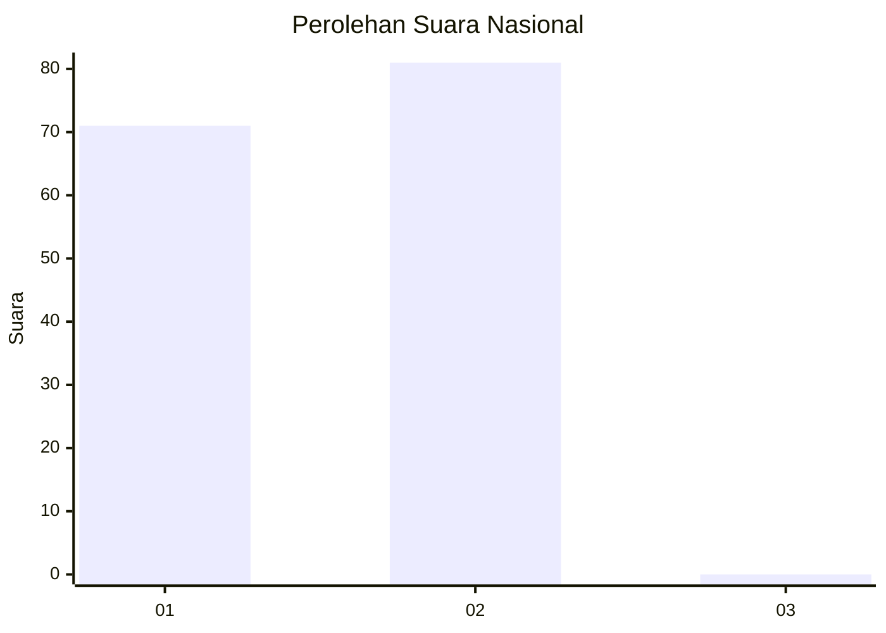
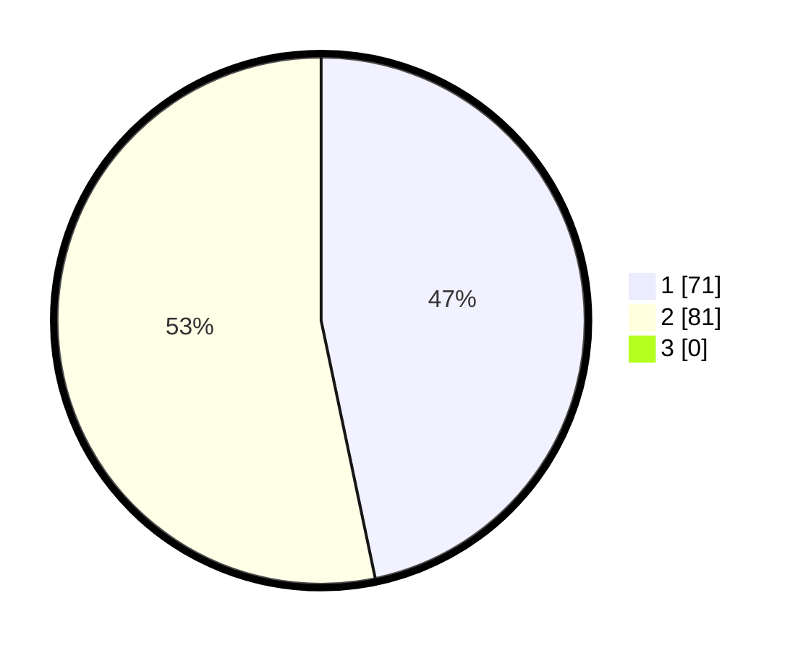

# Hasil

## Grafik

## Tabel

| No. | Nama Paslon    | Suara | Suara (raw) | Persentase |
|:--- |:-------------- | -----:| -----------:| ----------:|
| 1   | ANIES MUHAIMIN | 71    | [71][p-1]   | 46,71      |
| 2   | PRABOWO GIBRAN | 81    | [81][p-2]   | 53,29      |
| 3   | GANJAR MAHFUD  | 0     | [0][p-3]    | 0,00       |

[p-1]: https://github.com/gigit-pemilu/pemilu-2024/blob/main/pilpres/hitung-suara/sub/11-aceh/sub/02-aceh-tenggara/sub/07-darul-hasanah/sub/2023-lawe-mamas-indah/sub/002-tps/sub/paslon-1.txt
[p-2]: https://github.com/gigit-pemilu/pemilu-2024/blob/main/pilpres/hitung-suara/sub/11-aceh/sub/02-aceh-tenggara/sub/07-darul-hasanah/sub/2023-lawe-mamas-indah/sub/002-tps/sub/paslon-2.txt
[p-3]: https://github.com/gigit-pemilu/pemilu-2024/blob/main/pilpres/hitung-suara/sub/11-aceh/sub/02-aceh-tenggara/sub/07-darul-hasanah/sub/2023-lawe-mamas-indah/sub/002-tps/sub/paslon-3.txt

## Foto C Plano

https://sirekap-obj-formc.kpu.go.id/dacb/pemilu/ppwp/11/02/07/20/23/1102072023002-20240215-014635--b0a5896c-4d20-4eb3-a9de-562d8542f088.jpg

https://sirekap-obj-formc.kpu.go.id/dacb/pemilu/ppwp/11/02/07/20/23/1102072023002-20240215-020113--60fa43b8-2144-4e85-ad5d-00ae749ddde2.jpg

https://sirekap-obj-formc.kpu.go.id/dacb/pemilu/ppwp/11/02/07/20/23/1102072023002-20240215-023139--d277a2e0-866d-4655-94fe-c9d7cdcc18f8.jpg

## Metadata

| Key        | Value               |
| ---------- | ------------------- |
| Time Stamp | 2024-02-24 22:31:28 |

