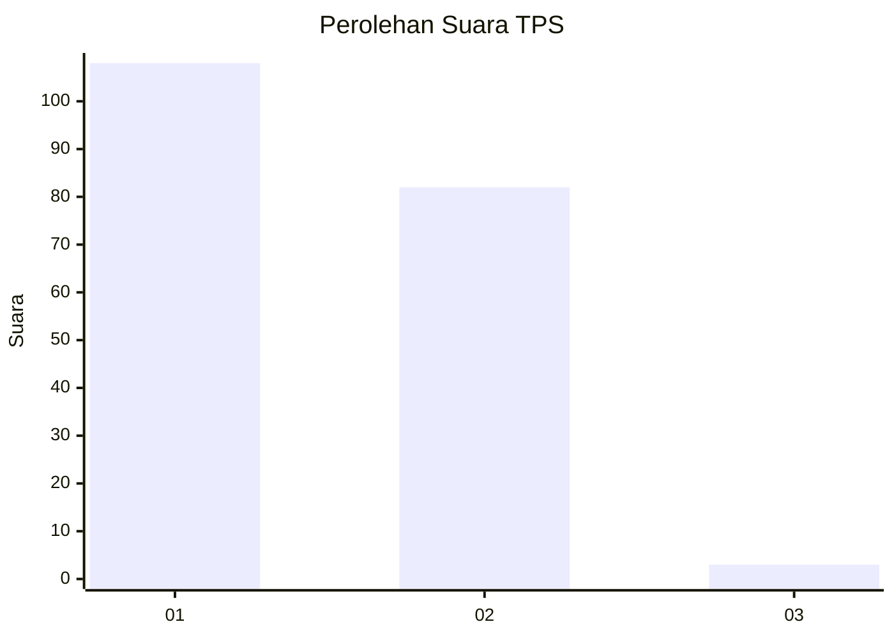
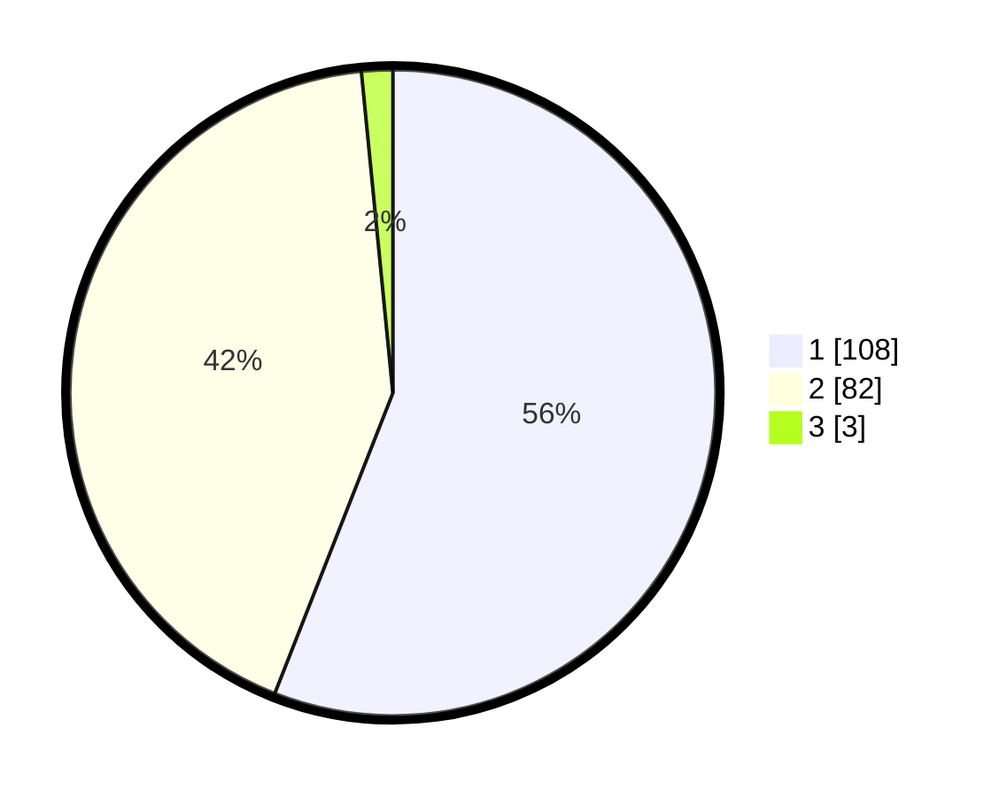

# Hasil

## Grafik

## Tabel

| No. | Nama Paslon    | Suara | Suara (raw) | Persentase |
|:--- |:-------------- | -----:| -----------:| ----------:|
| 1   | ANIES MUHAIMIN | 108   | [108][p-1]  | 55,96      |
| 2   | PRABOWO GIBRAN | 82    | [82][p-2]   | 42,49      |
| 3   | GANJAR MAHFUD  | 3     | [3][p-3]    | 1,55       |

[p-1]: https://github.com/gigit-pemilu/pemilu-2024-11-aceh/blob/main/pilpres/hitung-suara/sub/11-aceh/sub/02-aceh-tenggara/sub/07-darul-hasanah/sub/2026-lawe-pinis/sub/001-tps/sub/paslon-1.txt
[p-2]: https://github.com/gigit-pemilu/pemilu-2024-11-aceh/blob/main/pilpres/hitung-suara/sub/11-aceh/sub/02-aceh-tenggara/sub/07-darul-hasanah/sub/2026-lawe-pinis/sub/001-tps/sub/paslon-2.txt
[p-3]: https://github.com/gigit-pemilu/pemilu-2024-11-aceh/blob/main/pilpres/hitung-suara/sub/11-aceh/sub/02-aceh-tenggara/sub/07-darul-hasanah/sub/2026-lawe-pinis/sub/001-tps/sub/paslon-3.txt

## Foto C Plano

https://sirekap-obj-formc.kpu.go.id/11cd/pemilu/ppwp/11/02/07/20/26/1102072026001-20240215-104231--642fed36-9be3-4819-a816-191d22a5bc6a.jpg

https://sirekap-obj-formc.kpu.go.id/11cd/pemilu/ppwp/11/02/07/20/26/1102072026001-20240215-104327--ea8daa6e-fe53-4325-8d77-9bfc68011988.jpg

https://sirekap-obj-formc.kpu.go.id/11cd/pemilu/ppwp/11/02/07/20/26/1102072026001-20240215-104507--568357c9-f5da-43f2-b3dc-343ed328868e.jpg

## Metadata

| Key        | Value               |
| ---------- | ------------------- |
| Time Stamp | 2024-02-28 19:00:00 |

## DATA PEMILIH TETAP

Jumlah pemilih dalam DPT: **125**.
 * L: **114**.
 * P: **111**.

## DATA PENGGUNA HAK PILIH

Jumlah pengguna hak pilih dalam DPT: **196**.
 * L: **99**.
 * P: **97**.

Jumlah pengguna hak pilih dalam DPTb: **0**.
 * L: **0**.
 * P: **0**.

Jumlah pengguna hak pilih dalam DPK: **2**.
 * L: **1**.
 * P: **1**.

Jumlah pengguna hak pilih: **198**.
 * L: **100**.
 * P: **98**.

## JUMLAH SUARA SAH DAN TIDAK SAH

JUMLAH SELURUH SUARA SAH: **193**.

JUMLAH SUARA TIDAK SAH: **5**.

JUMLAH SELURUH SUARA SAH DAN SUARA TIDAK SAH: **198**.

