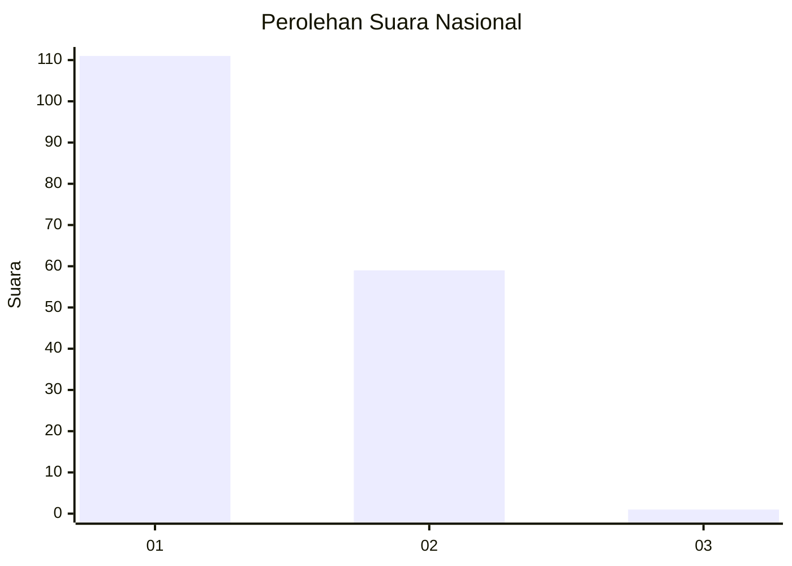
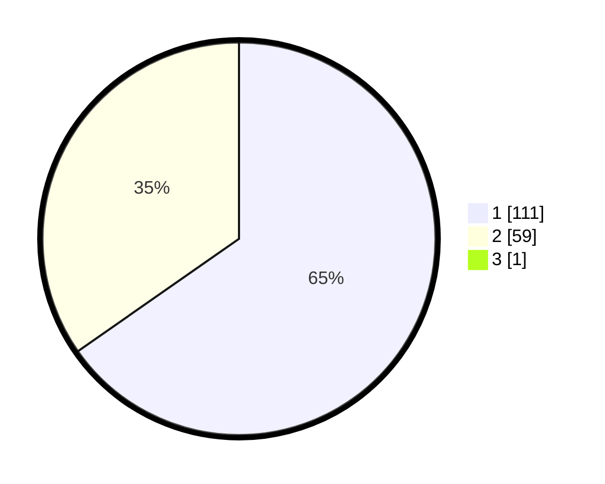

# Hasil

## Grafik

## Tabel

| No. | Nama Paslon    | Suara | Suara (raw) | Persentase |
|:--- |:-------------- | -----:| -----------:| ----------:|
| 1   | ANIES MUHAIMIN | 111   | [111][p-1]  | 64,91      |
| 2   | PRABOWO GIBRAN | 59    | [59][p-2]   | 34,50      |
| 3   | GANJAR MAHFUD  | 1     | [1][p-3]    | 0,58       |

[p-1]: https://github.com/gigit-pemilu/pemilu-2024/blob/main/pilpres/hitung-suara/sub/11-aceh/sub/02-aceh-tenggara/sub/08-lawe-bulan/sub/2001-pasir-gala/sub/001-tps/sub/paslon-1.txt
[p-2]: https://github.com/gigit-pemilu/pemilu-2024/blob/main/pilpres/hitung-suara/sub/11-aceh/sub/02-aceh-tenggara/sub/08-lawe-bulan/sub/2001-pasir-gala/sub/001-tps/sub/paslon-2.txt
[p-3]: https://github.com/gigit-pemilu/pemilu-2024/blob/main/pilpres/hitung-suara/sub/11-aceh/sub/02-aceh-tenggara/sub/08-lawe-bulan/sub/2001-pasir-gala/sub/001-tps/sub/paslon-3.txt

## Foto C Plano

https://sirekap-obj-formc.kpu.go.id/f128/pemilu/ppwp/11/02/08/20/01/1102082001001-20240214-231305--8ee00881-b89d-43cf-8a50-5aebf3331a9c.jpg

https://sirekap-obj-formc.kpu.go.id/f128/pemilu/ppwp/11/02/08/20/01/1102082001001-20240214-231400--82665daf-f404-4041-8ceb-2ad5a850bc54.jpg

https://sirekap-obj-formc.kpu.go.id/f128/pemilu/ppwp/11/02/08/20/01/1102082001001-20240214-231520--2a1dc078-1c14-4ef3-8ff4-d08fcca6600f.jpg

## Metadata

| Key        | Value               |
| ---------- | ------------------- |
| Time Stamp | 2024-02-15 18:00:26 |

