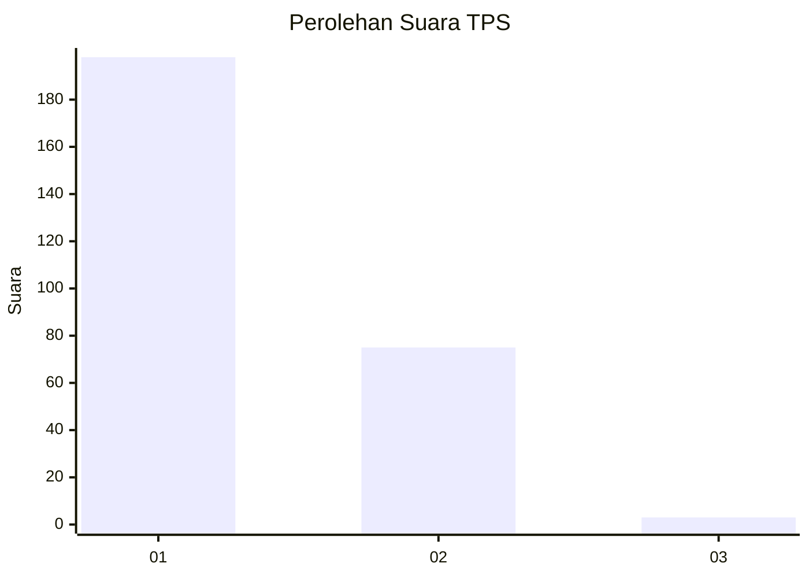
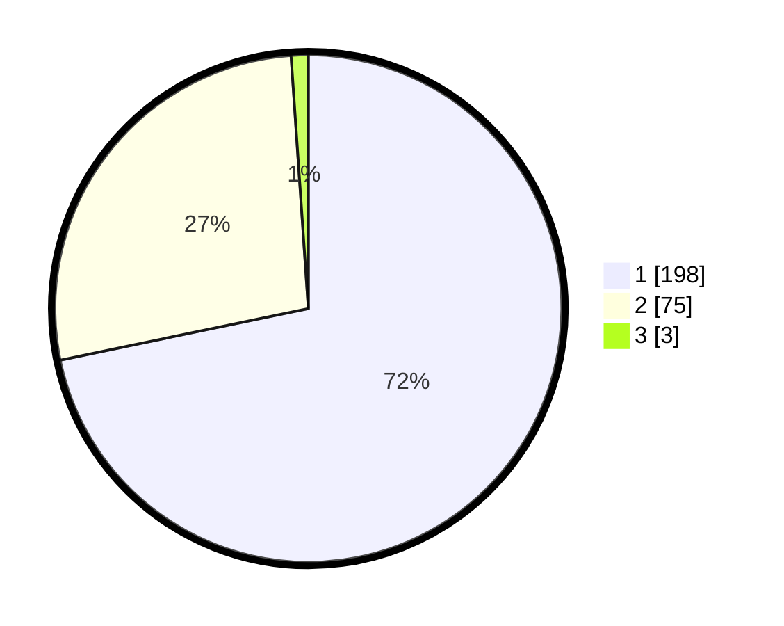

# Hasil

## Grafik

## Tabel

| No. | Nama Paslon    | Suara | Suara (raw) | Persentase |
|:--- |:-------------- | -----:| -----------:| ----------:|
| 1   | ANIES MUHAIMIN | 198   | [198][p-1]  | 71,74      |
| 2   | PRABOWO GIBRAN | 75    | [75][p-2]   | 27,17      |
| 3   | GANJAR MAHFUD  | 3     | [3][p-3]    | 1,09       |

[p-1]: https://github.com/gigit-pemilu/pemilu-2024-11-aceh/blob/main/pilpres/hitung-suara/sub/11-aceh/sub/02-aceh-tenggara/sub/08-lawe-bulan/sub/2001-pasir-gala/sub/002-tps/sub/paslon-1.txt
[p-2]: https://github.com/gigit-pemilu/pemilu-2024-11-aceh/blob/main/pilpres/hitung-suara/sub/11-aceh/sub/02-aceh-tenggara/sub/08-lawe-bulan/sub/2001-pasir-gala/sub/002-tps/sub/paslon-2.txt
[p-3]: https://github.com/gigit-pemilu/pemilu-2024-11-aceh/blob/main/pilpres/hitung-suara/sub/11-aceh/sub/02-aceh-tenggara/sub/08-lawe-bulan/sub/2001-pasir-gala/sub/002-tps/sub/paslon-3.txt

## Foto C Plano

https://sirekap-obj-formc.kpu.go.id/b226/pemilu/ppwp/11/02/08/20/01/1102082001002-20240221-114903--897ee9ef-97a8-45a0-a519-735391372837.jpg

https://sirekap-obj-formc.kpu.go.id/b226/pemilu/ppwp/11/02/08/20/01/1102082001002-20240221-115048--84099902-8472-4b64-984a-e87703ece53b.jpg

https://sirekap-obj-formc.kpu.go.id/b226/pemilu/ppwp/11/02/08/20/01/1102082001002-20240221-115334--2708ecd4-2301-4f69-953c-02e394ea2d4d.jpg

## Metadata

| Key        | Value               |
| ---------- | ------------------- |
| Time Stamp | 2024-02-25 11:00:00 |

