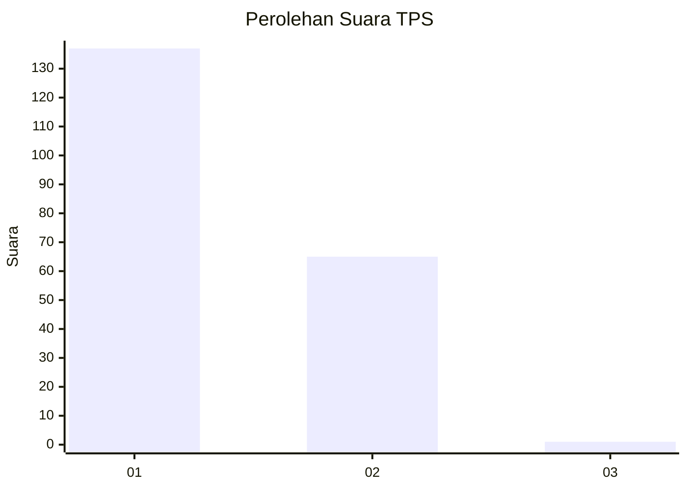
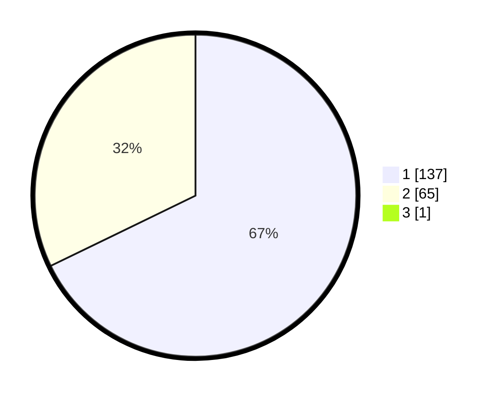

# Hasil

## Grafik

## Tabel

| No. | Nama Paslon    | Suara | Suara (raw) | Persentase |
|:--- |:-------------- | -----:| -----------:| ----------:|
| 1   | ANIES MUHAIMIN | 137   | [137][p-1]  | 67,49      |
| 2   | PRABOWO GIBRAN | 65    | [65][p-2]   | 32,02      |
| 3   | GANJAR MAHFUD  | 1     | [1][p-3]    | 0,49       |

[p-1]: https://github.com/gigit-pemilu/pemilu-2024-11-aceh/blob/main/pilpres/hitung-suara/sub/11-aceh/sub/02-aceh-tenggara/sub/08-lawe-bulan/sub/2002-pasir-penjengakan/sub/001-tps/sub/paslon-1.txt
[p-2]: https://github.com/gigit-pemilu/pemilu-2024-11-aceh/blob/main/pilpres/hitung-suara/sub/11-aceh/sub/02-aceh-tenggara/sub/08-lawe-bulan/sub/2002-pasir-penjengakan/sub/001-tps/sub/paslon-2.txt
[p-3]: https://github.com/gigit-pemilu/pemilu-2024-11-aceh/blob/main/pilpres/hitung-suara/sub/11-aceh/sub/02-aceh-tenggara/sub/08-lawe-bulan/sub/2002-pasir-penjengakan/sub/001-tps/sub/paslon-3.txt

## Foto C Plano

https://sirekap-obj-formc.kpu.go.id/0927/pemilu/ppwp/11/02/08/20/02/1102082002001-20240215-074411--b23790eb-e680-48a3-848e-6cc693282879.jpg

https://sirekap-obj-formc.kpu.go.id/0927/pemilu/ppwp/11/02/08/20/02/1102082002001-20240215-074514--e8c68da3-cc6e-403e-a65d-f583b16df285.jpg

https://sirekap-obj-formc.kpu.go.id/0927/pemilu/ppwp/11/02/08/20/02/1102082002001-20240215-074627--549fc9ae-ea51-4120-9727-16ef56cfce64.jpg

## Metadata

| Key        | Value               |
| ---------- | ------------------- |
| Time Stamp | 2024-02-15 20:30:46 |

