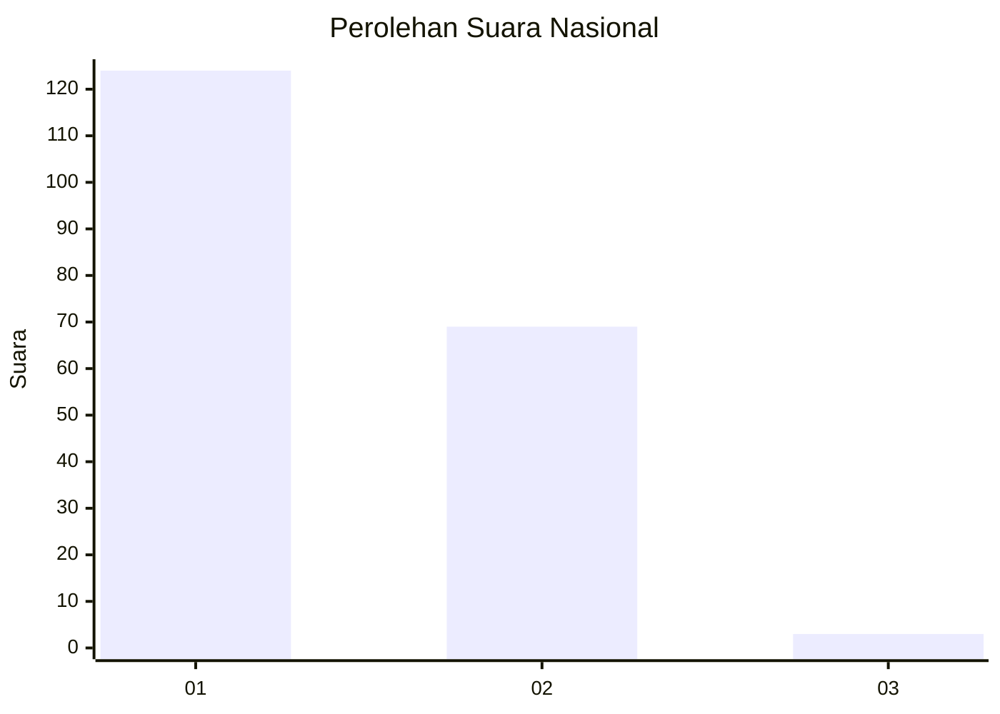
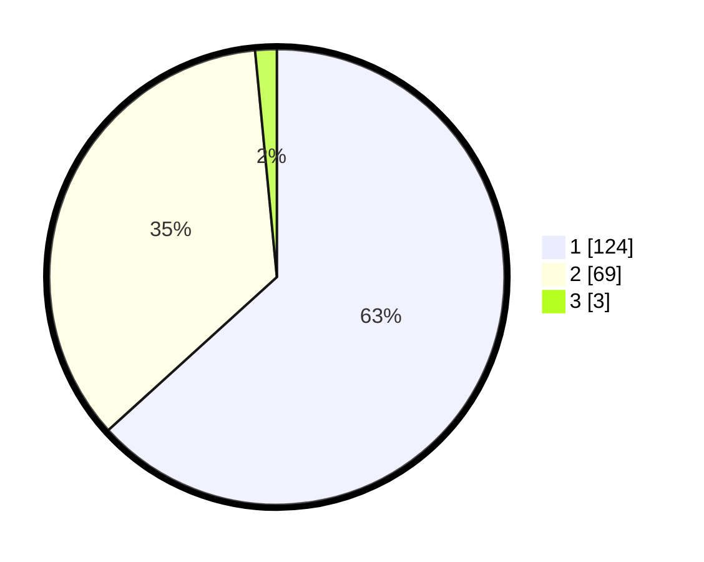

# Hasil

## Grafik

## Tabel

| No. | Nama Paslon    | Suara | Suara (raw) | Persentase |
|:--- |:-------------- | -----:| -----------:| ----------:|
| 1   | ANIES MUHAIMIN | 124   | [124][p-1]  | 63,27      |
| 2   | PRABOWO GIBRAN | 69    | [69][p-2]   | 35,20      |
| 3   | GANJAR MAHFUD  | 3     | [3][p-3]    | 1,53       |

[p-1]: https://github.com/gigit-pemilu/pemilu-2024/blob/main/pilpres/hitung-suara/sub/11-aceh/sub/02-aceh-tenggara/sub/08-lawe-bulan/sub/2002-pasir-penjengakan/sub/002-tps/sub/paslon-1.txt
[p-2]: https://github.com/gigit-pemilu/pemilu-2024/blob/main/pilpres/hitung-suara/sub/11-aceh/sub/02-aceh-tenggara/sub/08-lawe-bulan/sub/2002-pasir-penjengakan/sub/002-tps/sub/paslon-2.txt
[p-3]: https://github.com/gigit-pemilu/pemilu-2024/blob/main/pilpres/hitung-suara/sub/11-aceh/sub/02-aceh-tenggara/sub/08-lawe-bulan/sub/2002-pasir-penjengakan/sub/002-tps/sub/paslon-3.txt

## Foto C Plano

https://sirekap-obj-formc.kpu.go.id/bf70/pemilu/ppwp/11/02/08/20/02/1102082002002-20240215-084051--cdda47ad-64d6-41af-ad62-22ab24c0ca87.jpg

https://sirekap-obj-formc.kpu.go.id/bf70/pemilu/ppwp/11/02/08/20/02/1102082002002-20240215-083910--c19095f1-1409-4220-9437-72c72b47c055.jpg

https://sirekap-obj-formc.kpu.go.id/bf70/pemilu/ppwp/11/02/08/20/02/1102082002002-20240215-083800--bd8d5158-0f49-49ce-aa2b-924657faa3d2.jpg

## Metadata

| Key        | Value               |
| ---------- | ------------------- |
| Time Stamp | 2024-02-15 21:01:18 |

