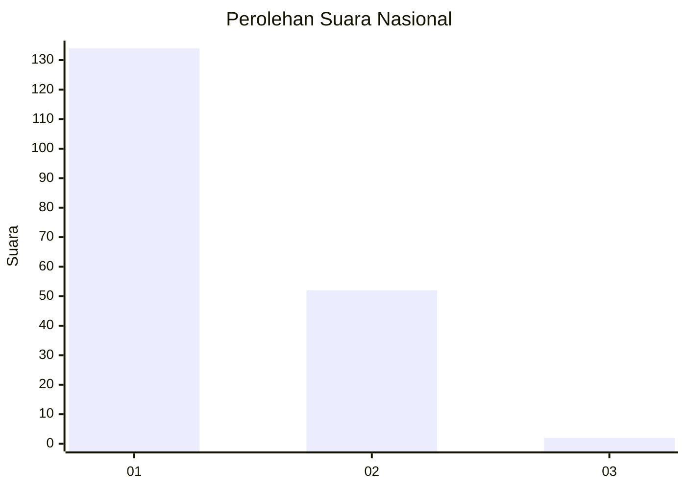
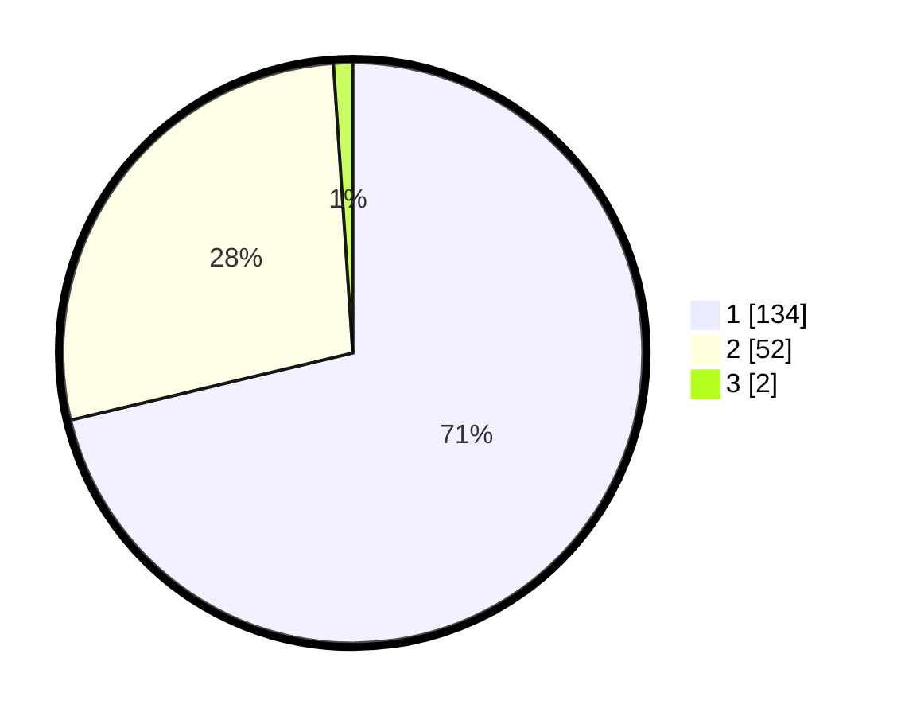

# Hasil

## Grafik

## Tabel

| No. | Nama Paslon    | Suara | Suara (raw) | Persentase |
|:--- |:-------------- | -----:| -----------:| ----------:|
| 1   | ANIES MUHAIMIN | 134   | [134][p-1]  | 71,28      |
| 2   | PRABOWO GIBRAN | 52    | [52][p-2]   | 27,66      |
| 3   | GANJAR MAHFUD  | 2     | [2][p-3]    | 1,06       |

[p-1]: https://github.com/gigit-pemilu/pemilu-2024/blob/main/pilpres/hitung-suara/sub/11-aceh/sub/02-aceh-tenggara/sub/08-lawe-bulan/sub/2003-kutambaru/sub/002-tps/sub/paslon-1.txt
[p-2]: https://github.com/gigit-pemilu/pemilu-2024/blob/main/pilpres/hitung-suara/sub/11-aceh/sub/02-aceh-tenggara/sub/08-lawe-bulan/sub/2003-kutambaru/sub/002-tps/sub/paslon-2.txt
[p-3]: https://github.com/gigit-pemilu/pemilu-2024/blob/main/pilpres/hitung-suara/sub/11-aceh/sub/02-aceh-tenggara/sub/08-lawe-bulan/sub/2003-kutambaru/sub/002-tps/sub/paslon-3.txt

## Foto C Plano

https://sirekap-obj-formc.kpu.go.id/f4f0/pemilu/ppwp/11/02/08/20/03/1102082003002-20240221-100612--912d6914-4cfc-4d14-81ed-0b46e148b60d.jpg

https://sirekap-obj-formc.kpu.go.id/f4f0/pemilu/ppwp/11/02/08/20/03/1102082003002-20240221-100718--bdcbecdb-12f9-40d9-8dd7-36d4aa9f9af2.jpg

https://sirekap-obj-formc.kpu.go.id/f4f0/pemilu/ppwp/11/02/08/20/03/1102082003002-20240221-100812--92f37be8-e999-4f6f-8719-57d21d14e122.jpg

## Metadata

| Key        | Value               |
| ---------- | ------------------- |
| Time Stamp | 2024-02-24 22:31:28 |

## DATA PEMILIH TETAP

Jumlah pemilih dalam DPT: **225**.
 * L: **108**.
 * P: **117**.

## DATA PENGGUNA HAK PILIH

Jumlah pengguna hak pilih dalam DPT: **193**.
 * L: **77**.
 * P: **116**.

Jumlah pengguna hak pilih dalam DPTb: **0**.
 * L: **0**.
 * P: **0**.

Jumlah pengguna hak pilih dalam DPK: **0**.
 * L: **0**.
 * P: **0**.

Jumlah pengguna hak pilih: **193**.
 * L: **77**.
 * P: **116**.

## JUMLAH SUARA SAH DAN TIDAK SAH

JUMLAH SELURUH SUARA SAH: **188**.

JUMLAH SUARA TIDAK SAH: **5**.

JUMLAH SELURUH SUARA SAH DAN SUARA TIDAK SAH: **193**.

