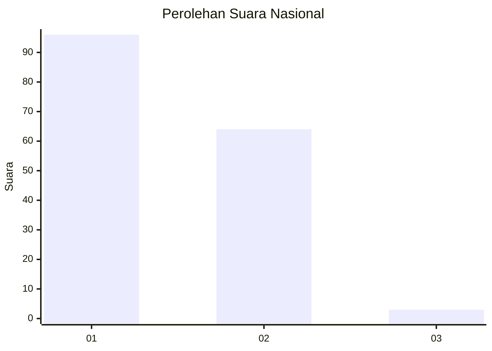
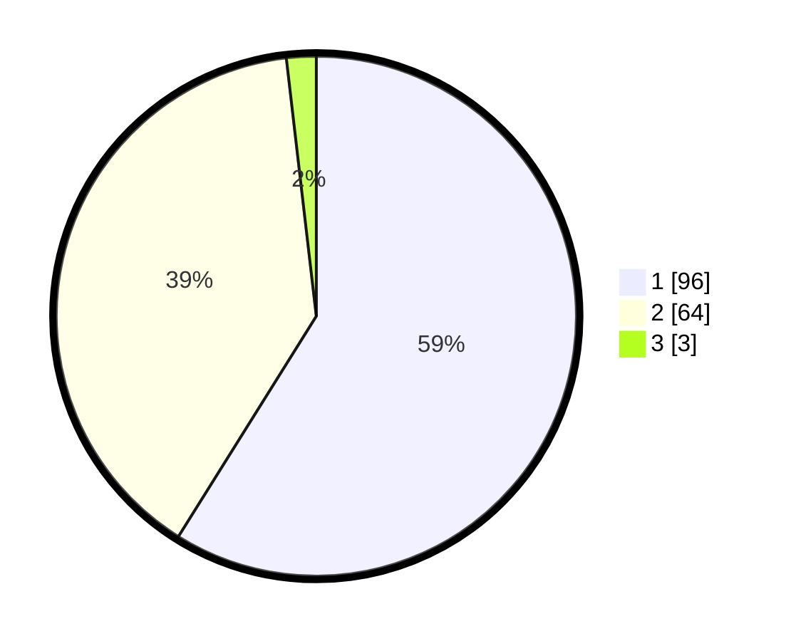

# Hasil

## Grafik

## Tabel

| No. | Nama Paslon    | Suara | Suara (raw) | Persentase |
|:--- |:-------------- | -----:| -----------:| ----------:|
| 1   | ANIES MUHAIMIN | 96    | [96][p-1]   | 58,90      |
| 2   | PRABOWO GIBRAN | 64    | [64][p-2]   | 39,26      |
| 3   | GANJAR MAHFUD  | 3     | [3][p-3]    | 1,84       |

[p-1]: https://github.com/gigit-pemilu/pemilu-2024/blob/main/pilpres/hitung-suara/sub/11-aceh/sub/02-aceh-tenggara/sub/08-lawe-bulan/sub/2003-kutambaru/sub/003-tps/sub/paslon-1.txt
[p-2]: https://github.com/gigit-pemilu/pemilu-2024/blob/main/pilpres/hitung-suara/sub/11-aceh/sub/02-aceh-tenggara/sub/08-lawe-bulan/sub/2003-kutambaru/sub/003-tps/sub/paslon-2.txt
[p-3]: https://github.com/gigit-pemilu/pemilu-2024/blob/main/pilpres/hitung-suara/sub/11-aceh/sub/02-aceh-tenggara/sub/08-lawe-bulan/sub/2003-kutambaru/sub/003-tps/sub/paslon-3.txt

## Foto C Plano

https://sirekap-obj-formc.kpu.go.id/e298/pemilu/ppwp/11/02/08/20/03/1102082003003-20240215-080228--dbdaaad0-825b-4c32-8c41-bf6e7a9cfaf4.jpg

https://sirekap-obj-formc.kpu.go.id/e298/pemilu/ppwp/11/02/08/20/03/1102082003003-20240215-080043--d6a4fb5b-a1a8-44f9-a8f6-af68ebc2110c.jpg

https://sirekap-obj-formc.kpu.go.id/e298/pemilu/ppwp/11/02/08/20/03/1102082003003-20240215-080410--b27e65f0-a637-45dd-b07f-a85564b13c59.jpg

## Metadata

| Key        | Value               |
| ---------- | ------------------- |
| Time Stamp | 2024-02-15 21:01:18 |

