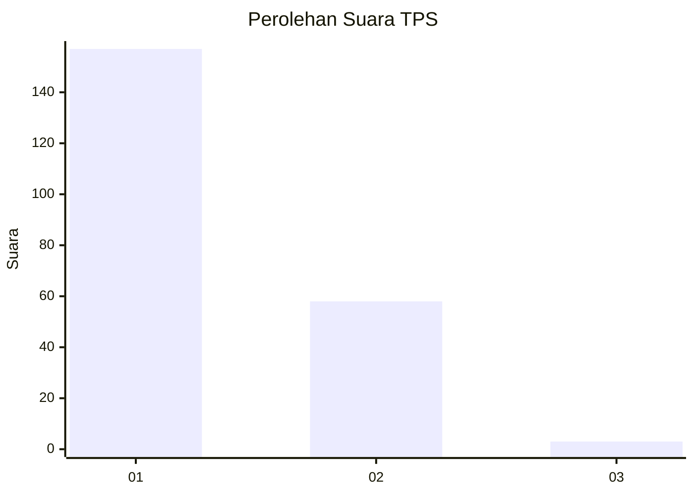
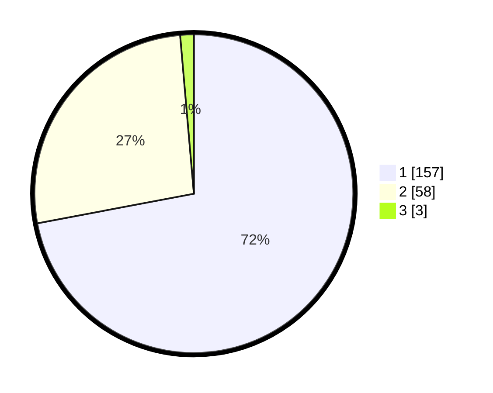

# Hasil

## Grafik

## Tabel

| No. | Nama Paslon    | Suara | Suara (raw) | Persentase |
|:--- |:-------------- | -----:| -----------:| ----------:|
| 1   | ANIES MUHAIMIN | 157   | [157][p-1]  | 72,02      |
| 2   | PRABOWO GIBRAN | 58    | [58][p-2]   | 26,61      |
| 3   | GANJAR MAHFUD  | 3     | [3][p-3]    | 1,38       |

[p-1]: https://github.com/gigit-pemilu/pemilu-2024-11-aceh/blob/main/pilpres/hitung-suara/sub/11-aceh/sub/02-aceh-tenggara/sub/08-lawe-bulan/sub/2004-lawe-sagu-hulu/sub/001-tps/sub/paslon-1.txt
[p-2]: https://github.com/gigit-pemilu/pemilu-2024-11-aceh/blob/main/pilpres/hitung-suara/sub/11-aceh/sub/02-aceh-tenggara/sub/08-lawe-bulan/sub/2004-lawe-sagu-hulu/sub/001-tps/sub/paslon-2.txt
[p-3]: https://github.com/gigit-pemilu/pemilu-2024-11-aceh/blob/main/pilpres/hitung-suara/sub/11-aceh/sub/02-aceh-tenggara/sub/08-lawe-bulan/sub/2004-lawe-sagu-hulu/sub/001-tps/sub/paslon-3.txt

## Foto C Plano

https://sirekap-obj-formc.kpu.go.id/3d71/pemilu/ppwp/11/02/08/20/04/1102082004001-20240215-022510--3567bae0-8aa9-4327-b2e3-12f8c167dde5.jpg

https://sirekap-obj-formc.kpu.go.id/3d71/pemilu/ppwp/11/02/08/20/04/1102082004001-20240215-102322--b6fe4fa9-1436-43eb-89e8-63b9baae7547.jpg

https://sirekap-obj-formc.kpu.go.id/3d71/pemilu/ppwp/11/02/08/20/04/1102082004001-20240217-102504--8b8c1bbb-45da-4ee4-9b79-64cf05f20198.jpg

## Metadata

| Key        | Value               |
| ---------- | ------------------- |
| Time Stamp | 2024-02-17 10:30:03 |

