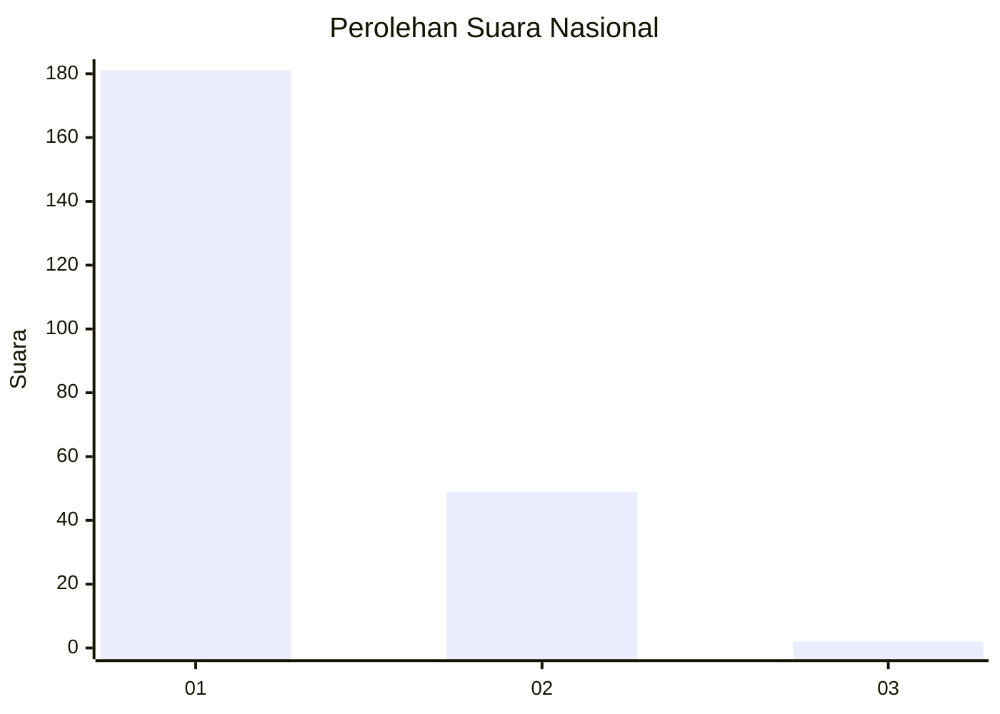
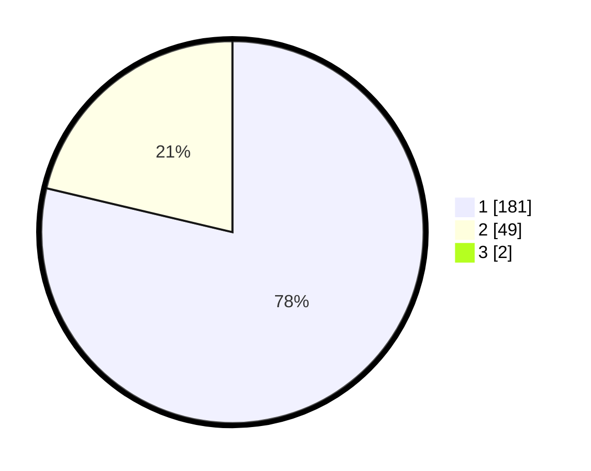

# Hasil

## Grafik

## Tabel

| No. | Nama Paslon    | Suara | Suara (raw) | Persentase |
|:--- |:-------------- | -----:| -----------:| ----------:|
| 1   | ANIES MUHAIMIN | 181   | [181][p-1]  | 78,02      |
| 2   | PRABOWO GIBRAN | 49    | [49][p-2]   | 21,12      |
| 3   | GANJAR MAHFUD  | 2     | [2][p-3]    | 0,86       |

[p-1]: https://github.com/gigit-pemilu/pemilu-2024/blob/main/pilpres/hitung-suara/sub/11-aceh/sub/02-aceh-tenggara/sub/08-lawe-bulan/sub/2004-lawe-sagu-hulu/sub/002-tps/sub/paslon-1.txt
[p-2]: https://github.com/gigit-pemilu/pemilu-2024/blob/main/pilpres/hitung-suara/sub/11-aceh/sub/02-aceh-tenggara/sub/08-lawe-bulan/sub/2004-lawe-sagu-hulu/sub/002-tps/sub/paslon-2.txt
[p-3]: https://github.com/gigit-pemilu/pemilu-2024/blob/main/pilpres/hitung-suara/sub/11-aceh/sub/02-aceh-tenggara/sub/08-lawe-bulan/sub/2004-lawe-sagu-hulu/sub/002-tps/sub/paslon-3.txt

## Foto C Plano

https://sirekap-obj-formc.kpu.go.id/d85e/pemilu/ppwp/11/02/08/20/04/1102082004002-20240215-013032--4c9ebd89-f95f-45d9-b76f-f05b5aa655d7.jpg

https://sirekap-obj-formc.kpu.go.id/d85e/pemilu/ppwp/11/02/08/20/04/1102082004002-20240215-013244--87694e44-16bb-4422-acab-7c513722c043.jpg

https://sirekap-obj-formc.kpu.go.id/d85e/pemilu/ppwp/11/02/08/20/04/1102082004002-20240215-013459--cdc9e921-8929-4852-b014-11b643171e18.jpg

## Metadata

| Key        | Value               |
| ---------- | ------------------- |
| Time Stamp | 2024-02-24 22:31:28 |

