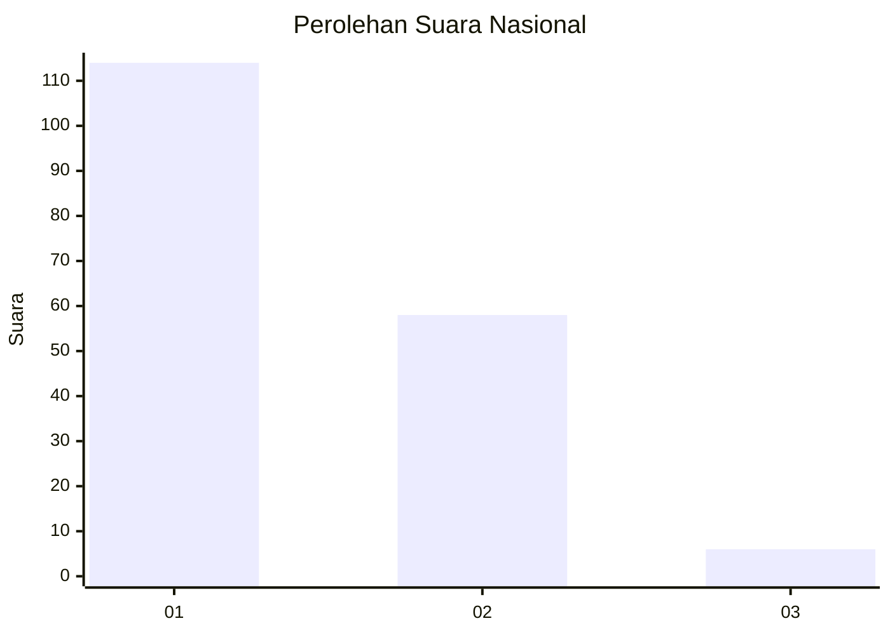
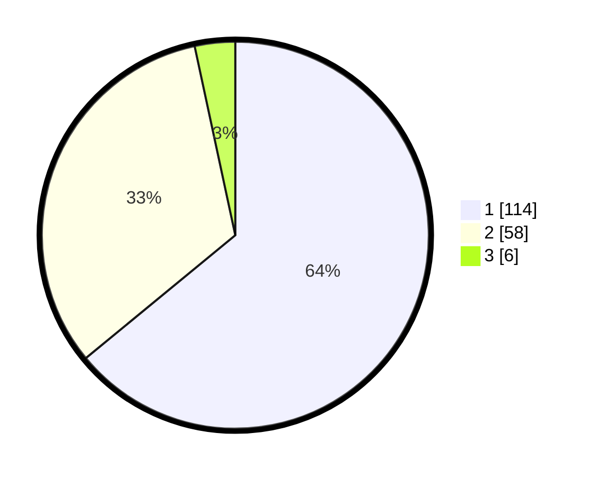

# Hasil

## Grafik

## Tabel

| No. | Nama Paslon    | Suara | Suara (raw) | Persentase |
|:--- |:-------------- | -----:| -----------:| ----------:|
| 1   | ANIES MUHAIMIN | 114   | [114][p-1]  | 64,04      |
| 2   | PRABOWO GIBRAN | 58    | [58][p-2]   | 32,58      |
| 3   | GANJAR MAHFUD  | 6     | [6][p-3]    | 3,37       |

[p-1]: https://github.com/gigit-pemilu/pemilu-2024/blob/main/pilpres/hitung-suara/sub/11-aceh/sub/02-aceh-tenggara/sub/08-lawe-bulan/sub/2005-lawe-sagu-hilir/sub/002-tps/sub/paslon-1.txt
[p-2]: https://github.com/gigit-pemilu/pemilu-2024/blob/main/pilpres/hitung-suara/sub/11-aceh/sub/02-aceh-tenggara/sub/08-lawe-bulan/sub/2005-lawe-sagu-hilir/sub/002-tps/sub/paslon-2.txt
[p-3]: https://github.com/gigit-pemilu/pemilu-2024/blob/main/pilpres/hitung-suara/sub/11-aceh/sub/02-aceh-tenggara/sub/08-lawe-bulan/sub/2005-lawe-sagu-hilir/sub/002-tps/sub/paslon-3.txt

## Foto C Plano

https://sirekap-obj-formc.kpu.go.id/3c76/pemilu/ppwp/11/02/08/20/05/1102082005002-20240215-034217--3c7c0332-e678-401b-a5df-36f21132c510.jpg

https://sirekap-obj-formc.kpu.go.id/3c76/pemilu/ppwp/11/02/08/20/05/1102082005002-20240215-034258--7dbc4b9e-e337-4766-b432-eb9cae84edda.jpg

https://sirekap-obj-formc.kpu.go.id/3c76/pemilu/ppwp/11/02/08/20/05/1102082005002-20240215-034407--7b3e28b5-c970-40ae-bdcd-7d248fcaf285.jpg

## Metadata

| Key        | Value               |
| ---------- | ------------------- |
| Time Stamp | 2024-02-15 21:01:18 |

