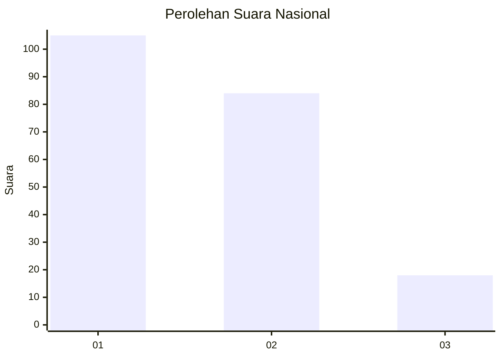
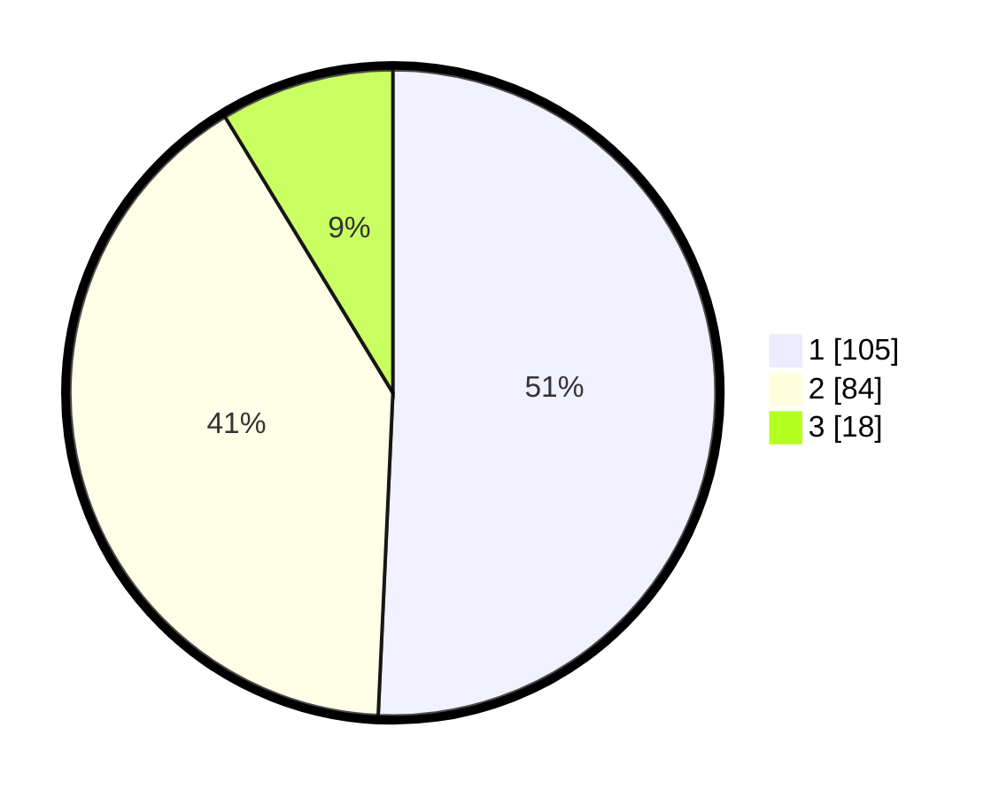

# Hasil

## Grafik

## Tabel

| No. | Nama Paslon    | Suara | Suara (raw) | Persentase |
|:--- |:-------------- | -----:| -----------:| ----------:|
| 1   | ANIES MUHAIMIN | 105   | [105][p-1]  | 50,72      |
| 2   | PRABOWO GIBRAN | 84    | [84][p-2]   | 40,58      |
| 3   | GANJAR MAHFUD  | 18    | [18][p-3]   | 8,70       |

[p-1]: https://github.com/gigit-pemilu/pemilu-2024/blob/main/pilpres/hitung-suara/sub/11-aceh/sub/02-aceh-tenggara/sub/08-lawe-bulan/sub/2006-kute-bantil/sub/001-tps/sub/paslon-1.txt
[p-2]: https://github.com/gigit-pemilu/pemilu-2024/blob/main/pilpres/hitung-suara/sub/11-aceh/sub/02-aceh-tenggara/sub/08-lawe-bulan/sub/2006-kute-bantil/sub/001-tps/sub/paslon-2.txt
[p-3]: https://github.com/gigit-pemilu/pemilu-2024/blob/main/pilpres/hitung-suara/sub/11-aceh/sub/02-aceh-tenggara/sub/08-lawe-bulan/sub/2006-kute-bantil/sub/001-tps/sub/paslon-3.txt

## Foto C Plano

https://sirekap-obj-formc.kpu.go.id/02a0/pemilu/ppwp/11/02/08/20/06/1102082006001-20240220-145958--4250dfd2-5634-43b4-8666-8c6d5905d5ae.jpg

https://sirekap-obj-formc.kpu.go.id/02a0/pemilu/ppwp/11/02/08/20/06/1102082006001-20240220-150030--387875ac-691f-4bea-bb58-115e4a8208e7.jpg

https://sirekap-obj-formc.kpu.go.id/02a0/pemilu/ppwp/11/02/08/20/06/1102082006001-20240220-150132--4034bae2-9722-4950-9d9b-9726279d4612.jpg

## Metadata

| Key        | Value               |
| ---------- | ------------------- |
| Time Stamp | 2024-02-24 22:31:28 |

