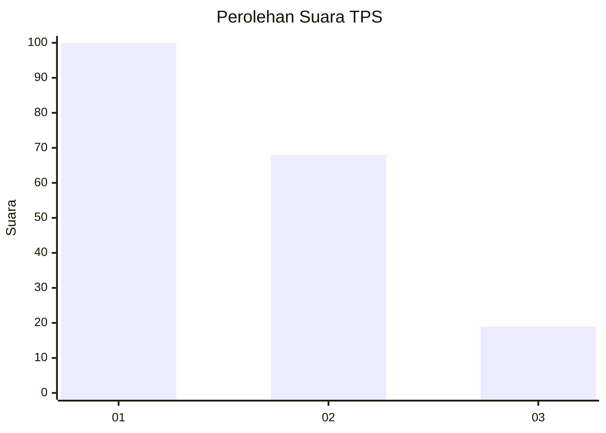
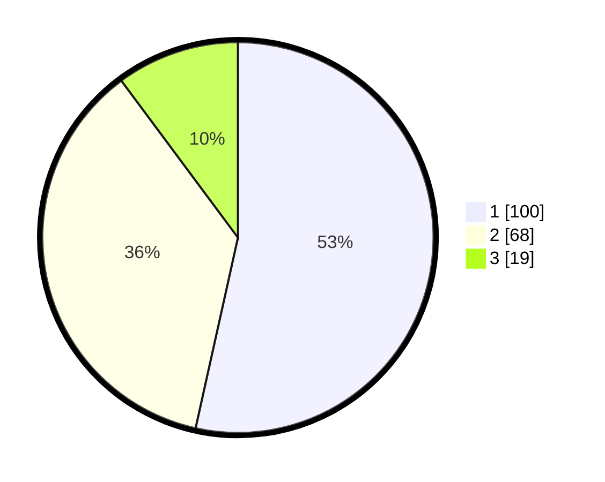

# Hasil

## Grafik

## Tabel

| No. | Nama Paslon    | Suara | Suara (raw) | Persentase |
|:--- |:-------------- | -----:| -----------:| ----------:|
| 1   | ANIES MUHAIMIN | 100   | [100][p-1]  | 53,48      |
| 2   | PRABOWO GIBRAN | 68    | [68][p-2]   | 36,36      |
| 3   | GANJAR MAHFUD  | 19    | [19][p-3]   | 10,16      |

[p-1]: https://github.com/gigit-pemilu/pemilu-2024-11-aceh/blob/main/pilpres/hitung-suara/sub/11-aceh/sub/02-aceh-tenggara/sub/08-lawe-bulan/sub/2006-kute-bantil/sub/002-tps/sub/paslon-1.txt
[p-2]: https://github.com/gigit-pemilu/pemilu-2024-11-aceh/blob/main/pilpres/hitung-suara/sub/11-aceh/sub/02-aceh-tenggara/sub/08-lawe-bulan/sub/2006-kute-bantil/sub/002-tps/sub/paslon-2.txt
[p-3]: https://github.com/gigit-pemilu/pemilu-2024-11-aceh/blob/main/pilpres/hitung-suara/sub/11-aceh/sub/02-aceh-tenggara/sub/08-lawe-bulan/sub/2006-kute-bantil/sub/002-tps/sub/paslon-3.txt

## Foto C Plano

https://sirekap-obj-formc.kpu.go.id/207a/pemilu/ppwp/11/02/08/20/06/1102082006002-20240220-145657--3d10e420-ce98-4a82-b91d-73a3e8ab2396.jpg

https://sirekap-obj-formc.kpu.go.id/207a/pemilu/ppwp/11/02/08/20/06/1102082006002-20240220-145832--407c71d6-f4cb-4d89-80f0-97d331bed0c4.jpg

https://sirekap-obj-formc.kpu.go.id/207a/pemilu/ppwp/11/02/08/20/06/1102082006002-20240220-150013--84bd8ed4-660e-47ba-a212-de586af0fcc4.jpg

## Metadata

| Key        | Value               |
| ---------- | ------------------- |
| Time Stamp | 2024-02-24 22:31:28 |

