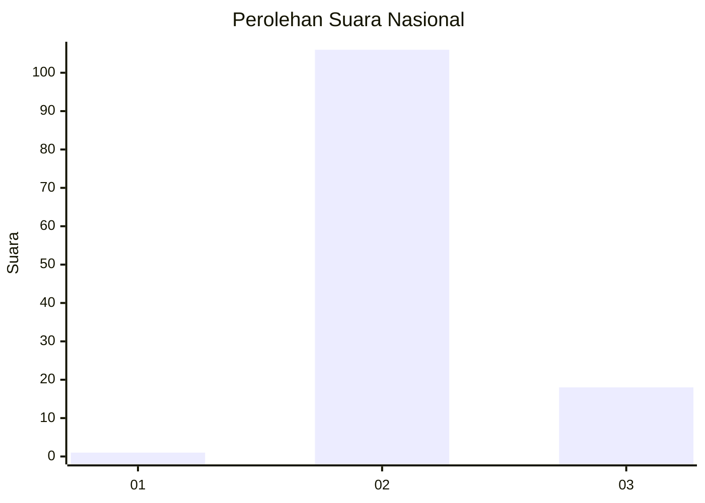
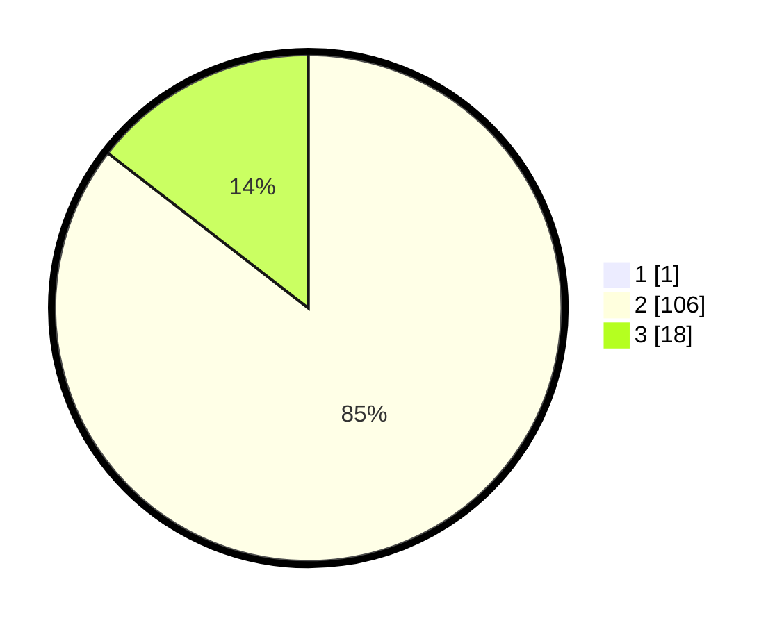

# Hasil

## Grafik

## Tabel

| No. | Nama Paslon    | Suara | Suara (raw) | Persentase |
|:--- |:-------------- | -----:| -----------:| ----------:|
| 1   | ANIES MUHAIMIN | 1     | [1][p-1]    | 0,80       |
| 2   | PRABOWO GIBRAN | 106   | [106][p-2]  | 84,80      |
| 3   | GANJAR MAHFUD  | 18    | [18][p-3]   | 14,40      |

[p-1]: https://github.com/gigit-pemilu/pemilu-2024/blob/main/pilpres/hitung-suara/sub/11-aceh/sub/02-aceh-tenggara/sub/08-lawe-bulan/sub/2011-lawe-kolok/sub/001-tps/sub/paslon-1.txt
[p-2]: https://github.com/gigit-pemilu/pemilu-2024/blob/main/pilpres/hitung-suara/sub/11-aceh/sub/02-aceh-tenggara/sub/08-lawe-bulan/sub/2011-lawe-kolok/sub/001-tps/sub/paslon-2.txt
[p-3]: https://github.com/gigit-pemilu/pemilu-2024/blob/main/pilpres/hitung-suara/sub/11-aceh/sub/02-aceh-tenggara/sub/08-lawe-bulan/sub/2011-lawe-kolok/sub/001-tps/sub/paslon-3.txt

## Foto C Plano

https://sirekap-obj-formc.kpu.go.id/9b70/pemilu/ppwp/11/02/08/20/11/1102082011001-20240214-233137--3810e217-3efc-4e5f-95d8-405f28e59ce0.jpg

https://sirekap-obj-formc.kpu.go.id/9b70/pemilu/ppwp/11/02/08/20/11/1102082011001-20240214-233545--77fe0a93-4c8c-4ebb-b10f-1486f480a380.jpg

https://sirekap-obj-formc.kpu.go.id/9b70/pemilu/ppwp/11/02/08/20/11/1102082011001-20240214-233647--6270ed2b-e7b8-4121-b34e-f1e47a726bc3.jpg

## Metadata

| Key        | Value               |
| ---------- | ------------------- |
| Time Stamp | 2024-02-15 21:30:27 |

