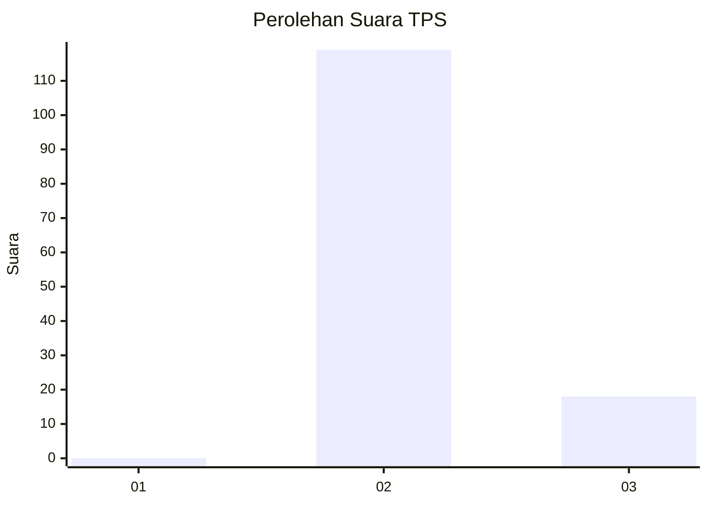
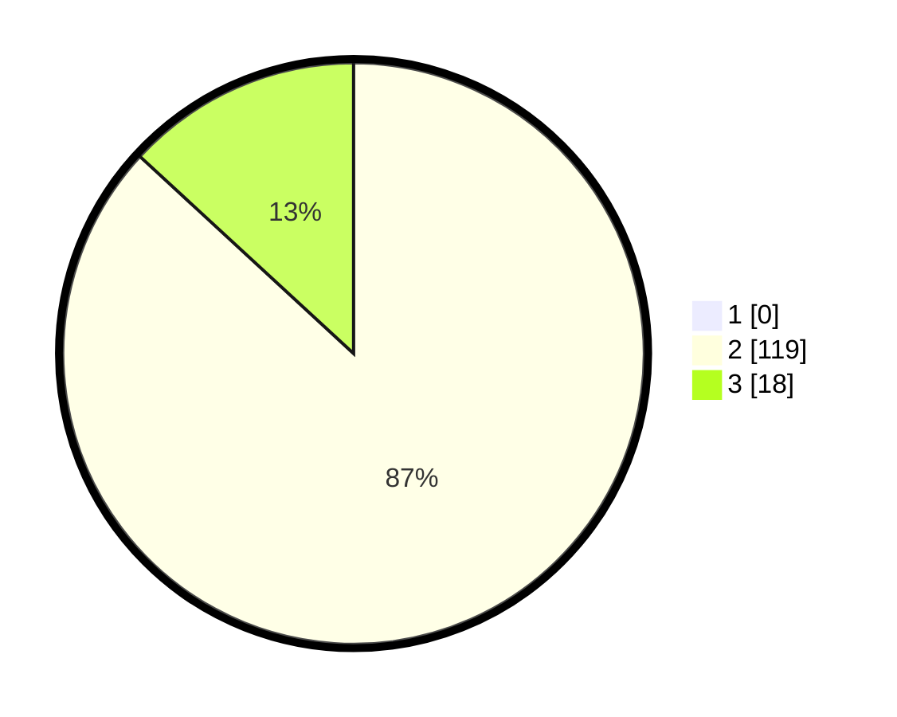

# Hasil

## Grafik

## Tabel

| No. | Nama Paslon    | Suara | Suara (raw) | Persentase |
|:--- |:-------------- | -----:| -----------:| ----------:|
| 1   | ANIES MUHAIMIN | 0     | [0][p-1]    | 0,00       |
| 2   | PRABOWO GIBRAN | 119   | [119][p-2]  | 86,86      |
| 3   | GANJAR MAHFUD  | 18    | [18][p-3]   | 13,14      |

[p-1]: https://github.com/gigit-pemilu/pemilu-2024-11-aceh/blob/main/pilpres/hitung-suara/sub/11-aceh/sub/02-aceh-tenggara/sub/08-lawe-bulan/sub/2011-lawe-kolok/sub/002-tps/sub/paslon-1.txt
[p-2]: https://github.com/gigit-pemilu/pemilu-2024-11-aceh/blob/main/pilpres/hitung-suara/sub/11-aceh/sub/02-aceh-tenggara/sub/08-lawe-bulan/sub/2011-lawe-kolok/sub/002-tps/sub/paslon-2.txt
[p-3]: https://github.com/gigit-pemilu/pemilu-2024-11-aceh/blob/main/pilpres/hitung-suara/sub/11-aceh/sub/02-aceh-tenggara/sub/08-lawe-bulan/sub/2011-lawe-kolok/sub/002-tps/sub/paslon-3.txt

## Foto C Plano

https://sirekap-obj-formc.kpu.go.id/0bae/pemilu/ppwp/11/02/08/20/11/1102082011002-20240219-142632--70346939-b5aa-46fc-8eaf-a73788615b8a.jpg

https://sirekap-obj-formc.kpu.go.id/0bae/pemilu/ppwp/11/02/08/20/11/1102082011002-20240219-142717--9cbc8931-a038-4044-aa11-9f2f9659d0ec.jpg

https://sirekap-obj-formc.kpu.go.id/0bae/pemilu/ppwp/11/02/08/20/11/1102082011002-20240219-142800--25a33be1-cfac-43ad-a370-e7c5648cf9be.jpg

## Metadata

| Key        | Value               |
| ---------- | ------------------- |
| Time Stamp | 2024-02-24 22:31:28 |

