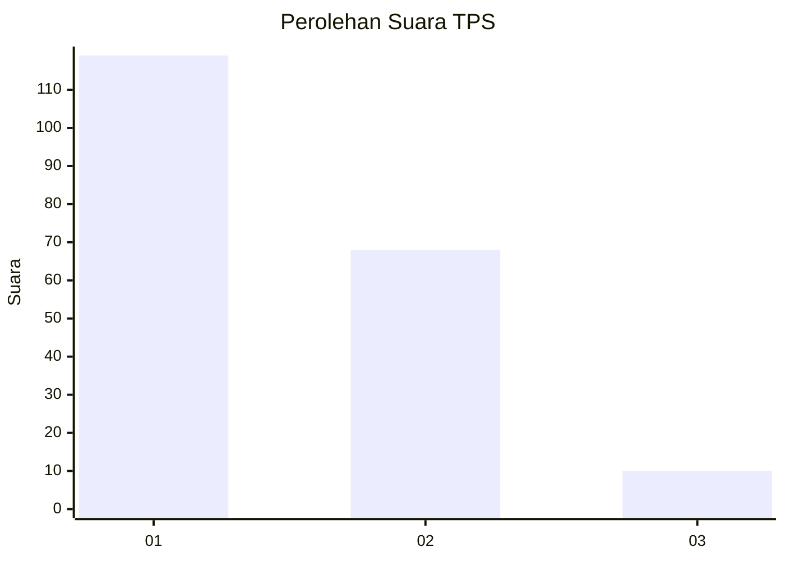
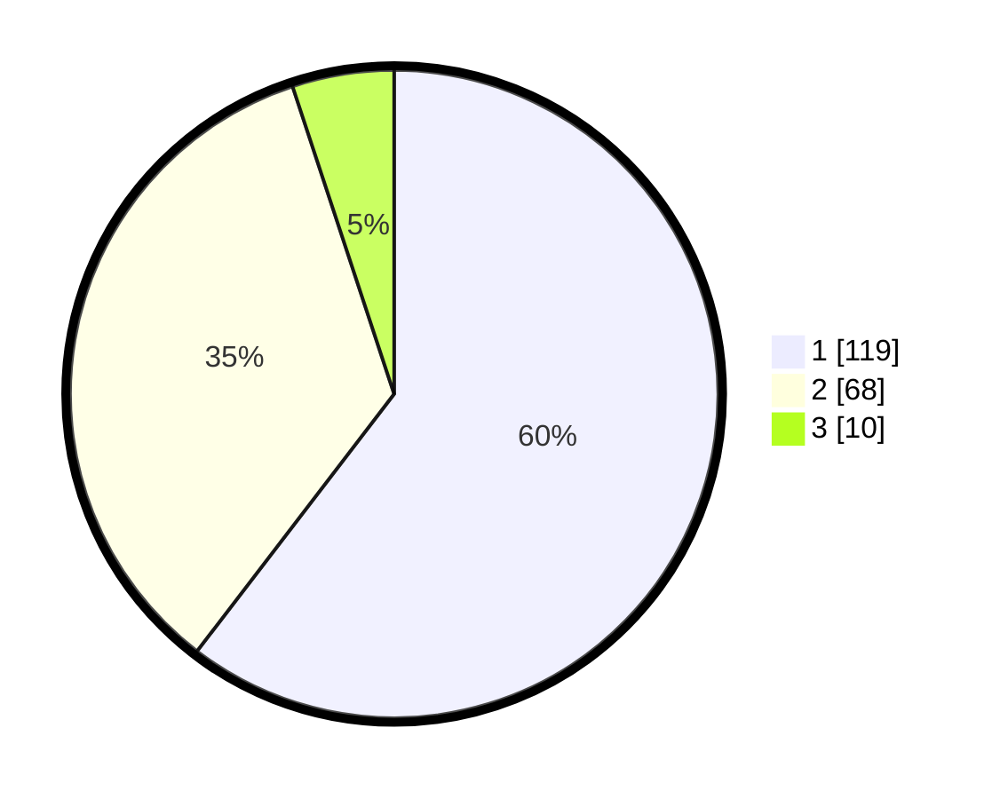

# Hasil

## Grafik

## Tabel

| No. | Nama Paslon    | Suara | Suara (raw) | Persentase |
|:--- |:-------------- | -----:| -----------:| ----------:|
| 1   | ANIES MUHAIMIN | 119   | [119][p-1]  | 60,41      |
| 2   | PRABOWO GIBRAN | 68    | [68][p-2]   | 34,52      |
| 3   | GANJAR MAHFUD  | 10    | [10][p-3]   | 5,08       |

[p-1]: https://github.com/gigit-pemilu/pemilu-2024-11-aceh/blob/main/pilpres/hitung-suara/sub/11-aceh/sub/02-aceh-tenggara/sub/08-lawe-bulan/sub/2012-lawe-rutung/sub/001-tps/sub/paslon-1.txt
[p-2]: https://github.com/gigit-pemilu/pemilu-2024-11-aceh/blob/main/pilpres/hitung-suara/sub/11-aceh/sub/02-aceh-tenggara/sub/08-lawe-bulan/sub/2012-lawe-rutung/sub/001-tps/sub/paslon-2.txt
[p-3]: https://github.com/gigit-pemilu/pemilu-2024-11-aceh/blob/main/pilpres/hitung-suara/sub/11-aceh/sub/02-aceh-tenggara/sub/08-lawe-bulan/sub/2012-lawe-rutung/sub/001-tps/sub/paslon-3.txt

## Foto C Plano

https://sirekap-obj-formc.kpu.go.id/8519/pemilu/ppwp/11/02/08/20/12/1102082012001-20240214-194225--af744996-7e7c-48ea-8072-547d81dae947.jpg

https://sirekap-obj-formc.kpu.go.id/8519/pemilu/ppwp/11/02/08/20/12/1102082012001-20240218-204705--639d4de9-30b4-41d4-85dc-7c3ef873e41b.jpg

https://sirekap-obj-formc.kpu.go.id/8519/pemilu/ppwp/11/02/08/20/12/1102082012001-20240218-205047--61f60e67-a3ec-42fb-b601-2a926fd7c4b5.jpg

## Metadata

| Key        | Value               |
| ---------- | ------------------- |
| Time Stamp | 2024-02-24 22:31:28 |

