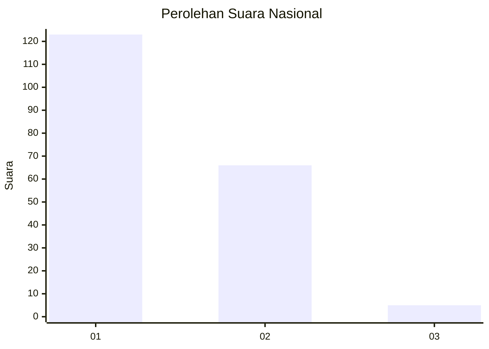
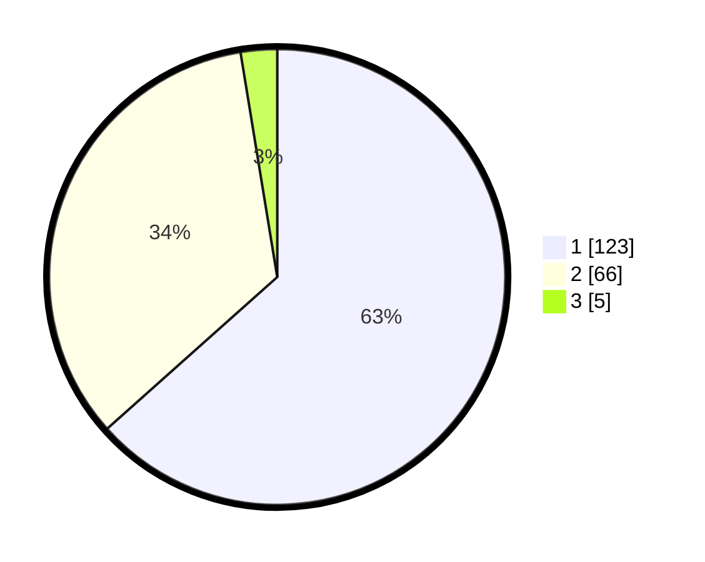

# Hasil

## Grafik

## Tabel

| No. | Nama Paslon    | Suara | Suara (raw) | Persentase |
|:--- |:-------------- | -----:| -----------:| ----------:|
| 1   | ANIES MUHAIMIN | 123   | [123][p-1]  | 63,40      |
| 2   | PRABOWO GIBRAN | 66    | [66][p-2]   | 34,02      |
| 3   | GANJAR MAHFUD  | 5     | [5][p-3]    | 2,58       |

[p-1]: https://github.com/gigit-pemilu/pemilu-2024/blob/main/pilpres/hitung-suara/sub/11-aceh/sub/02-aceh-tenggara/sub/08-lawe-bulan/sub/2012-lawe-rutung/sub/002-tps/sub/paslon-1.txt
[p-2]: https://github.com/gigit-pemilu/pemilu-2024/blob/main/pilpres/hitung-suara/sub/11-aceh/sub/02-aceh-tenggara/sub/08-lawe-bulan/sub/2012-lawe-rutung/sub/002-tps/sub/paslon-2.txt
[p-3]: https://github.com/gigit-pemilu/pemilu-2024/blob/main/pilpres/hitung-suara/sub/11-aceh/sub/02-aceh-tenggara/sub/08-lawe-bulan/sub/2012-lawe-rutung/sub/002-tps/sub/paslon-3.txt

## Foto C Plano

https://sirekap-obj-formc.kpu.go.id/67c4/pemilu/ppwp/11/02/08/20/12/1102082012002-20240218-222844--39218243-6275-48ac-aa16-1ad55bf35239.jpg

https://sirekap-obj-formc.kpu.go.id/67c4/pemilu/ppwp/11/02/08/20/12/1102082012002-20240218-222948--60dc8bc3-6b27-4022-82f9-5671bf0c2cf2.jpg

https://sirekap-obj-formc.kpu.go.id/67c4/pemilu/ppwp/11/02/08/20/12/1102082012002-20240218-223053--44b3328f-afc2-43cf-af88-e7beb72997b0.jpg

## Metadata

| Key        | Value               |
| ---------- | ------------------- |
| Time Stamp | 2024-02-24 22:31:28 |

