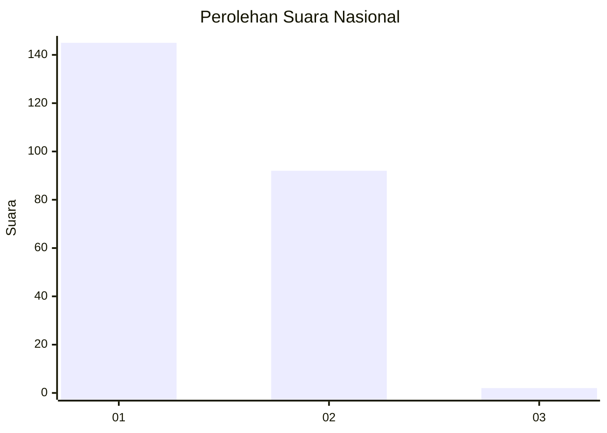
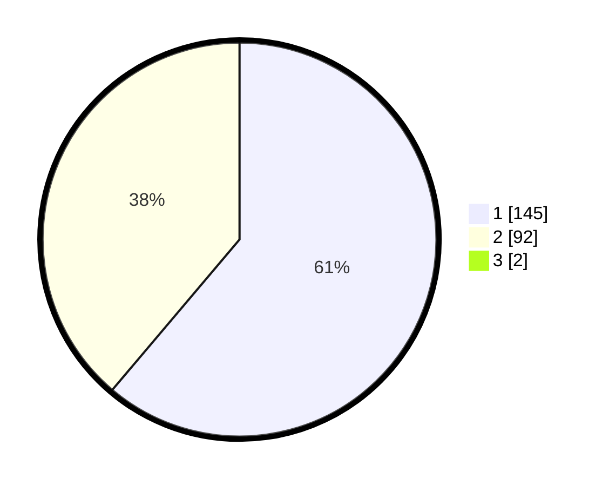

# Hasil

## Grafik

## Tabel

| No. | Nama Paslon    | Suara | Suara (raw) | Persentase |
|:--- |:-------------- | -----:| -----------:| ----------:|
| 1   | ANIES MUHAIMIN | 145   | [145][p-1]  | 60,67      |
| 2   | PRABOWO GIBRAN | 92    | [92][p-2]   | 38,49      |
| 3   | GANJAR MAHFUD  | 2     | [2][p-3]    | 0,84       |

[p-1]: https://github.com/gigit-pemilu/pemilu-2024/blob/main/pilpres/hitung-suara/sub/11-aceh/sub/02-aceh-tenggara/sub/08-lawe-bulan/sub/2012-lawe-rutung/sub/003-tps/sub/paslon-1.txt
[p-2]: https://github.com/gigit-pemilu/pemilu-2024/blob/main/pilpres/hitung-suara/sub/11-aceh/sub/02-aceh-tenggara/sub/08-lawe-bulan/sub/2012-lawe-rutung/sub/003-tps/sub/paslon-2.txt
[p-3]: https://github.com/gigit-pemilu/pemilu-2024/blob/main/pilpres/hitung-suara/sub/11-aceh/sub/02-aceh-tenggara/sub/08-lawe-bulan/sub/2012-lawe-rutung/sub/003-tps/sub/paslon-3.txt

## Foto C Plano

https://sirekap-obj-formc.kpu.go.id/468b/pemilu/ppwp/11/02/08/20/12/1102082012003-20240215-043937--bbbe2fc0-9b91-4c5b-8ae7-0305d41c46dd.jpg

https://sirekap-obj-formc.kpu.go.id/468b/pemilu/ppwp/11/02/08/20/12/1102082012003-20240215-044103--d52af314-f36a-43b3-be39-037064a2d20d.jpg

https://sirekap-obj-formc.kpu.go.id/468b/pemilu/ppwp/11/02/08/20/12/1102082012003-20240219-102945--66c06684-7c8a-41e4-8822-29a20eb91c27.jpg

## Metadata

| Key        | Value               |
| ---------- | ------------------- |
| Time Stamp | 2024-02-24 22:31:28 |

