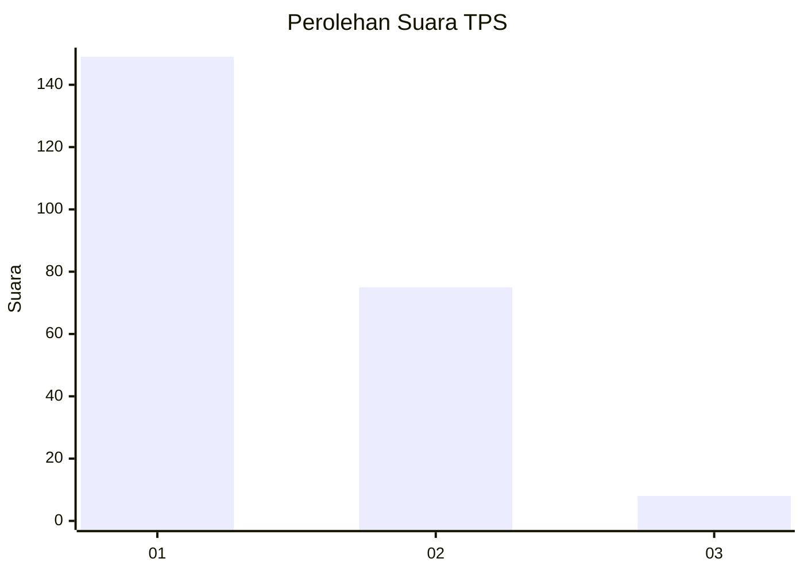
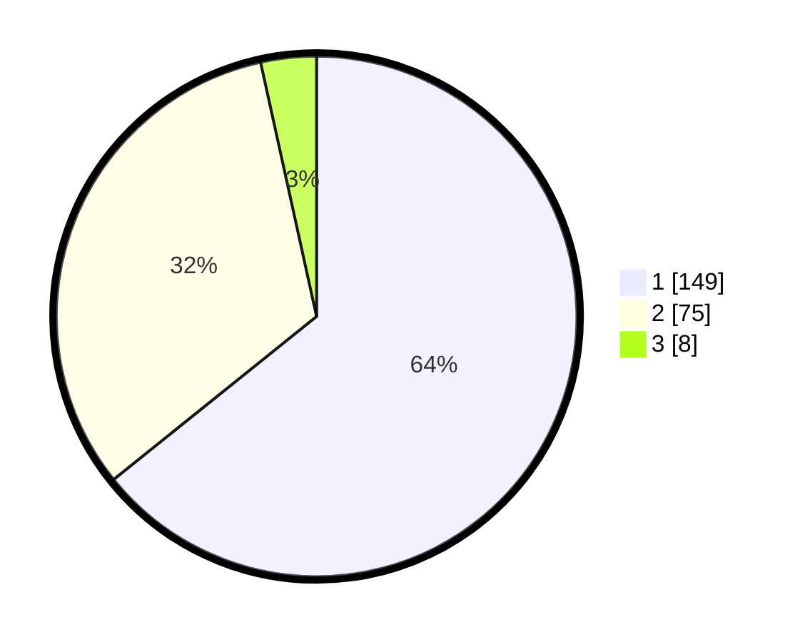

# Hasil

## Grafik

## Tabel

| No. | Nama Paslon    | Suara | Suara (raw) | Persentase |
|:--- |:-------------- | -----:| -----------:| ----------:|
| 1   | ANIES MUHAIMIN | 149   | [149][p-1]  | 64,22      |
| 2   | PRABOWO GIBRAN | 75    | [75][p-2]   | 32,33      |
| 3   | GANJAR MAHFUD  | 8     | [8][p-3]    | 3,45       |

[p-1]: https://github.com/gigit-pemilu/pemilu-2024-11-aceh/blob/main/pilpres/hitung-suara/sub/11-aceh/sub/02-aceh-tenggara/sub/08-lawe-bulan/sub/2012-lawe-rutung/sub/004-tps/sub/paslon-1.txt
[p-2]: https://github.com/gigit-pemilu/pemilu-2024-11-aceh/blob/main/pilpres/hitung-suara/sub/11-aceh/sub/02-aceh-tenggara/sub/08-lawe-bulan/sub/2012-lawe-rutung/sub/004-tps/sub/paslon-2.txt
[p-3]: https://github.com/gigit-pemilu/pemilu-2024-11-aceh/blob/main/pilpres/hitung-suara/sub/11-aceh/sub/02-aceh-tenggara/sub/08-lawe-bulan/sub/2012-lawe-rutung/sub/004-tps/sub/paslon-3.txt

## Foto C Plano

https://sirekap-obj-formc.kpu.go.id/a610/pemilu/ppwp/11/02/08/20/12/1102082012004-20240215-050842--b3451c1c-2ca0-4958-8646-c102521c8680.jpg

https://sirekap-obj-formc.kpu.go.id/a610/pemilu/ppwp/11/02/08/20/12/1102082012004-20240215-051014--78734e66-9eab-4005-8a10-6eaeb9171f7c.jpg

https://sirekap-obj-formc.kpu.go.id/a610/pemilu/ppwp/11/02/08/20/12/1102082012004-20240215-051141--9b953d68-cd4e-46eb-bbca-0564e3fa63eb.jpg

## Metadata

| Key        | Value               |
| ---------- | ------------------- |
| Time Stamp | 2024-02-15 21:30:27 |

