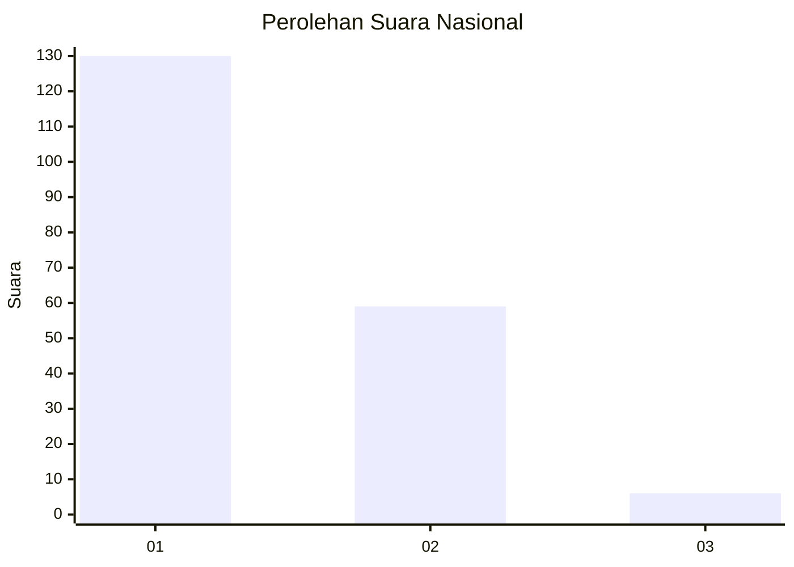
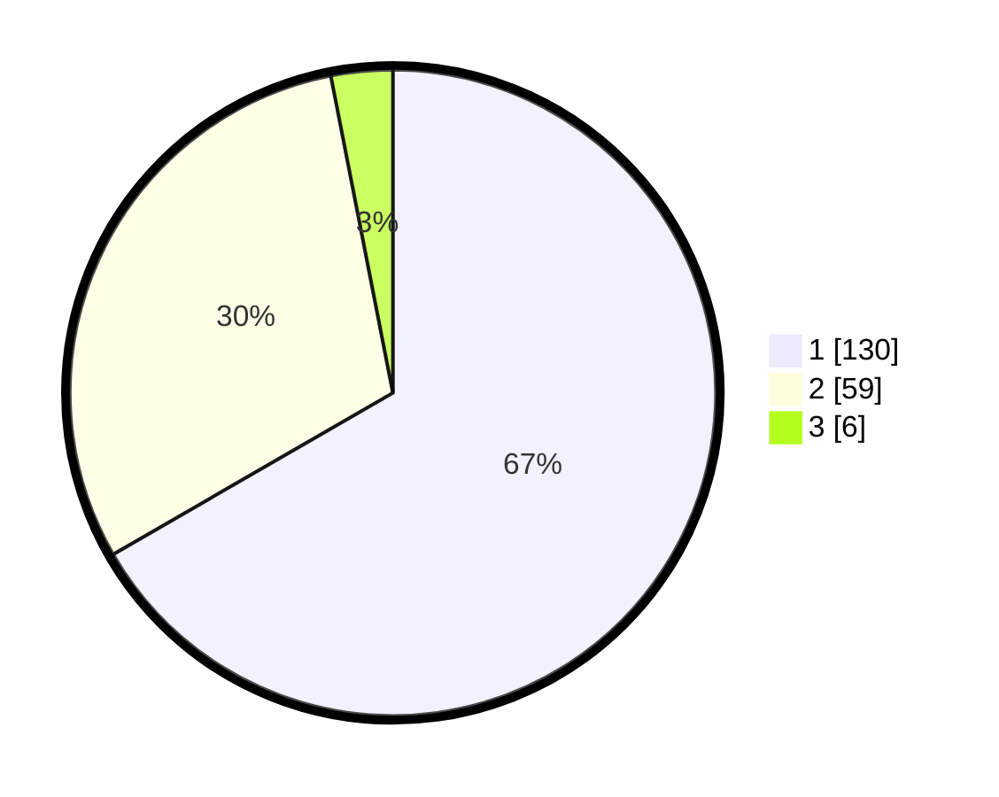

# Hasil

## Grafik

## Tabel

| No. | Nama Paslon    | Suara | Suara (raw) | Persentase |
|:--- |:-------------- | -----:| -----------:| ----------:|
| 1   | ANIES MUHAIMIN | 130   | [130][p-1]  | 66,67      |
| 2   | PRABOWO GIBRAN | 59    | [59][p-2]   | 30,26      |
| 3   | GANJAR MAHFUD  | 6     | [6][p-3]    | 3,08       |

[p-1]: https://github.com/gigit-pemilu/pemilu-2024/blob/main/pilpres/hitung-suara/sub/11-aceh/sub/02-aceh-tenggara/sub/08-lawe-bulan/sub/2012-lawe-rutung/sub/005-tps/sub/paslon-1.txt
[p-2]: https://github.com/gigit-pemilu/pemilu-2024/blob/main/pilpres/hitung-suara/sub/11-aceh/sub/02-aceh-tenggara/sub/08-lawe-bulan/sub/2012-lawe-rutung/sub/005-tps/sub/paslon-2.txt
[p-3]: https://github.com/gigit-pemilu/pemilu-2024/blob/main/pilpres/hitung-suara/sub/11-aceh/sub/02-aceh-tenggara/sub/08-lawe-bulan/sub/2012-lawe-rutung/sub/005-tps/sub/paslon-3.txt

## Foto C Plano

https://sirekap-obj-formc.kpu.go.id/2ccd/pemilu/ppwp/11/02/08/20/12/1102082012005-20240219-114207--38168821-def1-45ba-804f-96fb46b45a72.jpg

https://sirekap-obj-formc.kpu.go.id/2ccd/pemilu/ppwp/11/02/08/20/12/1102082012005-20240219-114242--4bab2401-23fe-44b3-972a-dfc6105a0754.jpg

https://sirekap-obj-formc.kpu.go.id/2ccd/pemilu/ppwp/11/02/08/20/12/1102082012005-20240219-114337--eb50cfa6-883a-4f92-a5ca-95ece73830c8.jpg

## Metadata

| Key        | Value               |
| ---------- | ------------------- |
| Time Stamp | 2024-02-24 22:31:28 |

