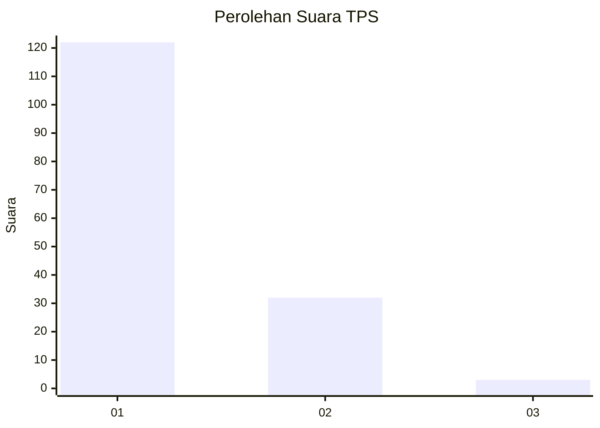
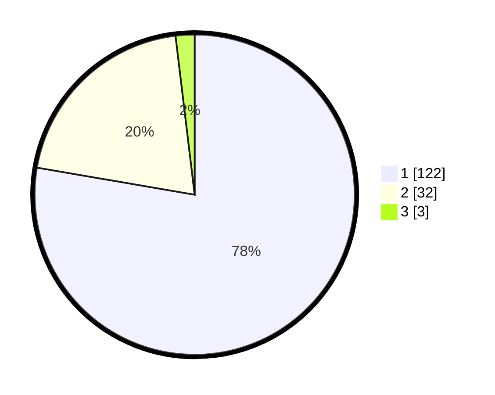

# Hasil

## Grafik

## Tabel

| No. | Nama Paslon    | Suara | Suara (raw) | Persentase |
|:--- |:-------------- | -----:| -----------:| ----------:|
| 1   | ANIES MUHAIMIN | 122   | [122][p-1]  | 77,71      |
| 2   | PRABOWO GIBRAN | 32    | [32][p-2]   | 20,38      |
| 3   | GANJAR MAHFUD  | 3     | [3][p-3]    | 1,91       |

[p-1]: https://github.com/gigit-pemilu/pemilu-2024-11-aceh/blob/main/pilpres/hitung-suara/sub/11-aceh/sub/02-aceh-tenggara/sub/08-lawe-bulan/sub/2012-lawe-rutung/sub/006-tps/sub/paslon-1.txt
[p-2]: https://github.com/gigit-pemilu/pemilu-2024-11-aceh/blob/main/pilpres/hitung-suara/sub/11-aceh/sub/02-aceh-tenggara/sub/08-lawe-bulan/sub/2012-lawe-rutung/sub/006-tps/sub/paslon-2.txt
[p-3]: https://github.com/gigit-pemilu/pemilu-2024-11-aceh/blob/main/pilpres/hitung-suara/sub/11-aceh/sub/02-aceh-tenggara/sub/08-lawe-bulan/sub/2012-lawe-rutung/sub/006-tps/sub/paslon-3.txt

## Foto C Plano

https://sirekap-obj-formc.kpu.go.id/781e/pemilu/ppwp/11/02/08/20/12/1102082012006-20240219-114513--d0617de8-8045-4c28-b3e2-4b3d1e70aaab.jpg

https://sirekap-obj-formc.kpu.go.id/781e/pemilu/ppwp/11/02/08/20/12/1102082012006-20240219-114607--e629f32e-0154-458f-a931-4b07e6d77a61.jpg

https://sirekap-obj-formc.kpu.go.id/781e/pemilu/ppwp/11/02/08/20/12/1102082012006-20240219-114703--79d3fc28-290e-4a3b-9ae2-a824716d3e47.jpg

## Metadata

| Key        | Value               |
| ---------- | ------------------- |
| Time Stamp | 2024-02-24 22:31:28 |

