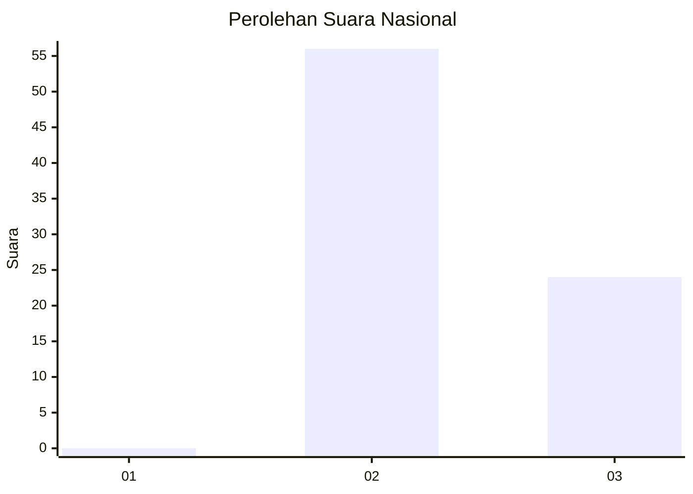
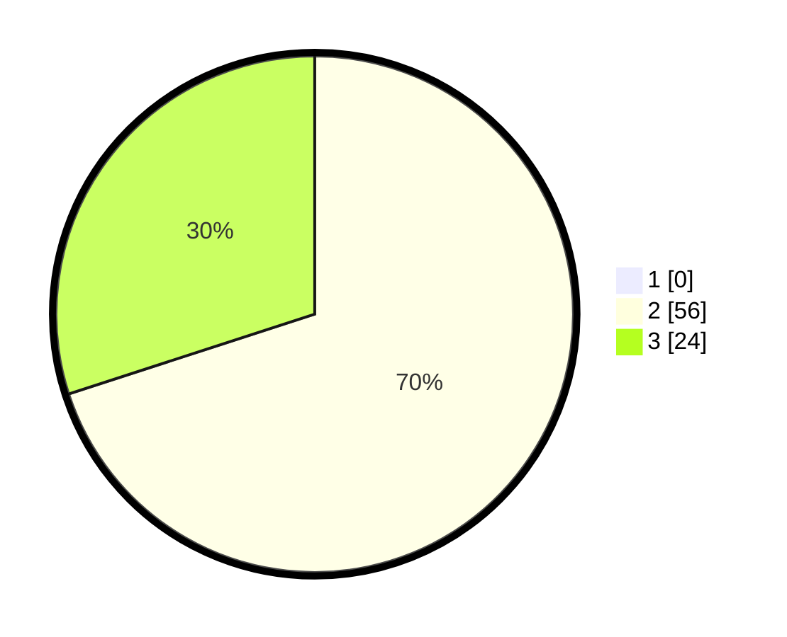

# Hasil

## Grafik

## Tabel

| No. | Nama Paslon    | Suara | Suara (raw) | Persentase |
|:--- |:-------------- | -----:| -----------:| ----------:|
| 1   | ANIES MUHAIMIN | 0     | [0][p-1]    | 0,00       |
| 2   | PRABOWO GIBRAN | 56    | [56][p-2]   | 70,00      |
| 3   | GANJAR MAHFUD  | 24    | [24][p-3]   | 30,00      |

[p-1]: https://github.com/gigit-pemilu/pemilu-2024/blob/main/pilpres/hitung-suara/sub/11-aceh/sub/02-aceh-tenggara/sub/08-lawe-bulan/sub/2014-tenembak-juhar/sub/002-tps/sub/paslon-1.txt
[p-2]: https://github.com/gigit-pemilu/pemilu-2024/blob/main/pilpres/hitung-suara/sub/11-aceh/sub/02-aceh-tenggara/sub/08-lawe-bulan/sub/2014-tenembak-juhar/sub/002-tps/sub/paslon-2.txt
[p-3]: https://github.com/gigit-pemilu/pemilu-2024/blob/main/pilpres/hitung-suara/sub/11-aceh/sub/02-aceh-tenggara/sub/08-lawe-bulan/sub/2014-tenembak-juhar/sub/002-tps/sub/paslon-3.txt

## Foto C Plano

https://sirekap-obj-formc.kpu.go.id/ddd4/pemilu/ppwp/11/02/08/20/14/1102082014002-20240221-164516--823b88c0-832f-4850-aab0-efdb4d27d02d.jpg

https://sirekap-obj-formc.kpu.go.id/ddd4/pemilu/ppwp/11/02/08/20/14/1102082014002-20240221-164706--f49206a6-5863-45e4-a8c8-0cf6c0d75ca6.jpg

https://sirekap-obj-formc.kpu.go.id/ddd4/pemilu/ppwp/11/02/08/20/14/1102082014002-20240221-164812--de6937d9-4588-4ca6-8b2d-49d746b60e6a.jpg

## Metadata

| Key        | Value               |
| ---------- | ------------------- |
| Time Stamp | 2024-02-21 17:00:00 |

## DATA PEMILIH TETAP

Jumlah pemilih dalam DPT: **128**.
 * L: **65**.
 * P: **63**.

## DATA PENGGUNA HAK PILIH

Jumlah pengguna hak pilih dalam DPT: **89**.
 * L: **42**.
 * P: **47**.

Jumlah pengguna hak pilih dalam DPTb: **1**.
 * L: **1**.
 * P: **0**.

Jumlah pengguna hak pilih dalam DPK: **0**.
 * L: **0**.
 * P: **0**.

Jumlah pengguna hak pilih: **90**.
 * L: **43**.
 * P: **47**.

## JUMLAH SUARA SAH DAN TIDAK SAH

JUMLAH SELURUH SUARA SAH: **90**.

JUMLAH SUARA TIDAK SAH: **0**.

JUMLAH SELURUH SUARA SAH DAN SUARA TIDAK SAH: **90**.

