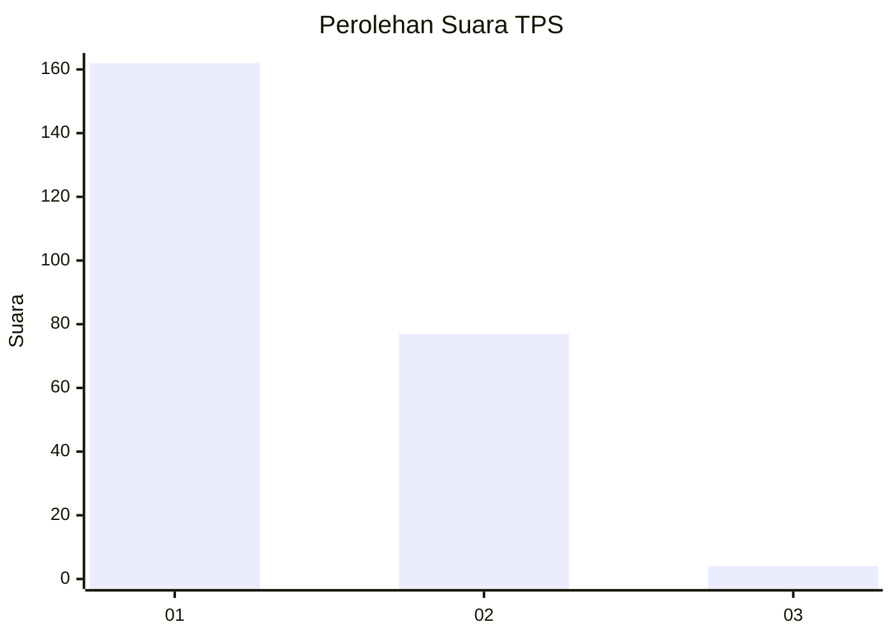
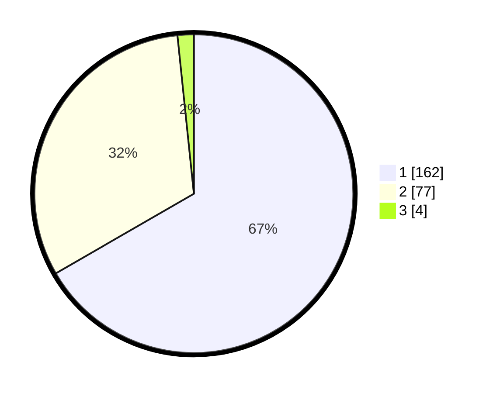

# Hasil

## Grafik

## Tabel

| No. | Nama Paslon    | Suara | Suara (raw) | Persentase |
|:--- |:-------------- | -----:| -----------:| ----------:|
| 1   | ANIES MUHAIMIN | 162   | [162][p-1]  | 66,67      |
| 2   | PRABOWO GIBRAN | 77    | [77][p-2]   | 31,69      |
| 3   | GANJAR MAHFUD  | 4     | [4][p-3]    | 1,65       |

[p-1]: https://github.com/gigit-pemilu/pemilu-2024-11-aceh/blob/main/pilpres/hitung-suara/sub/11-aceh/sub/02-aceh-tenggara/sub/08-lawe-bulan/sub/2015-simpang-empat/sub/001-tps/sub/paslon-1.txt
[p-2]: https://github.com/gigit-pemilu/pemilu-2024-11-aceh/blob/main/pilpres/hitung-suara/sub/11-aceh/sub/02-aceh-tenggara/sub/08-lawe-bulan/sub/2015-simpang-empat/sub/001-tps/sub/paslon-2.txt
[p-3]: https://github.com/gigit-pemilu/pemilu-2024-11-aceh/blob/main/pilpres/hitung-suara/sub/11-aceh/sub/02-aceh-tenggara/sub/08-lawe-bulan/sub/2015-simpang-empat/sub/001-tps/sub/paslon-3.txt

## Foto C Plano

https://sirekap-obj-formc.kpu.go.id/976c/pemilu/ppwp/11/02/08/20/15/1102082015001-20240221-142523--ea7c73d6-3ccc-46e6-9b65-1ebdf2373e91.jpg

https://sirekap-obj-formc.kpu.go.id/976c/pemilu/ppwp/11/02/08/20/15/1102082015001-20240221-142638--67995dd9-a0d8-4ac4-a9c2-563f394a79c3.jpg

https://sirekap-obj-formc.kpu.go.id/976c/pemilu/ppwp/11/02/08/20/15/1102082015001-20240221-142732--8134eebd-340a-4a95-be1e-d28d4f0bf37d.jpg

## Metadata

| Key        | Value               |
| ---------- | ------------------- |
| Time Stamp | 2024-02-24 22:31:28 |

