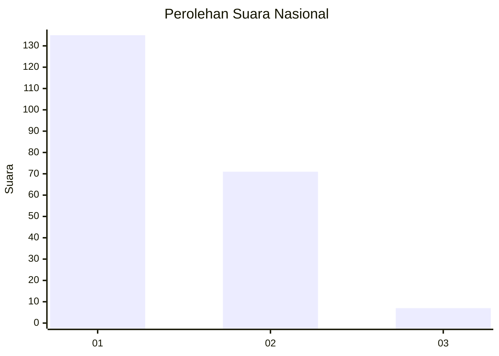
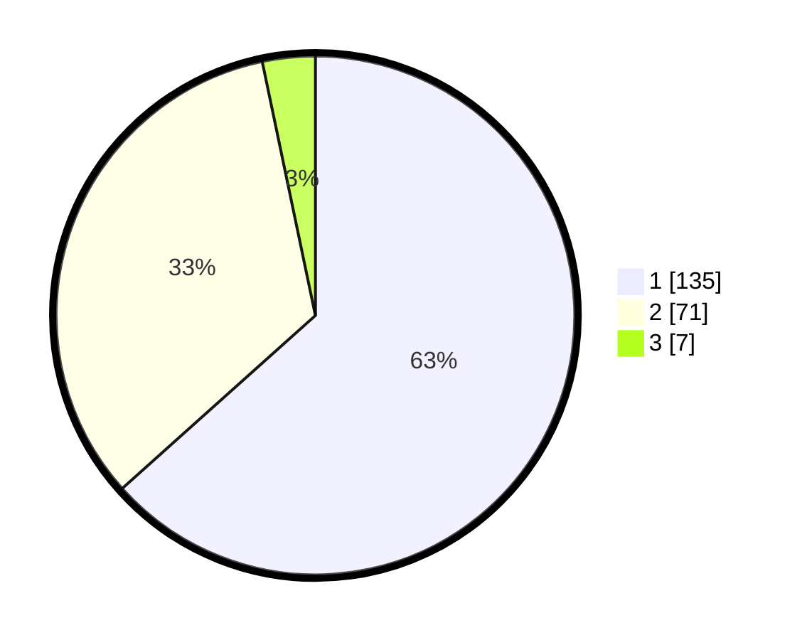

# Hasil

## Grafik

## Tabel

| No. | Nama Paslon    | Suara | Suara (raw) | Persentase |
|:--- |:-------------- | -----:| -----------:| ----------:|
| 1   | ANIES MUHAIMIN | 135   | [135][p-1]  | 63,38      |
| 2   | PRABOWO GIBRAN | 71    | [71][p-2]   | 33,33      |
| 3   | GANJAR MAHFUD  | 7     | [7][p-3]    | 3,29       |

[p-1]: https://github.com/gigit-pemilu/pemilu-2024/blob/main/pilpres/hitung-suara/sub/11-aceh/sub/02-aceh-tenggara/sub/08-lawe-bulan/sub/2015-simpang-empat/sub/002-tps/sub/paslon-1.txt
[p-2]: https://github.com/gigit-pemilu/pemilu-2024/blob/main/pilpres/hitung-suara/sub/11-aceh/sub/02-aceh-tenggara/sub/08-lawe-bulan/sub/2015-simpang-empat/sub/002-tps/sub/paslon-2.txt
[p-3]: https://github.com/gigit-pemilu/pemilu-2024/blob/main/pilpres/hitung-suara/sub/11-aceh/sub/02-aceh-tenggara/sub/08-lawe-bulan/sub/2015-simpang-empat/sub/002-tps/sub/paslon-3.txt

## Foto C Plano

https://sirekap-obj-formc.kpu.go.id/c159/pemilu/ppwp/11/02/08/20/15/1102082015002-20240221-142748--9f01b35c-f0b9-4452-872b-2697fe7e3a59.jpg

https://sirekap-obj-formc.kpu.go.id/c159/pemilu/ppwp/11/02/08/20/15/1102082015002-20240221-142910--2186e66d-e746-48b7-a569-32b0457388b1.jpg

## Metadata

| Key        | Value               |
| ---------- | ------------------- |
| Time Stamp | 2024-02-24 22:31:28 |

