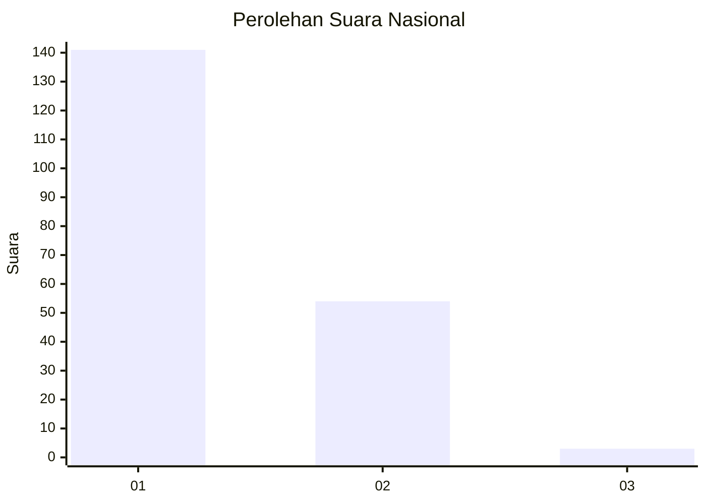
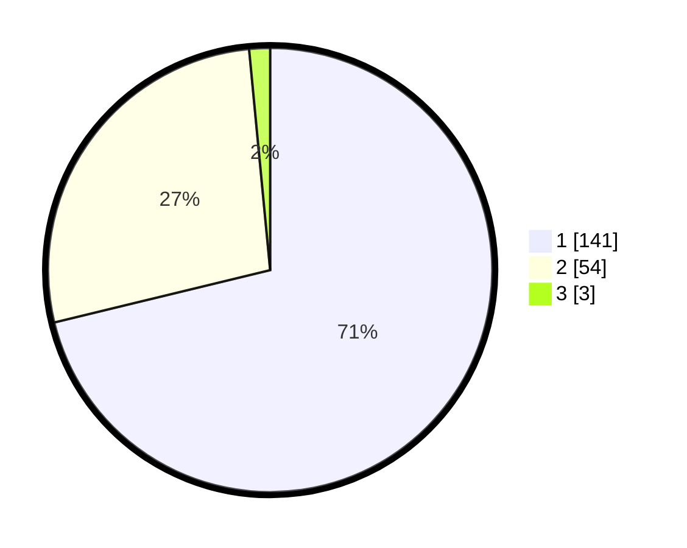

# Hasil

## Grafik

## Tabel

| No. | Nama Paslon    | Suara | Suara (raw) | Persentase |
|:--- |:-------------- | -----:| -----------:| ----------:|
| 1   | ANIES MUHAIMIN | 141   | [141][p-1]  | 71,21      |
| 2   | PRABOWO GIBRAN | 54    | [54][p-2]   | 27,27      |
| 3   | GANJAR MAHFUD  | 3     | [3][p-3]    | 1,52       |

[p-1]: https://github.com/gigit-pemilu/pemilu-2024/blob/main/pilpres/hitung-suara/sub/11-aceh/sub/02-aceh-tenggara/sub/08-lawe-bulan/sub/2015-simpang-empat/sub/003-tps/sub/paslon-1.txt
[p-2]: https://github.com/gigit-pemilu/pemilu-2024/blob/main/pilpres/hitung-suara/sub/11-aceh/sub/02-aceh-tenggara/sub/08-lawe-bulan/sub/2015-simpang-empat/sub/003-tps/sub/paslon-2.txt
[p-3]: https://github.com/gigit-pemilu/pemilu-2024/blob/main/pilpres/hitung-suara/sub/11-aceh/sub/02-aceh-tenggara/sub/08-lawe-bulan/sub/2015-simpang-empat/sub/003-tps/sub/paslon-3.txt

## Foto C Plano

https://sirekap-obj-formc.kpu.go.id/120d/pemilu/ppwp/11/02/08/20/15/1102082015003-20240221-142739--fe05cb82-4285-4cba-9c97-9d7468f63c92.jpg

https://sirekap-obj-formc.kpu.go.id/120d/pemilu/ppwp/11/02/08/20/15/1102082015003-20240221-142903--8ad4d946-28a1-48ba-a045-fc1d72e3e0b1.jpg

https://sirekap-obj-formc.kpu.go.id/120d/pemilu/ppwp/11/02/08/20/15/1102082015003-20240221-143046--68e0fcd9-cc93-4e8c-b62b-597a74971741.jpg

## Metadata

| Key        | Value               |
| ---------- | ------------------- |
| Time Stamp | 2024-02-24 22:31:28 |

