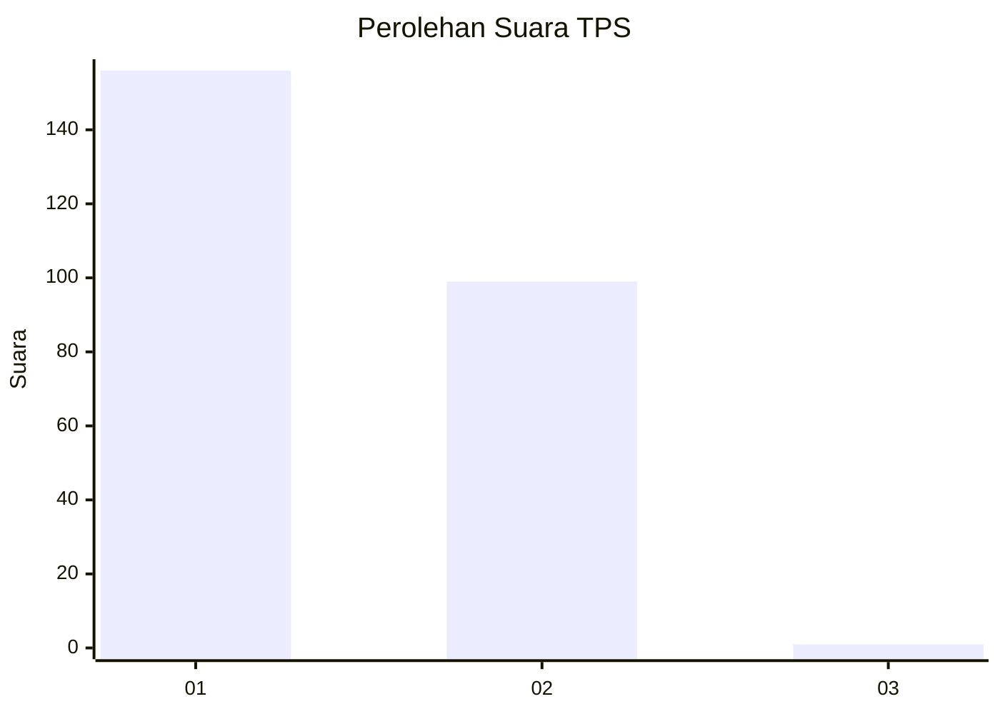
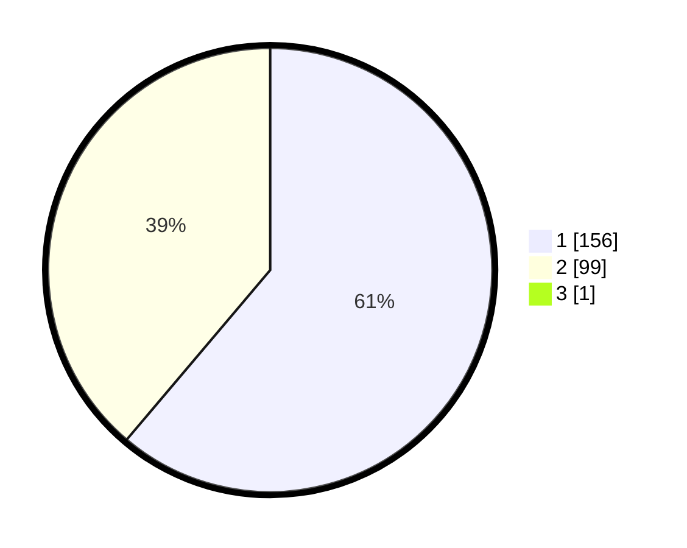

# Hasil

## Grafik

## Tabel

| No. | Nama Paslon    | Suara | Suara (raw) | Persentase |
|:--- |:-------------- | -----:| -----------:| ----------:|
| 1   | ANIES MUHAIMIN | 156   | [156][p-1]  | 60,94      |
| 2   | PRABOWO GIBRAN | 99    | [99][p-2]   | 38,67      |
| 3   | GANJAR MAHFUD  | 1     | [1][p-3]    | 0,39       |

[p-1]: https://github.com/gigit-pemilu/pemilu-2024-11-aceh/blob/main/pilpres/hitung-suara/sub/11-aceh/sub/02-aceh-tenggara/sub/08-lawe-bulan/sub/2016-kuta-buluh-botong/sub/001-tps/sub/paslon-1.txt
[p-2]: https://github.com/gigit-pemilu/pemilu-2024-11-aceh/blob/main/pilpres/hitung-suara/sub/11-aceh/sub/02-aceh-tenggara/sub/08-lawe-bulan/sub/2016-kuta-buluh-botong/sub/001-tps/sub/paslon-2.txt
[p-3]: https://github.com/gigit-pemilu/pemilu-2024-11-aceh/blob/main/pilpres/hitung-suara/sub/11-aceh/sub/02-aceh-tenggara/sub/08-lawe-bulan/sub/2016-kuta-buluh-botong/sub/001-tps/sub/paslon-3.txt

## Foto C Plano

https://sirekap-obj-formc.kpu.go.id/4298/pemilu/ppwp/11/02/08/20/16/1102082016001-20240218-142407--9eb74f40-172b-422f-90e8-3a8570dd7b86.jpg

https://sirekap-obj-formc.kpu.go.id/4298/pemilu/ppwp/11/02/08/20/16/1102082016001-20240218-142506--73d05e2f-3b8e-4e16-b782-0304f94ef369.jpg

https://sirekap-obj-formc.kpu.go.id/4298/pemilu/ppwp/11/02/08/20/16/1102082016001-20240218-142541--896cd79a-d544-4060-a492-27bf0d9090be.jpg

## Metadata

| Key        | Value               |
| ---------- | ------------------- |
| Time Stamp | 2024-02-24 22:31:28 |

