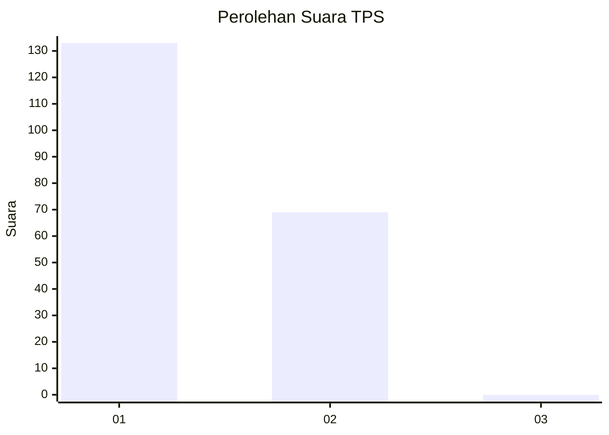
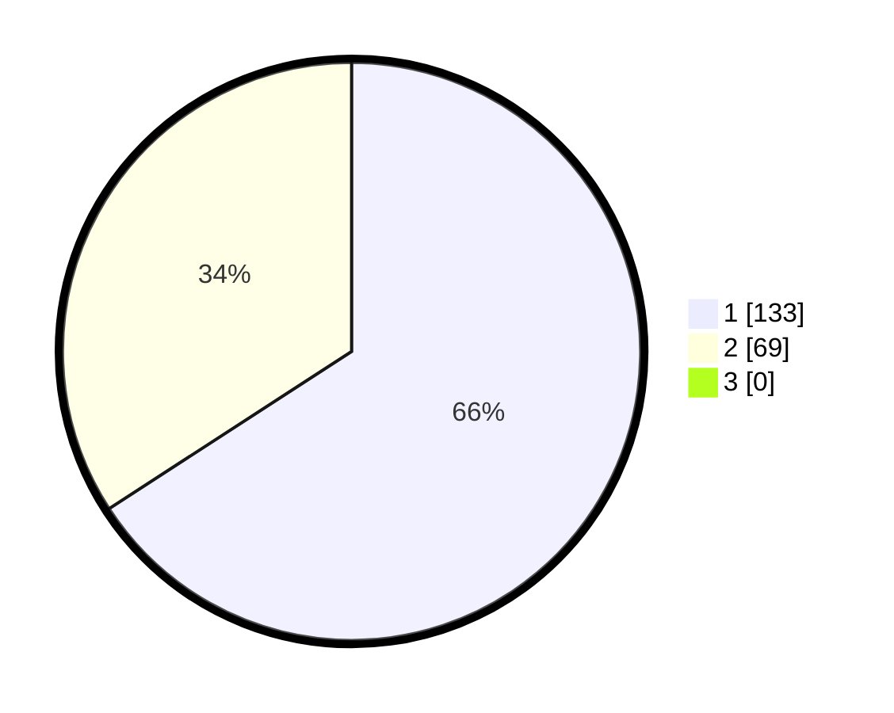

# Hasil

## Grafik

## Tabel

| No. | Nama Paslon    | Suara | Suara (raw) | Persentase |
|:--- |:-------------- | -----:| -----------:| ----------:|
| 1   | ANIES MUHAIMIN | 133   | [133][p-1]  | 65,84      |
| 2   | PRABOWO GIBRAN | 69    | [69][p-2]   | 34,16      |
| 3   | GANJAR MAHFUD  | 0     | [0][p-3]    | 0,00       |

[p-1]: https://github.com/gigit-pemilu/pemilu-2024-11-aceh/blob/main/pilpres/hitung-suara/sub/11-aceh/sub/02-aceh-tenggara/sub/08-lawe-bulan/sub/2017-katambaru-becawan/sub/001-tps/sub/paslon-1.txt
[p-2]: https://github.com/gigit-pemilu/pemilu-2024-11-aceh/blob/main/pilpres/hitung-suara/sub/11-aceh/sub/02-aceh-tenggara/sub/08-lawe-bulan/sub/2017-katambaru-becawan/sub/001-tps/sub/paslon-2.txt
[p-3]: https://github.com/gigit-pemilu/pemilu-2024-11-aceh/blob/main/pilpres/hitung-suara/sub/11-aceh/sub/02-aceh-tenggara/sub/08-lawe-bulan/sub/2017-katambaru-becawan/sub/001-tps/sub/paslon-3.txt

## Foto C Plano

https://sirekap-obj-formc.kpu.go.id/47b0/pemilu/ppwp/11/02/08/20/17/1102082017001-20240219-205425--f96c5021-6d98-4bb8-99ce-8bebadf38366.jpg

https://sirekap-obj-formc.kpu.go.id/47b0/pemilu/ppwp/11/02/08/20/17/1102082017001-20240219-205559--1f964f4a-ce6c-4ca9-93af-f451033a1c41.jpg

https://sirekap-obj-formc.kpu.go.id/47b0/pemilu/ppwp/11/02/08/20/17/1102082017001-20240219-205721--e06adba9-b07d-4cf0-9009-595839e48898.jpg

## Metadata

| Key        | Value               |
| ---------- | ------------------- |
| Time Stamp | 2024-02-24 22:31:28 |

