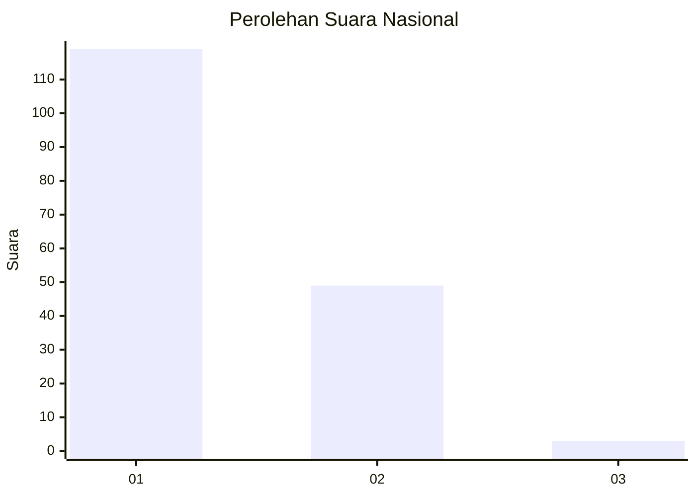
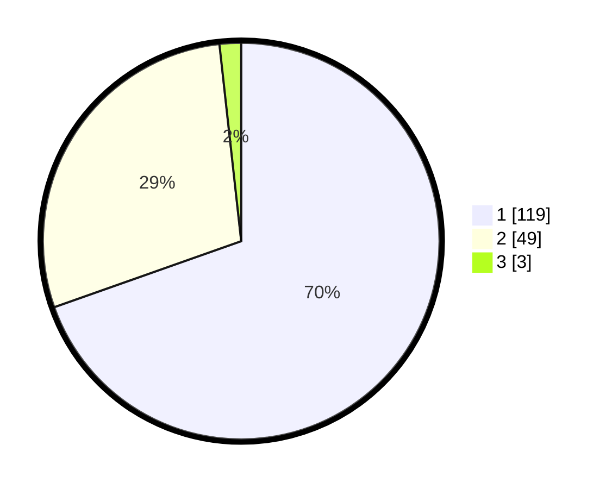

# Hasil

## Grafik

## Tabel

| No. | Nama Paslon    | Suara | Suara (raw) | Persentase |
|:--- |:-------------- | -----:| -----------:| ----------:|
| 1   | ANIES MUHAIMIN | 119   | [119][p-1]  | 69,59      |
| 2   | PRABOWO GIBRAN | 49    | [49][p-2]   | 28,65      |
| 3   | GANJAR MAHFUD  | 3     | [3][p-3]    | 1,75       |

[p-1]: https://github.com/gigit-pemilu/pemilu-2024/blob/main/pilpres/hitung-suara/sub/11-aceh/sub/02-aceh-tenggara/sub/08-lawe-bulan/sub/2017-katambaru-becawan/sub/002-tps/sub/paslon-1.txt
[p-2]: https://github.com/gigit-pemilu/pemilu-2024/blob/main/pilpres/hitung-suara/sub/11-aceh/sub/02-aceh-tenggara/sub/08-lawe-bulan/sub/2017-katambaru-becawan/sub/002-tps/sub/paslon-2.txt
[p-3]: https://github.com/gigit-pemilu/pemilu-2024/blob/main/pilpres/hitung-suara/sub/11-aceh/sub/02-aceh-tenggara/sub/08-lawe-bulan/sub/2017-katambaru-becawan/sub/002-tps/sub/paslon-3.txt

## Foto C Plano

https://sirekap-obj-formc.kpu.go.id/8517/pemilu/ppwp/11/02/08/20/17/1102082017002-20240219-205746--2e1abac5-dc36-49cd-ac75-46c61402680e.jpg

https://sirekap-obj-formc.kpu.go.id/8517/pemilu/ppwp/11/02/08/20/17/1102082017002-20240219-205818--aaadfa0e-4ad3-455c-af9a-2398fe0076ff.jpg

## Metadata

| Key        | Value               |
| ---------- | ------------------- |
| Time Stamp | 2024-02-24 22:31:28 |

