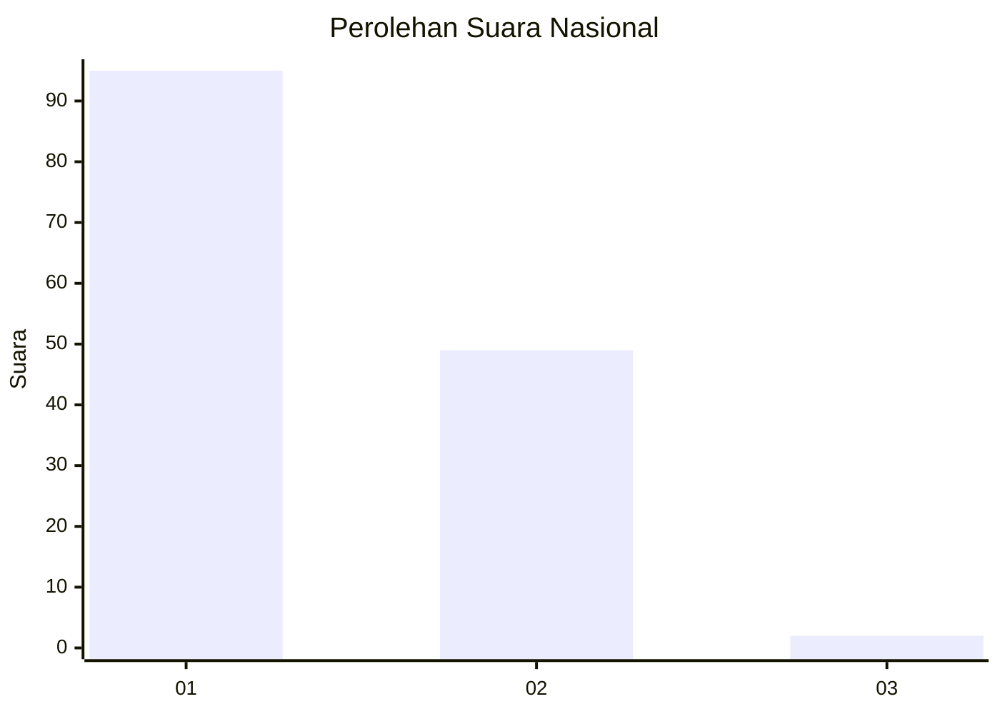
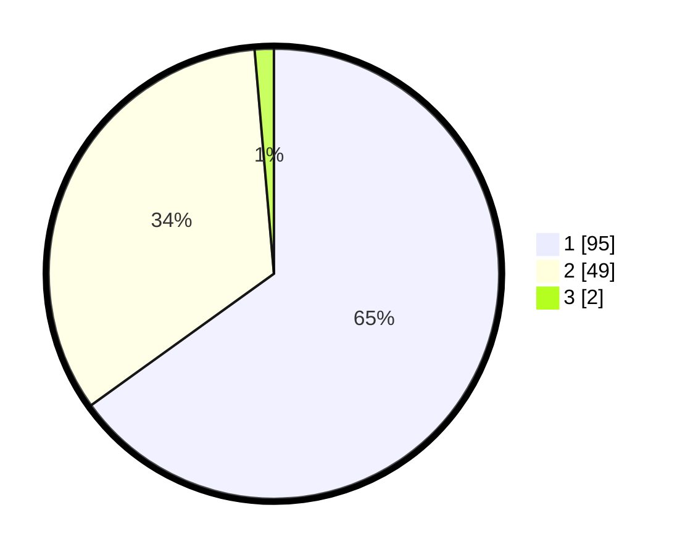

# Hasil

## Grafik

## Tabel

| No. | Nama Paslon    | Suara | Suara (raw) | Persentase |
|:--- |:-------------- | -----:| -----------:| ----------:|
| 1   | ANIES MUHAIMIN | 95    | [95][p-1]   | 65,07      |
| 2   | PRABOWO GIBRAN | 49    | [49][p-2]   | 33,56      |
| 3   | GANJAR MAHFUD  | 2     | [2][p-3]    | 1,37       |

[p-1]: https://github.com/gigit-pemilu/pemilu-2024/blob/main/pilpres/hitung-suara/sub/11-aceh/sub/02-aceh-tenggara/sub/08-lawe-bulan/sub/2019-kandang-mbelang-mandiri/sub/002-tps/sub/paslon-1.txt
[p-2]: https://github.com/gigit-pemilu/pemilu-2024/blob/main/pilpres/hitung-suara/sub/11-aceh/sub/02-aceh-tenggara/sub/08-lawe-bulan/sub/2019-kandang-mbelang-mandiri/sub/002-tps/sub/paslon-2.txt
[p-3]: https://github.com/gigit-pemilu/pemilu-2024/blob/main/pilpres/hitung-suara/sub/11-aceh/sub/02-aceh-tenggara/sub/08-lawe-bulan/sub/2019-kandang-mbelang-mandiri/sub/002-tps/sub/paslon-3.txt

## Foto C Plano

https://sirekap-obj-formc.kpu.go.id/b9b1/pemilu/ppwp/11/02/08/20/19/1102082019002-20240215-150150--2fa7282c-9c7e-43f6-b8fa-7b75a7df69cf.jpg

https://sirekap-obj-formc.kpu.go.id/b9b1/pemilu/ppwp/11/02/08/20/19/1102082019002-20240215-124215--1dfe8c78-a63b-4b97-ae95-bbe7d6670a86.jpg

https://sirekap-obj-formc.kpu.go.id/b9b1/pemilu/ppwp/11/02/08/20/19/1102082019002-20240215-132921--6b12dc2d-0a59-42cc-bf40-625e16105934.jpg

## Metadata

| Key        | Value               |
| ---------- | ------------------- |
| Time Stamp | 2024-02-15 22:00:27 |

