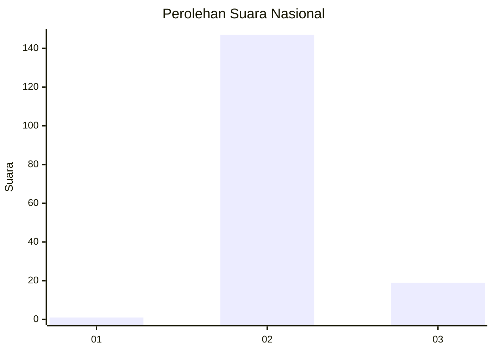
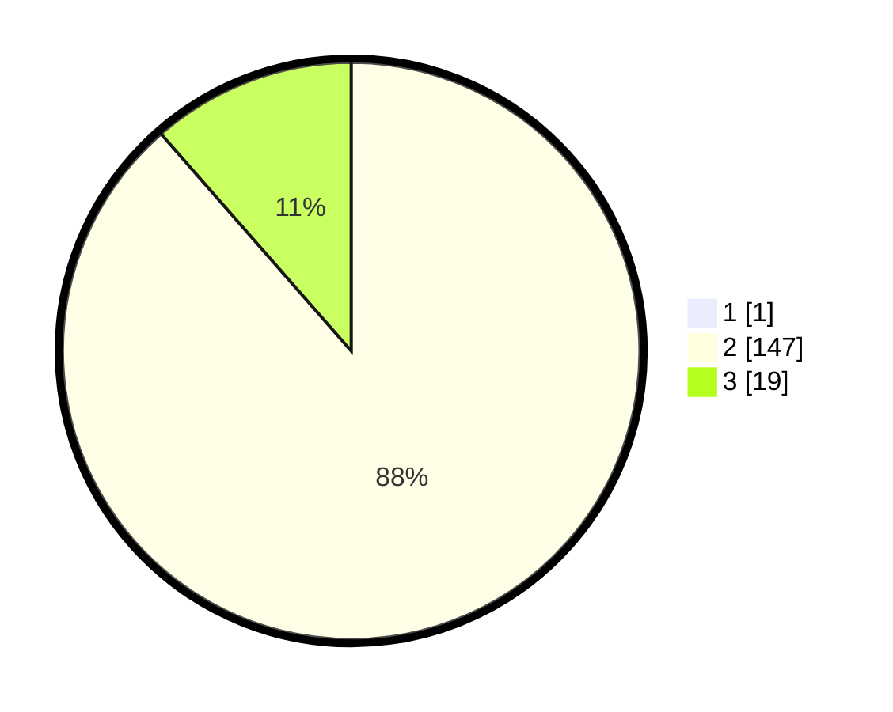

# Hasil

## Grafik

## Tabel

| No. | Nama Paslon    | Suara | Suara (raw) | Persentase |
|:--- |:-------------- | -----:| -----------:| ----------:|
| 1   | ANIES MUHAIMIN | 1     | [1][p-1]    | 0,60       |
| 2   | PRABOWO GIBRAN | 147   | [147][p-2]  | 88,02      |
| 3   | GANJAR MAHFUD  | 19    | [19][p-3]   | 11,38      |

[p-1]: https://github.com/gigit-pemilu/pemilu-2024/blob/main/pilpres/hitung-suara/sub/11-aceh/sub/02-aceh-tenggara/sub/08-lawe-bulan/sub/2020-mbacang-racun/sub/001-tps/sub/paslon-1.txt
[p-2]: https://github.com/gigit-pemilu/pemilu-2024/blob/main/pilpres/hitung-suara/sub/11-aceh/sub/02-aceh-tenggara/sub/08-lawe-bulan/sub/2020-mbacang-racun/sub/001-tps/sub/paslon-2.txt
[p-3]: https://github.com/gigit-pemilu/pemilu-2024/blob/main/pilpres/hitung-suara/sub/11-aceh/sub/02-aceh-tenggara/sub/08-lawe-bulan/sub/2020-mbacang-racun/sub/001-tps/sub/paslon-3.txt

## Foto C Plano

https://sirekap-obj-formc.kpu.go.id/da6d/pemilu/ppwp/11/02/08/20/20/1102082020001-20240214-235935--861e63b5-2e44-4286-97e8-b70c0a8bbad8.jpg

https://sirekap-obj-formc.kpu.go.id/da6d/pemilu/ppwp/11/02/08/20/20/1102082020001-20240215-000104--20753492-a5fe-4273-9266-d885b8909639.jpg

https://sirekap-obj-formc.kpu.go.id/da6d/pemilu/ppwp/11/02/08/20/20/1102082020001-20240215-000205--9ca0ed6e-88f1-45a3-aa0f-dae8b3015c15.jpg

## Metadata

| Key        | Value               |
| ---------- | ------------------- |
| Time Stamp | 2024-02-24 22:31:28 |

