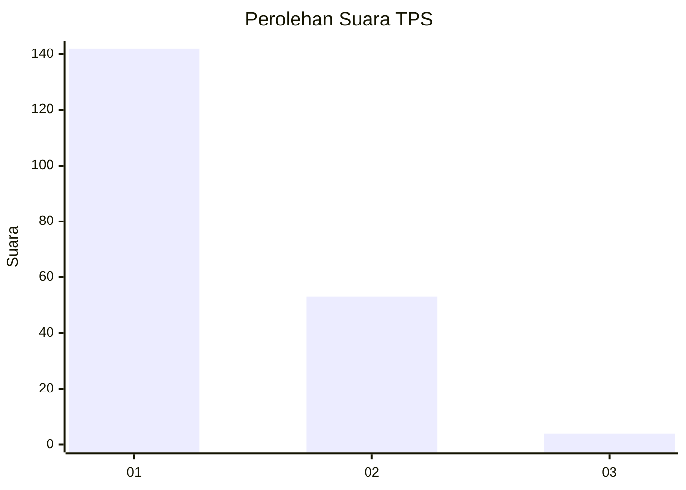
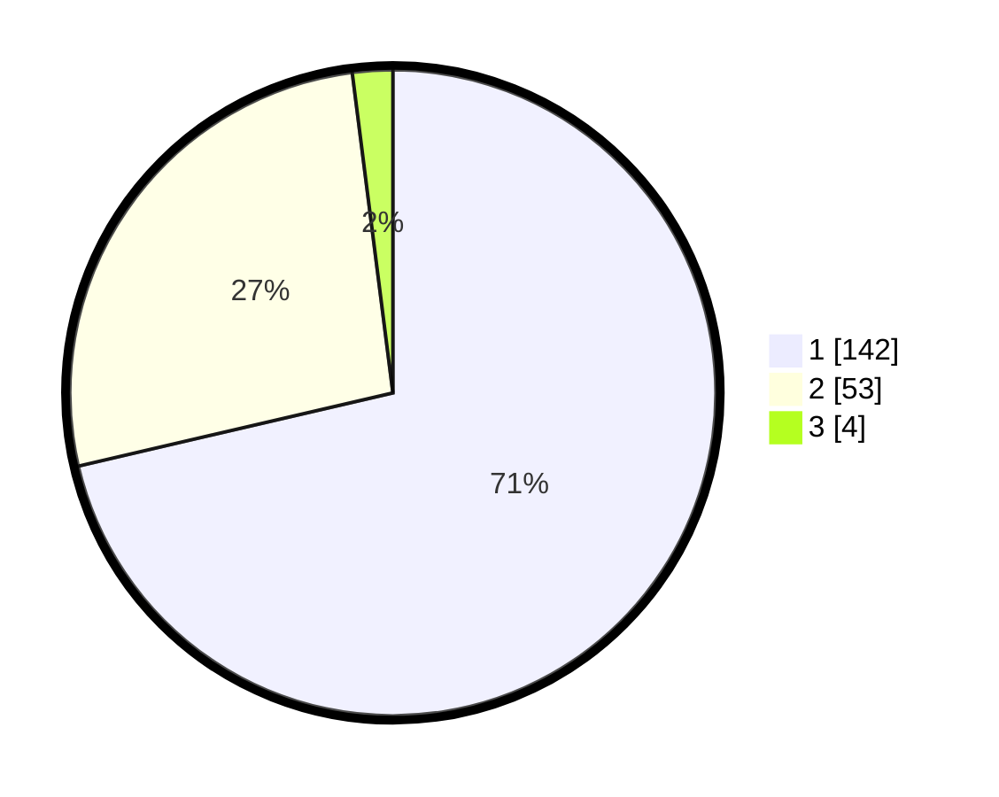

# Hasil

## Grafik

## Tabel

| No. | Nama Paslon    | Suara | Suara (raw) | Persentase |
|:--- |:-------------- | -----:| -----------:| ----------:|
| 1   | ANIES MUHAIMIN | 142   | [142][p-1]  | 71,36      |
| 2   | PRABOWO GIBRAN | 53    | [53][p-2]   | 26,63      |
| 3   | GANJAR MAHFUD  | 4     | [4][p-3]    | 2,01       |

[p-1]: https://github.com/gigit-pemilu/pemilu-2024-11-aceh/blob/main/pilpres/hitung-suara/sub/11-aceh/sub/02-aceh-tenggara/sub/08-lawe-bulan/sub/2021-telaga-mekar/sub/001-tps/sub/paslon-1.txt
[p-2]: https://github.com/gigit-pemilu/pemilu-2024-11-aceh/blob/main/pilpres/hitung-suara/sub/11-aceh/sub/02-aceh-tenggara/sub/08-lawe-bulan/sub/2021-telaga-mekar/sub/001-tps/sub/paslon-2.txt
[p-3]: https://github.com/gigit-pemilu/pemilu-2024-11-aceh/blob/main/pilpres/hitung-suara/sub/11-aceh/sub/02-aceh-tenggara/sub/08-lawe-bulan/sub/2021-telaga-mekar/sub/001-tps/sub/paslon-3.txt

## Foto C Plano

https://sirekap-obj-formc.kpu.go.id/c74c/pemilu/ppwp/11/02/08/20/21/1102082021001-20240215-044428--f5fda44c-91d2-4d57-a936-48f1c2fce34f.jpg

https://sirekap-obj-formc.kpu.go.id/c74c/pemilu/ppwp/11/02/08/20/21/1102082021001-20240215-044705--06c19daa-11cf-4f7c-a2b8-554505e3e7d5.jpg

https://sirekap-obj-formc.kpu.go.id/c74c/pemilu/ppwp/11/02/08/20/21/1102082021001-20240215-045131--45f6ef4d-4e8d-42af-a000-682b14cbb3c1.jpg

## Metadata

| Key        | Value               |
| ---------- | ------------------- |
| Time Stamp | 2024-02-15 21:30:27 |

