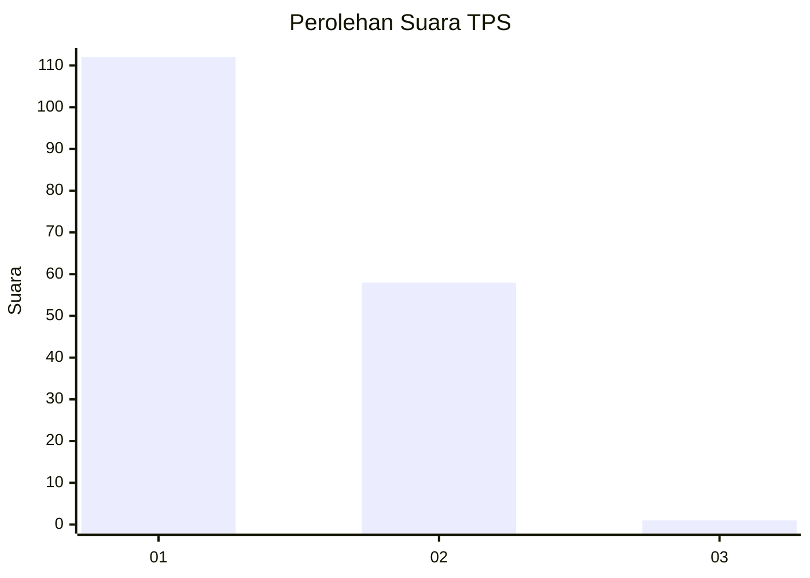
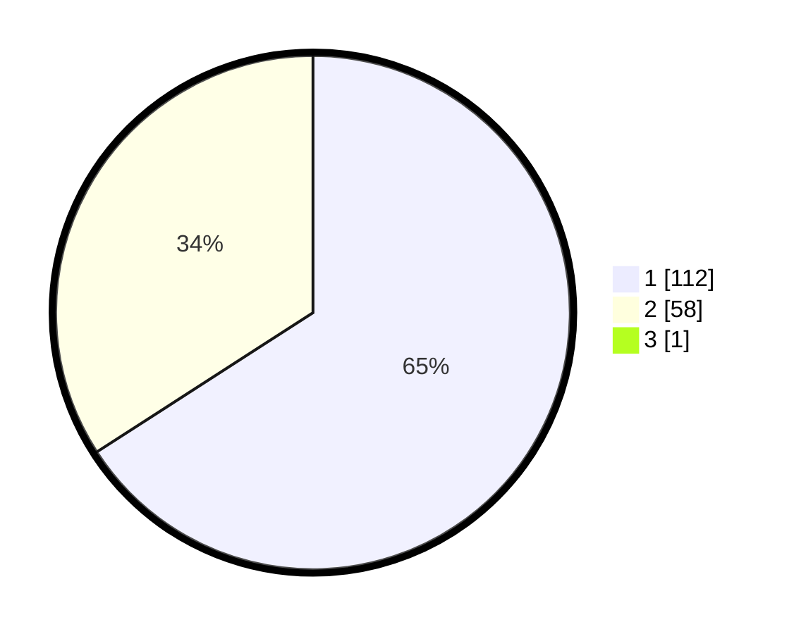

# Hasil

## Grafik

## Tabel

| No. | Nama Paslon    | Suara | Suara (raw) | Persentase |
|:--- |:-------------- | -----:| -----------:| ----------:|
| 1   | ANIES MUHAIMIN | 112   | [112][p-1]  | 65,50      |
| 2   | PRABOWO GIBRAN | 58    | [58][p-2]   | 33,92      |
| 3   | GANJAR MAHFUD  | 1     | [1][p-3]    | 0,58       |

[p-1]: https://github.com/gigit-pemilu/pemilu-2024-11-aceh/blob/main/pilpres/hitung-suara/sub/11-aceh/sub/02-aceh-tenggara/sub/08-lawe-bulan/sub/2021-telaga-mekar/sub/002-tps/sub/paslon-1.txt
[p-2]: https://github.com/gigit-pemilu/pemilu-2024-11-aceh/blob/main/pilpres/hitung-suara/sub/11-aceh/sub/02-aceh-tenggara/sub/08-lawe-bulan/sub/2021-telaga-mekar/sub/002-tps/sub/paslon-2.txt
[p-3]: https://github.com/gigit-pemilu/pemilu-2024-11-aceh/blob/main/pilpres/hitung-suara/sub/11-aceh/sub/02-aceh-tenggara/sub/08-lawe-bulan/sub/2021-telaga-mekar/sub/002-tps/sub/paslon-3.txt

## Foto C Plano

https://sirekap-obj-formc.kpu.go.id/c800/pemilu/ppwp/11/02/08/20/21/1102082021002-20240217-144112--485c4af4-defe-4516-bb13-9e2d7c203364.jpg

https://sirekap-obj-formc.kpu.go.id/c800/pemilu/ppwp/11/02/08/20/21/1102082021002-20240217-144154--3118a52c-74ff-490d-8092-299ea451bac6.jpg

https://sirekap-obj-formc.kpu.go.id/c800/pemilu/ppwp/11/02/08/20/21/1102082021002-20240217-144306--9235232f-1d75-4966-93df-0f5a9e22eed7.jpg

## Metadata

| Key        | Value               |
| ---------- | ------------------- |
| Time Stamp | 2024-02-24 22:31:28 |

