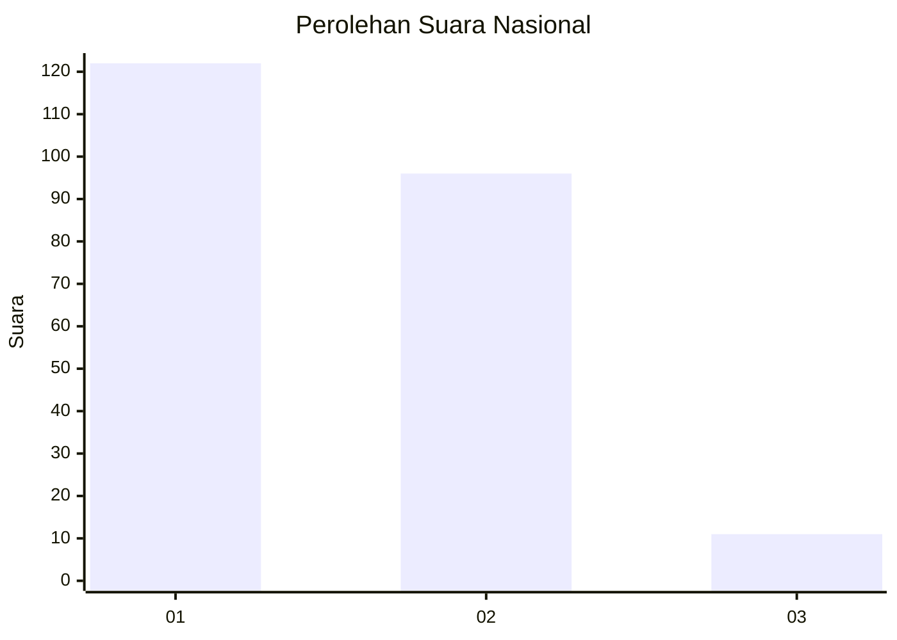
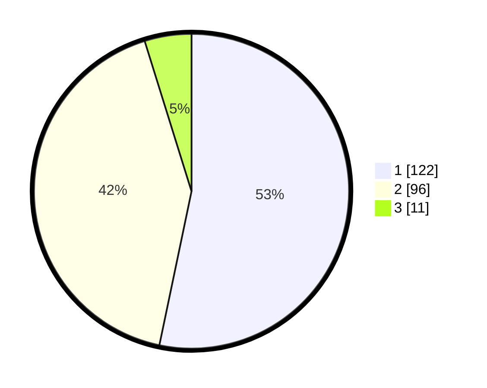

# Hasil

## Grafik

## Tabel

| No. | Nama Paslon    | Suara | Suara (raw) | Persentase |
|:--- |:-------------- | -----:| -----------:| ----------:|
| 1   | ANIES MUHAIMIN | 122   | [122][p-1]  | 53,28      |
| 2   | PRABOWO GIBRAN | 96    | [96][p-2]   | 41,92      |
| 3   | GANJAR MAHFUD  | 11    | [11][p-3]   | 4,80       |

[p-1]: https://github.com/gigit-pemilu/pemilu-2024/blob/main/pilpres/hitung-suara/sub/11-aceh/sub/02-aceh-tenggara/sub/08-lawe-bulan/sub/2023-pulonas-baru/sub/001-tps/sub/paslon-1.txt
[p-2]: https://github.com/gigit-pemilu/pemilu-2024/blob/main/pilpres/hitung-suara/sub/11-aceh/sub/02-aceh-tenggara/sub/08-lawe-bulan/sub/2023-pulonas-baru/sub/001-tps/sub/paslon-2.txt
[p-3]: https://github.com/gigit-pemilu/pemilu-2024/blob/main/pilpres/hitung-suara/sub/11-aceh/sub/02-aceh-tenggara/sub/08-lawe-bulan/sub/2023-pulonas-baru/sub/001-tps/sub/paslon-3.txt

## Foto C Plano

https://sirekap-obj-formc.kpu.go.id/b39c/pemilu/ppwp/11/02/08/20/23/1102082023001-20240215-044001--e884578d-f4b5-43a2-9485-3c47e8623a48.jpg

https://sirekap-obj-formc.kpu.go.id/b39c/pemilu/ppwp/11/02/08/20/23/1102082023001-20240215-044231--ca07adef-f6bd-4090-ab09-bdc6b044820d.jpg

https://sirekap-obj-formc.kpu.go.id/b39c/pemilu/ppwp/11/02/08/20/23/1102082023001-20240215-044338--7ca426ce-f2a6-44a5-b25a-779d0fdd6f3a.jpg

## Metadata

| Key        | Value               |
| ---------- | ------------------- |
| Time Stamp | 2024-02-15 21:30:27 |

