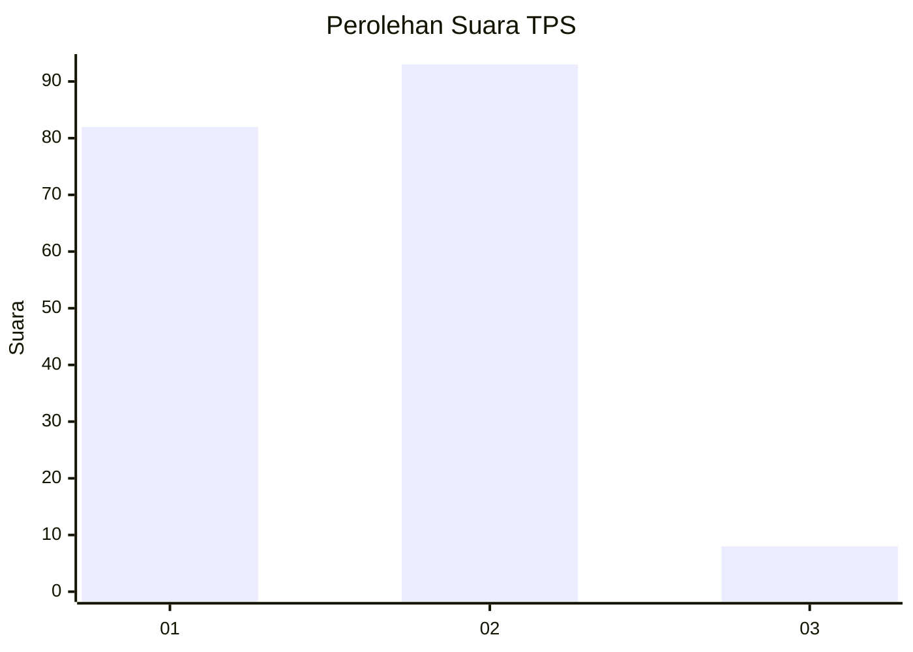
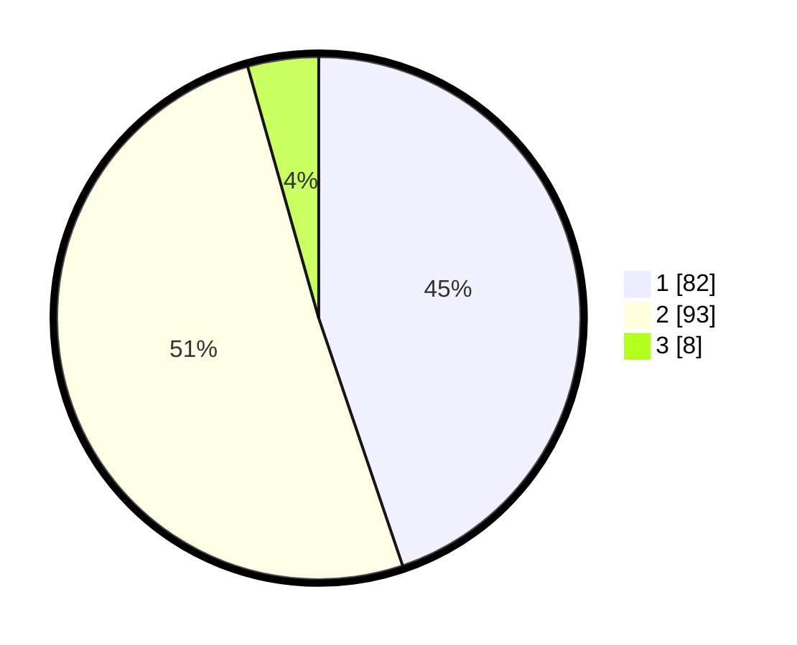

# Hasil

## Grafik

## Tabel

| No. | Nama Paslon    | Suara | Suara (raw) | Persentase |
|:--- |:-------------- | -----:| -----------:| ----------:|
| 1   | ANIES MUHAIMIN | 82    | [82][p-1]   | 44,81      |
| 2   | PRABOWO GIBRAN | 93    | [93][p-2]   | 50,82      |
| 3   | GANJAR MAHFUD  | 8     | [8][p-3]    | 4,37       |

[p-1]: https://github.com/gigit-pemilu/pemilu-2024-11-aceh/blob/main/pilpres/hitung-suara/sub/11-aceh/sub/02-aceh-tenggara/sub/08-lawe-bulan/sub/2023-pulonas-baru/sub/002-tps/sub/paslon-1.txt
[p-2]: https://github.com/gigit-pemilu/pemilu-2024-11-aceh/blob/main/pilpres/hitung-suara/sub/11-aceh/sub/02-aceh-tenggara/sub/08-lawe-bulan/sub/2023-pulonas-baru/sub/002-tps/sub/paslon-2.txt
[p-3]: https://github.com/gigit-pemilu/pemilu-2024-11-aceh/blob/main/pilpres/hitung-suara/sub/11-aceh/sub/02-aceh-tenggara/sub/08-lawe-bulan/sub/2023-pulonas-baru/sub/002-tps/sub/paslon-3.txt

## Foto C Plano

https://sirekap-obj-formc.kpu.go.id/2975/pemilu/ppwp/11/02/08/20/23/1102082023002-20240220-101348--0f7f64cb-ad24-4c74-9d00-e2163313d083.jpg

https://sirekap-obj-formc.kpu.go.id/2975/pemilu/ppwp/11/02/08/20/23/1102082023002-20240220-101423--2c79ece0-e490-4f1b-8129-398aeee6e3eb.jpg

https://sirekap-obj-formc.kpu.go.id/2975/pemilu/ppwp/11/02/08/20/23/1102082023002-20240220-101506--ede6c297-c4df-4b57-8496-1694e730b014.jpg

## Metadata

| Key        | Value               |
| ---------- | ------------------- |
| Time Stamp | 2024-02-25 16:00:00 |

