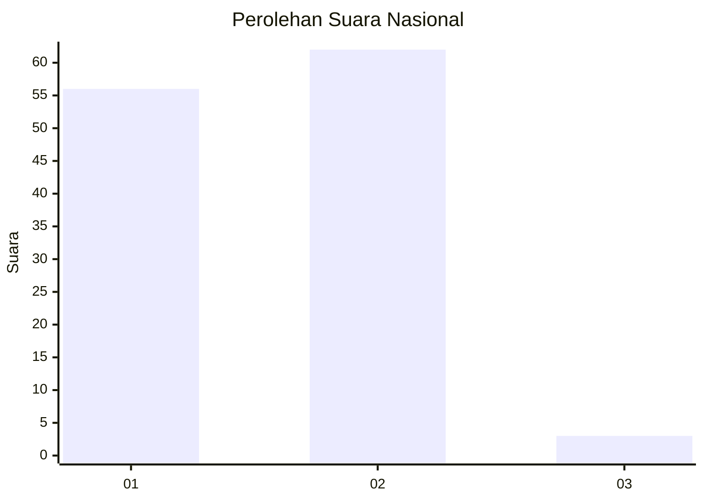
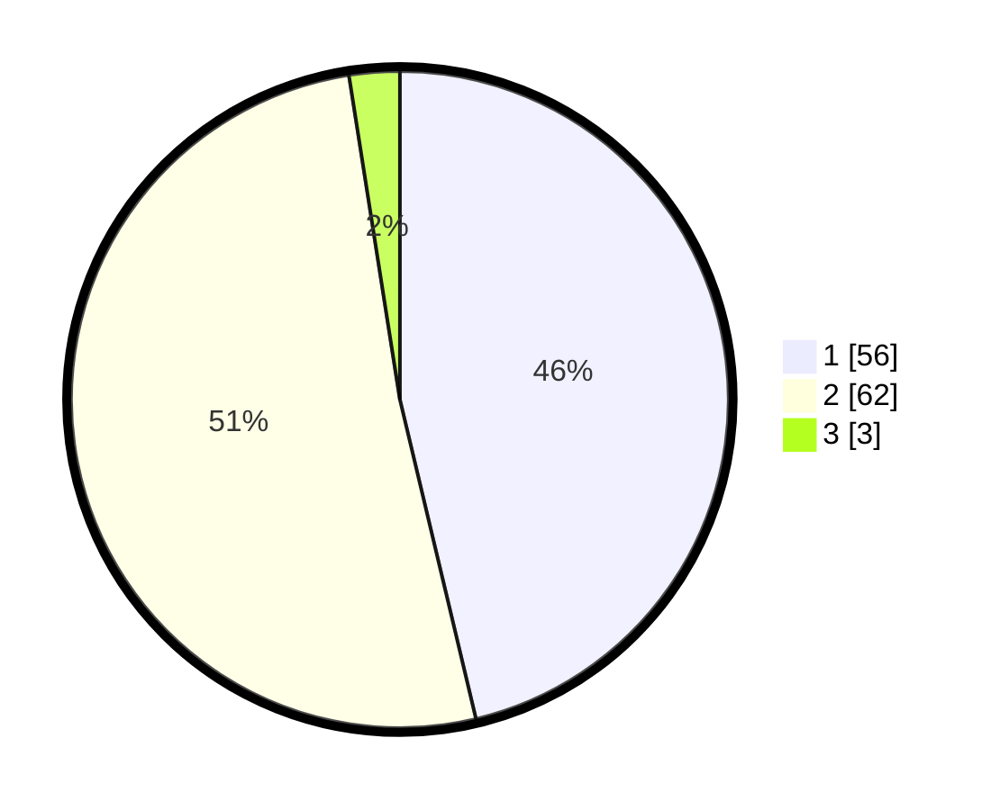

# Hasil

## Grafik

## Tabel

| No. | Nama Paslon    | Suara | Suara (raw) | Persentase |
|:--- |:-------------- | -----:| -----------:| ----------:|
| 1   | ANIES MUHAIMIN | 56    | [56][p-1]   | 46,28      |
| 2   | PRABOWO GIBRAN | 62    | [62][p-2]   | 51,24      |
| 3   | GANJAR MAHFUD  | 3     | [3][p-3]    | 2,48       |

[p-1]: https://github.com/gigit-pemilu/pemilu-2024/blob/main/pilpres/hitung-suara/sub/11-aceh/sub/02-aceh-tenggara/sub/08-lawe-bulan/sub/2023-pulonas-baru/sub/003-tps/sub/paslon-1.txt
[p-2]: https://github.com/gigit-pemilu/pemilu-2024/blob/main/pilpres/hitung-suara/sub/11-aceh/sub/02-aceh-tenggara/sub/08-lawe-bulan/sub/2023-pulonas-baru/sub/003-tps/sub/paslon-2.txt
[p-3]: https://github.com/gigit-pemilu/pemilu-2024/blob/main/pilpres/hitung-suara/sub/11-aceh/sub/02-aceh-tenggara/sub/08-lawe-bulan/sub/2023-pulonas-baru/sub/003-tps/sub/paslon-3.txt

## Foto C Plano

https://sirekap-obj-formc.kpu.go.id/21e8/pemilu/ppwp/11/02/08/20/23/1102082023003-20240214-230152--fe8a1f45-0163-44e6-a2bd-b6342e72ad8c.jpg

https://sirekap-obj-formc.kpu.go.id/21e8/pemilu/ppwp/11/02/08/20/23/1102082023003-20240214-230617--18038f3b-25ff-4067-8ed2-d0a5ff344b97.jpg

https://sirekap-obj-formc.kpu.go.id/21e8/pemilu/ppwp/11/02/08/20/23/1102082023003-20240214-230346--e28751d5-beec-42f4-9677-718cf9ab6729.jpg

## Metadata

| Key        | Value               |
| ---------- | ------------------- |
| Time Stamp | 2024-02-15 21:30:27 |

